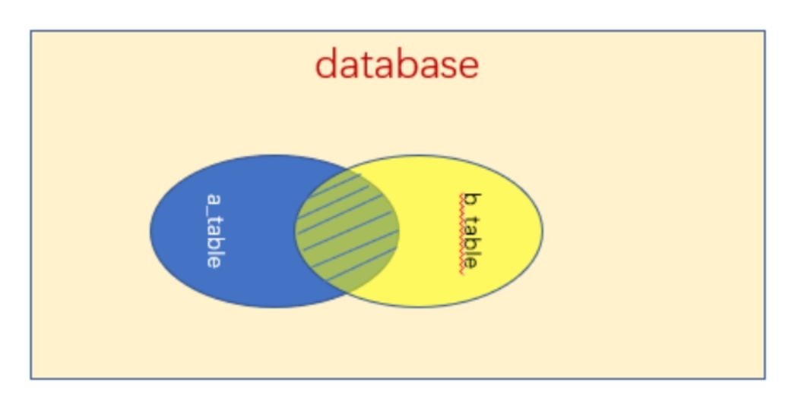
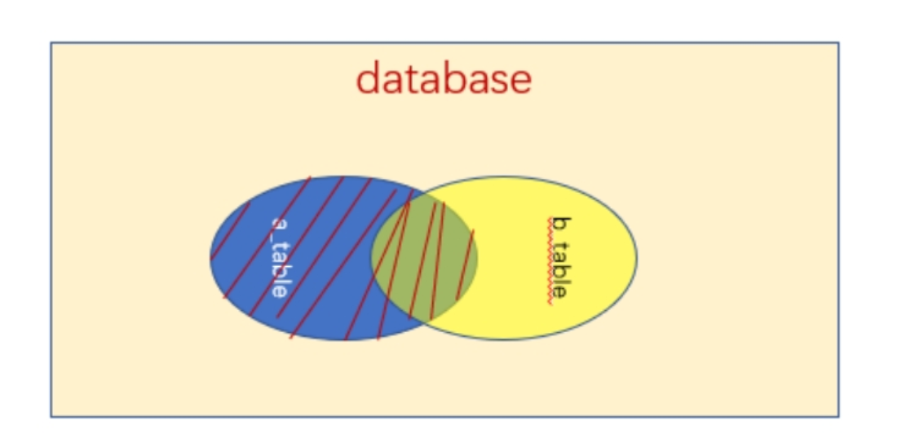
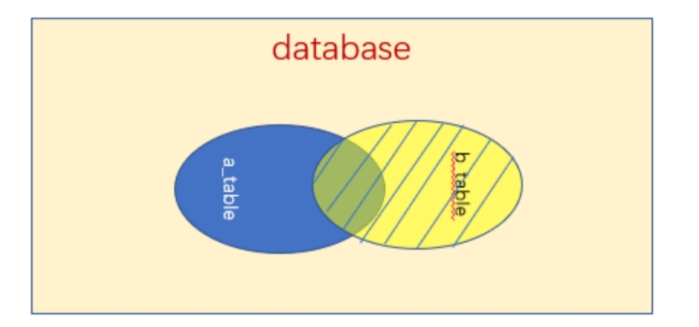

## 一、内连接

关键字：inner join on

说明：组合两个表中的记录，返回关联字段相符的记录，也就是返回两个表的交集（阴影）部分。

```sql
select * from a_user a INNER JOIN b_class b on a.class_id=b.user_id
```

 

## 二、左连接（左外连接）

关键字：left join on

说明：

left join 是left outer join的简写，它的全称是左外连接，是外连接中的一种。左(外)连接，左表(a_table)的记录将会全部表示出来，而右表(b_table)只会显示符合搜索条件的记录。右表记录不足的地方均为NULL。

```sql
select * from a_user a left JOIN b_class b on a.class_id=b.user_id
```

  

## 三、右连接（右外连接）

关键字：right join on

```sql
select * from a_table a right outer join b_table b on a.a_id = b.b_id;
```

说明：

right join是right outer join的简写，它的全称是右外连接，是外连接中的一种。与左(外)连接相反，右(外)连接，左表(a_table)只会显示符合搜索条件的记录，而右表(b_table)的记录将会全部表示出来。左表记录不足的地方均为NULL。


