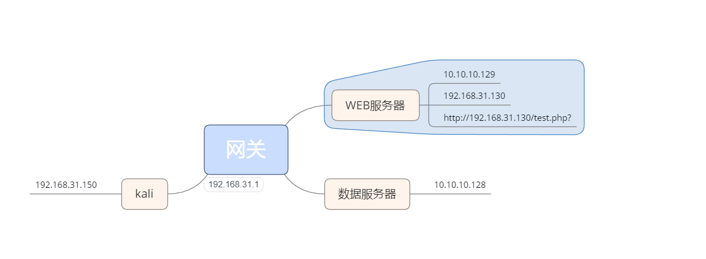

拓扑图

http://sourceforge.net/projects/ssocks/

```bash
wget https://nchc.dl.sourceforge.net/project/ssocks/ssocks-0.0.14.tar.gz
tar xf ssocks-0.0.14.tar.gz && cd ssocks-0.0.14
./configure
make && make install
```

等待远程Socks5服务器访问本地1080端口，创建端口1080与本地端口1088的连接通道（192.168.31.150）

```
rcsocks -l 1088 -p 1080 -vv
```

远程连接1080 （192.168.31.130）

```bash
rssocks -vv -s 192.168.31.150:1080 
```

利用proxychains进行Socks5代理

```bash
apt-get install proxychains -y
```

 在kali里面修改/etc/proxychains.conf

```bash
socks5 127.0.0.1 1088
```

用kali 里面的nmap扫描10.10.10.128

```bash
proxychains nmap -Pn -sT 10.10.10.128
```


 