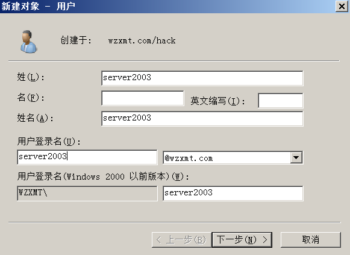

## 域控配置

创建一台windowsServer2008机器

1. 打开服务器管理，如下图所示：

   

2. 选择【角色】然后点击右侧新建角色，在“添加角色向导”页面点击【服务器角色】，如下图所示：

   

3. 勾选“Active Directory域服务” ，根据提示添加相应组件，然后点击【下一步】，如下图所示：

   

4. 选择【下一步】，如下图所示：

   

5. 点击【安装】，如下图所示：

   

6. 安装完成后点击关闭，如下图所示：

   

7. 在运行中输入dcpromo.exe，如下图所示：

   

8. 弹出Active Directory域服务安装向导，点击下一步，如下图所示：

   

9. 继续下一步，如下图所示：

   

10. 选择新建域，如下图所示：

    

11. 输入自定义域名点击下一步，如下图所示：

    

12. 林功能级别选择Windows server 2008 R2，点击下一步，如下图所示：

    

13. 勾选DNS服务器，点击下一步，如下图所示：

    

14. 选择是，单击下一步，如下图所示：

    

15. 选择文件存放路径，点击下一步，如下图所示：

    

16. 设置还原密码后点击下一步，如下图所示：

    

17. 查看配置信息，点击下一步，如下图所示：

    

18. 完成安装，如下图所示：

    

19. 选择不立即重启，如下图所示：

    

20. 打开网卡的IP配置信息，将DNS服务器设置为本机ip，如下图所示：

    

21. 重启服务器。

22. 域控用户和计算机

23. 新建

    

24. 新增加的组织

    

25. 增加用户

    

26. 新建对象

    

27. 新建对象密码

    

## 主机加入域

1. 打开第二台机器修改主机的DNS为域服务器ip，如下图所示：

   

2. 点击更改域和工作组，如下图所示：

   

3. 填入创建的域名，如下图所示：

   

4. 输入域管理员账号和密码，等待加域成功，重启后生效。

域控 2008

```
10.10.1.2
adminstrator  xxx123456..
```

域控客户2008

```
10.10.1.4
server2008 xx123456..
```

域控客户2003 

```
10.10.1.3
server2003 xxsb123456..
```

域控两个用户

```
server2003 xxsb123456..
server2008 xx123456..
```

