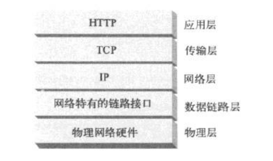
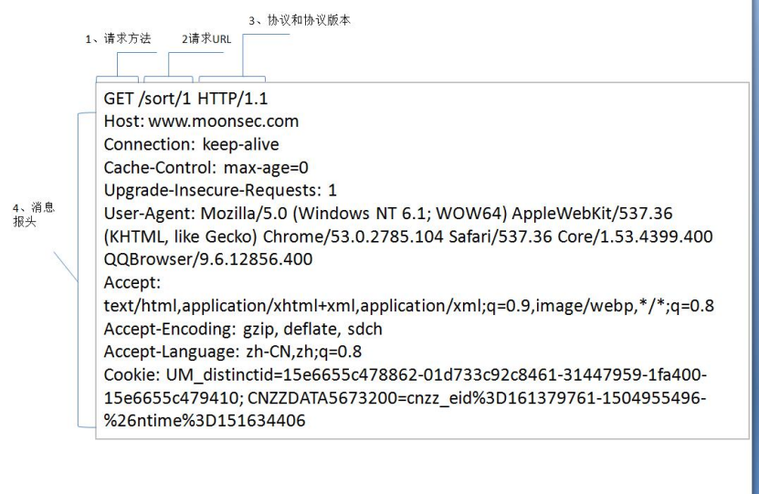
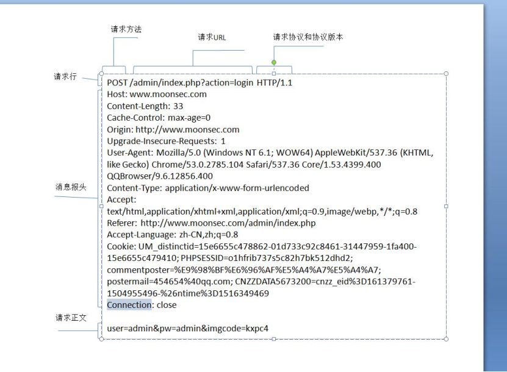
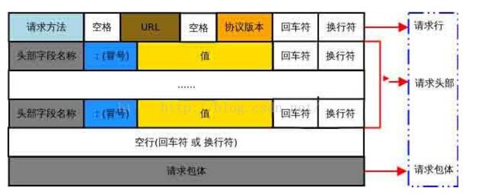
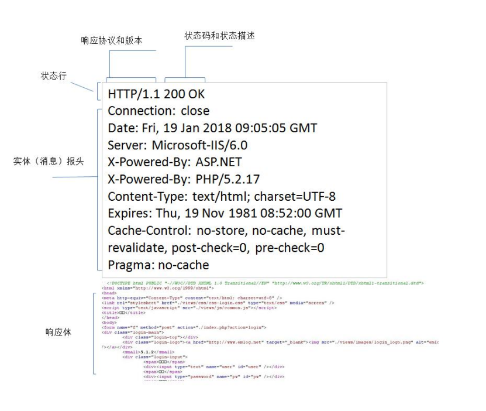

http（超文本传输协议）是一个基于请求与响应模式的、无状态的、应用层的协议，常基于TCP的连接方式，HTTP1.1版本中给出一种持续连接的机制，绝大多数的Web开发，都是构建在HTTP协议之上的Web应用。HTTP是一个属于应用层的面对的协议

互联网协议的五层协议栈



1、 支持客户/服务器模式  基于请求与响应的

2、 无连接:限制每次连接只处理一一个请求。服务器处理完客户的请求，并收到客户的应答后，即断开连接。采用这种方式可以节省传输时间

3、 无状态：指协议对事务处理没有记忆能力，缺少状态一位着如果后续处理需要前面的信息，则它必须重传，这样可能导致每次连接传送的数据量增大。另一个方面 ，在服务器不需要先前的信息时它的应答就比较快。

## HTTP URL解析篇

```
http://host[":"port][abs_path]
```

http表示要通过HTTP协议来定位网络资源；host表示合法的Internet主机域名或者IP地址；port指定一个端口号，为空则使用缺省端口80；abs_path指定请求资源的URI；如果URL中没有给出abs_path，那么当它作为请求URI时，必须以“/”的形式给出，通常这个工作浏览器自动帮我们完成。
eg:
1、输入：[www.moonsec.com](http://www.moonsec.com)

浏览器自动转换成：http://www.moonsec.com/
2、http:192.168.0.116:8080/moon.php

URL 查询字符串

http://www.moonsec.com/index.php?mod=upload&a=up

查询字符串?mod=upload&a=up

http://localhost/http.php?mod=upload&a=up

形式是key=value 的形式组成  以&隔开

## HTTP 请求篇

三个部分组成：请求行 、消息报头、请求正文

GET / HTTP/1.1  请求行



Upgrade-Insecure-Requests: 1
客户端向服务器端发送信号表示它支持 upgrade-insecure-requests 的升级机制
max-age=0表示不管response怎么设置，在重新获取资源之前，先检验ETag/Last-Modified

POST /admin/index.php?action=login HTTP/1.1  请求行



报文格式：



请求行以一个方法符号开头，以空格分开，后面跟着请求的URI和协议的版本，格式如下：Method Request-URI HTTP-Version CRLF  
其中 Method表示请求方法；Request-URI是一个统一资源标识符；HTTP-Version表示请求的HTTP协议版本；CRLF表示回车和换行（除了作为结尾的CRLF外，不允许出现单独的CR或LF字符）。

请求方法（所有方法全为大写）有多种，各个方法的解释如下：

- GET   请求获取Request-URI所标识的资源
- POST   在Request-URI所标识的资源后附加新的数据
- HEAD   请求获取由Request-URI所标识的资源的响应消息报头
- PUT   请求服务器存储一个资源，并用Request-URI作为其标识
- DELETE  请求服务器删除Request-URI所标识的资源
- TRACE  请求服务器回送收到的请求信息，主要用于测试或诊断CONNECT 保留将来使用
- OPTIONS 请求查询服务器的性能，或者查询与资源相关的选项和需求

## HTTP 响应篇

三个组成：状态行、消息报头、响应正文



\r\n


常见的状态码

1xx（100～199）：指示信息（Informational）–表示请求已接收，继续处理

2xx（200～299 ）：成功（Successful）–表示请求已被成功接收、理解、接受

3xx（300～399）：重定向（Redirection）–要完成请求必须进行更进一步的操作

4xx（400～499）：客户端错误（Client Error）–请求有语法错误或请求无法实现

5xx（500～599）：服务器端错误（ Server Error ）–服务器未能实现合法的请求

 

常见的状态代码 状态描述 说明

200 OK // 客户端请求成功

302 Redirection //请求重定向 （A 找 B 借钱，B 通知 A 找C 借钱 ， A找C 借钱） A 客户端 B、C服务器

304 //服务器端资源没有改动，通知客户端查找本地缓存

400 Bad Request //客户端请求有语法错误，不能被服务器所理解

401 Unauthorized //请求未经授权，这个状态代码必须和WWW-Authenticate报头域一起使用

403 Forbidden //服务器收到请求，但是拒接提供服务

[www.moonsec.com/xx/](http://www.moonsec.com/xx/) 403 

404 Not Found //客户端访问资源不存在

500 Internal Server Error //服务器发生不可预期的错误

503 Server Unavailable //服务器当前不能处理客户端的请求，一段时间后可能恢复正常