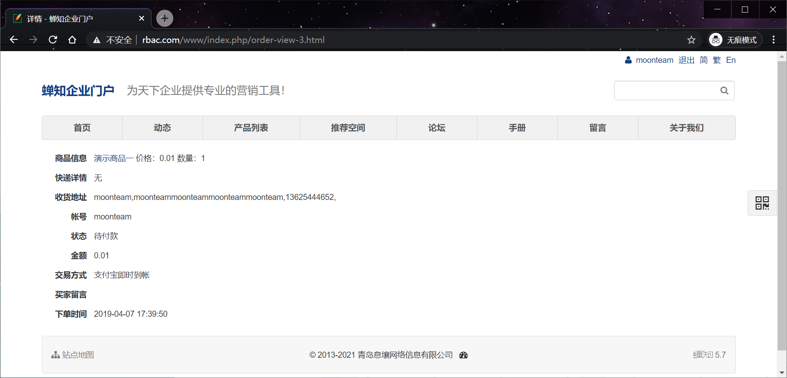
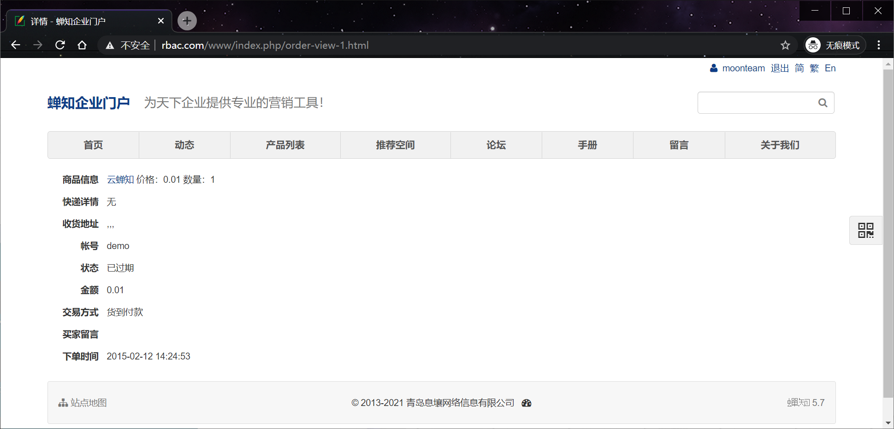
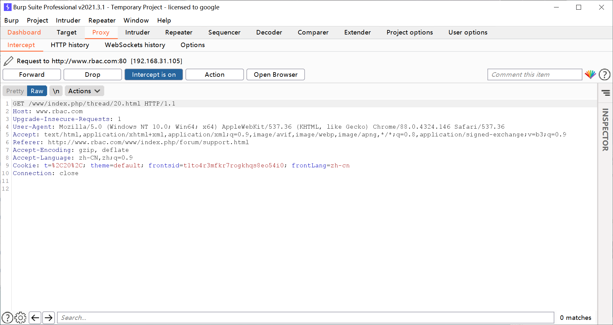
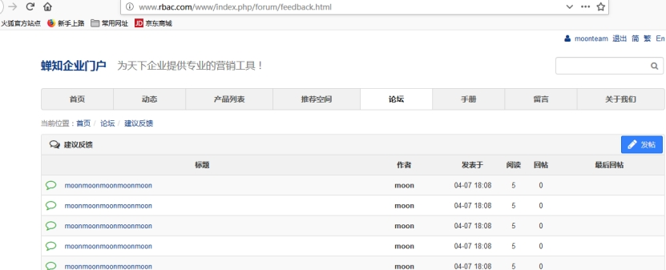

## 1、什么是越权漏洞

越权漏洞是一种很常见的逻辑安全漏洞。可以这样理解：服务器端对客户提出的数据操作请求过分信任，忽略了对该用户操作权限的判定，导致攻击账号拥有了其他账户的增删改查功能。

## 2、越权漏洞分类

### （1）平行越权

就是相同级别（权限）的用户或者同一角色不同的用户之间，可以越权访问、修改或者删除的非法操作。两个相同权限的账号分别是moonteam moon 密码都是x123456

这个是moon的订单

```http
http://www.rbac.com/www/index.php/order-view-4.html
```

这个4的数字是可以变化的 查询3的时候 是moonteam这个用户的数据 查看1的时候是账号demo的订单。





相同用户权限之间的越权就做水平越权

### （2）垂直越权

垂直越权是不同级别之间或不同角色之间的越权

用moon账号新建一个帖子 用admin登录系统得转帖的数据包。

```
POST /www/index.php/thread-transfer-20.html HTTP/1.1
Host: www.rbac.com
Content-Length: 13
Accept: application/json, text/javascript, */*; q=0.01
X-Requested-With: XMLHttpRequest
User-Agent: Mozilla/5.0 (Windows NT 10.0; Win64; x64) AppleWebKit/537.36 (KHTML, like Gecko) Chrome/88.0.4324.146 Safari/537.36
Content-Type: application/x-www-form-urlencoded; charset=UTF-8
Origin: http://www.rbac.com
Referer: http://www.rbac.com/www/index.php/thread/20.html
Accept-Encoding: gzip, deflate
Accept-Language: zh-CN,zh;q=0.9
Cookie: t=%2C20%2C; theme=default; frontsid=t1to4r3mfkr7rogkhqs8eo54i0; frontLang=zh-cn
Connection: close

targetBoard=5
```

用moonteam的权限去转移帖子。

登录moonteam 账号 把cookie信息替换

 

转移成功

 

 

一般垂直越权 都是用一个普通账号是测试 较高的用户的一些操作比如增删该查。测试的方法就是cookie之间的替换。

## 3、带来的危害

越权查询

越权删除

越权修改

越权增加