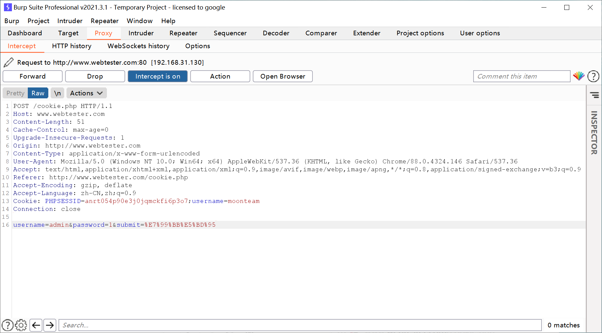
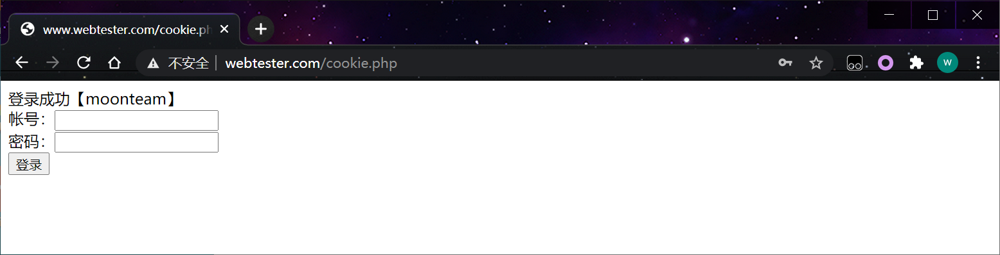

## 1、cookie的作用

我们在浏览器中，经常涉及到数据的交换，比如你登录邮箱，登录一个页面。我们经常会在此时设置30天内记住我，或者自动登录选项。那么它们是怎么记录信息的呢，答案就是今天的主角cookie了，Cookie是由HTTP服务器设置的，保存在浏览器中，但HTTP协议是一种无状态协议，在数据交换完毕后，服务器端和客户端的链接就会关闭，每次交换数据都需要建立新的链接。就像我们去超市买东西，没有积分卡的情况下，我们买完东西之后，超市没有我们的任何消费信息，但我们办了积分卡之后，超市就有了我们的消费信息。cookie就像是积分卡，可以保存积分，商品就是我们的信息，超市的系统就像服务器后台，http协议就是交易的过程。

## 2、机制的区别

session机制采用的是在服务器端保持状态的方案，而cookie机制则是在客户端保持状态的方案，cookie又叫会话跟踪机制。打开一次浏览器到关闭浏览器算是一次会话。说到这里，讲下HTTP协议，前面提到，HTTP协议是一种无状态协议，在数据交换完毕后，服务器端和客户端的链接就会关闭，每次交换数据都需要建立新的链接。此时，服务器无法从链接上跟踪会话。cookie可以跟踪会话，弥补HTTP无状态协议的不足。

## 3、cookie的分类

cookie分为会话cookie和持久cookie，会话cookie是指在不设定它的生命周期expires时的状态，前面说了，浏览器的开启到关闭就是一次会话，当关闭浏览器时，会话cookie就会跟随浏览器而销毁。当关闭一个页面时，不影响会话cookie的销毁。会话cookie就像我们没有办理积分卡时，单一的买卖过程，离开之后，信息则销毁。

持久cookie则是设定了它的生命周期expires，此时，cookie像商品一样，有个保质期，关闭浏览器之后，它不会销毁，直到设定的过期时间。对于持久cookie，可以在同一个浏览器中传递数据，比如，你在打开一个淘宝页面登陆后，你在点开一个商品页面，依然是登录状态，即便你关闭了浏览器，再次开启浏览器，依然会是登录状态。这就是因为cookie自动将数据传送到服务器端，在反馈回来的结果。持久cookie就像是我们办理了一张积分卡，即便离开，信息一直保留，直到时间到期，信息销毁。

在访问网站的时候 网站有一些业务需要会自动分配一些cookie到浏览上，用来记录用户的行为，如购物车。

在WEB安全中存在安全隐患，多数发生在验证登录。不少程序在验证处,判断cookie是否为空,假如不为空 即可登录，cookie可预测。

```php
<?php
include 'init.php';
if($_COOKIE['username']){
	echo "登录成功【{$_COOKIE['usernme']}】"	
}
?>
    
<meta charset="UTF-8">
<form method='post'>
	<label>帐号：</label><input type='text' name='username'><br>
	<label>密码：</label><input type='password' name='password'><br>
	<input type='submit' value='登录' name='submit'>
</form>
```

cookie可以在浏览器提交的数据进行修改的。

绕过方法

用buspteuie 修改username 不等于空即可绕过 。

repeater 提交

 

截包修改 

 
