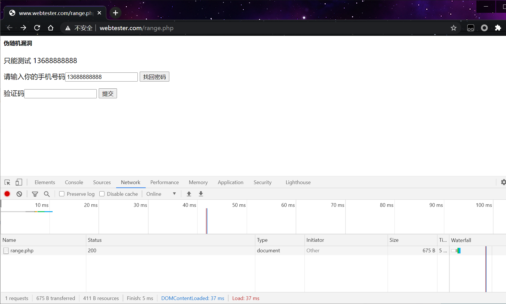
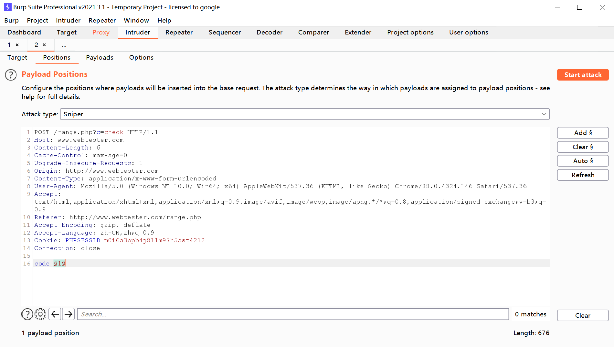
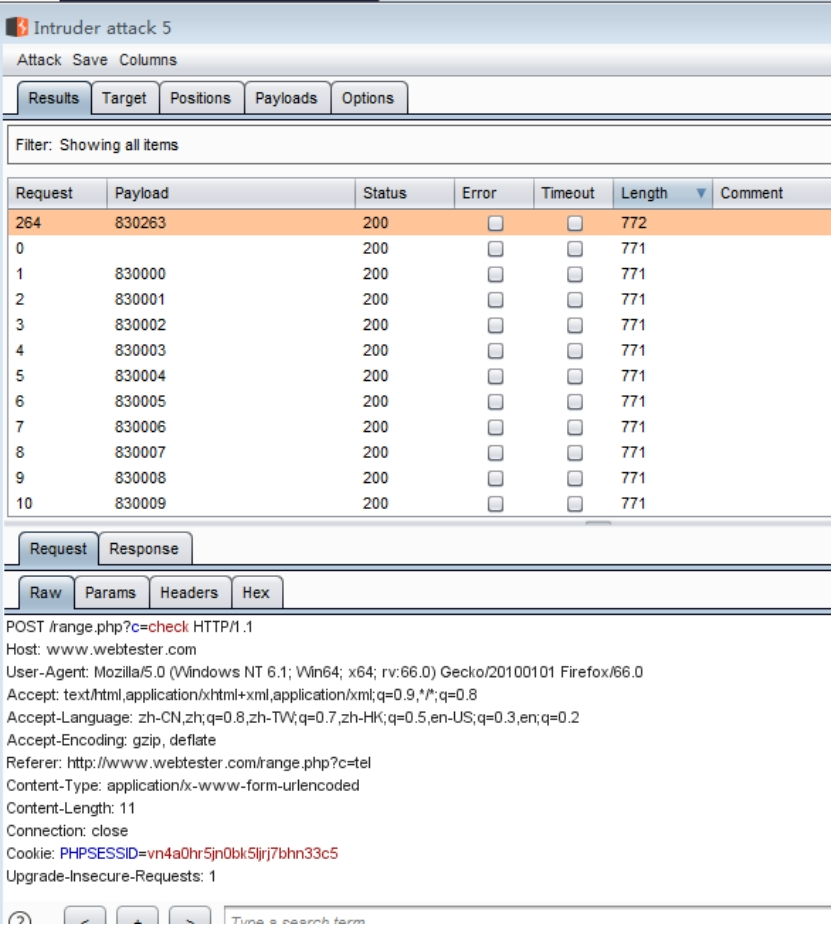
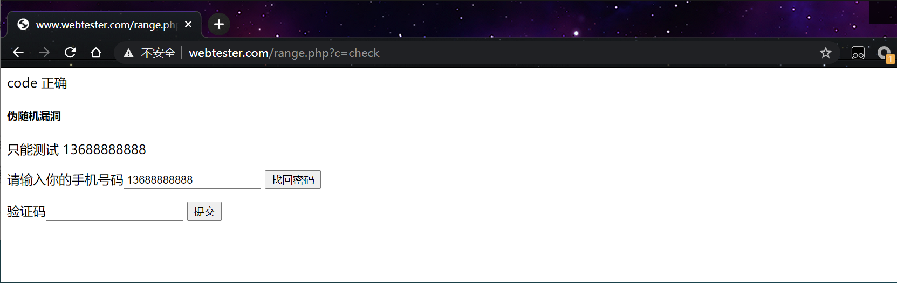

## 1、伪随机码 

结构可以预先确定，重复产生和复制，具有某种随机序列的随机特性的序列号。
在WEB开发中 伪随机码主要用于确定范围 例如6位数的范围是 000000-999999 这个范围内
随机生成一个值。在php里就有这样的函数 rand()函数是产生随机数的一个随机函数
例如生成000000-999999 可以这样设置 rand(000000,999999)
在WEB安全里 用到这样的伪随机数 一般是 手机获取验证码。
如果这个验证码使用这种模式，我们就可以枚举所有数值进行对比，即可绕过。

## 2、绕过

```http
http://www.webtester.com/range.php
```

 

 用burpsuite穷举伪随机数 验证码

 

设置变量 选择payload的的范围

 

 

## 3、防御方法 

设置失败次数 超过次数后烧毁数值。

设置提交的间隔时间。

 

 

 