## 1、详细说明

【请看完所有的说明再按照步骤操作！】

程序默认管理员账号：admin

程序默认管理员密码：1234567

以上数据安装后可以在【个人设置】处修改，记得修改邮箱，涉及到超级管理后台发信测试。

大家需要修改配置文件：config.php

大家还需要修改：authtest.php  把其中的【替换成你的域名】这几个字替换为你的域名例如：www.baidu.com  即可。注意结尾没有/ 开头也没有http//

大家还需要修改文件夹[程序总数据]里面的xss-MYSQL.sql 你需要替换【替换成你的域名】这几个字替换为你的域名例如：www.baidu.com  即可。注意结尾没有/开头也没有http//，程序默认首页是xss.php

如果你要是登录那地址就是： www.xxx.com/xss.php?do=login

(不要问为什么用xss.php 防止空间有俩程序跟别的冲突。可以修改，但是需要替换所有php文件里面的对应名称。)

最后就是伪静态规则已经设置好，后来项目源码处所看到的JS你自己访问一下(如果显示代码了)，那就没问题了。

\--------------------------------------------------------------------------------------------------------------------

【修改模块注意】

这里特意把模块数据单独摘出来，方便大家修改及替换

编辑模块数据大家尽量用 EditPlus、 Vim、 Notepad、 等编辑器来编辑。尽量别用系统自带的txt编辑(主要是怕出错)。。。

总共提供了两个模块。。。（模块一，基本都做了验证，可以用。。。模块二，打部分做了验证，剩下部分需要大家自测。）

先安装模块一，再安装模块二。。。

这两个模块，你只需要替换【替换成你的域名】这几个字替换为你的域名例如：www.baidu.com  即可。注意结尾没有/开头也没有http//

注意模块二文件夹里有几个PHP文件，这几个文件没有做过滤，如果想用所有插件你就自己做一下过滤然后上传，如果没必要，个人建议不用上传文件夹二里面的文件

只导入【XSS-module(模块二及附加文件).sql】数据即可，只是里面有2--3个插件用不了而已。

【※※※】注意模块都不导入，不影响程序使用！！！【※※※】

\--------------------------------------------------------------------------------------------------------------

【数据导入方法】

一般的空间都会带phpmyadmin (如果没有，你可以下载一个然后上传到你空间里面，然后访问你的网站www.xxx.com/phpmyadmin )  大家可以用这个工具导入数据库。。。如果不会。。

那就推荐 Navicat  通过这个工具也可以把数据导入到你的mysql数据库里面。

上面两种方法都特别简单，，，仁兄，，，这个说明已经详细的不能再详细了。。。（如果你弄不明白可以论坛回帖）

一、导入程序总数据  (需要修改)

二、导入模块一		(需要修改)

三、导入模块二		(需要修改)

【※※※】注意模块都不导入，不影响程序使用！！！【※※※】

\---------------------------------------------------------------------------------------------------------------

hosts里面绑定域名127.0.0.1 www.xsstools.com

在phpstudy 里面绑定域名和指向文件夹

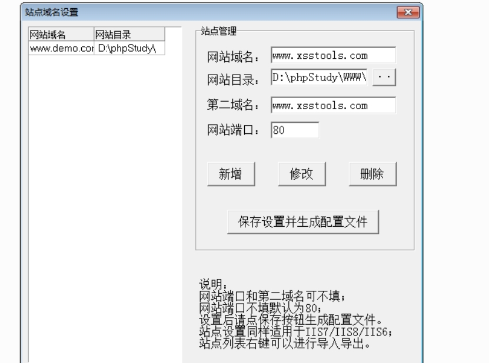 

 

创建数据库  xsstools 

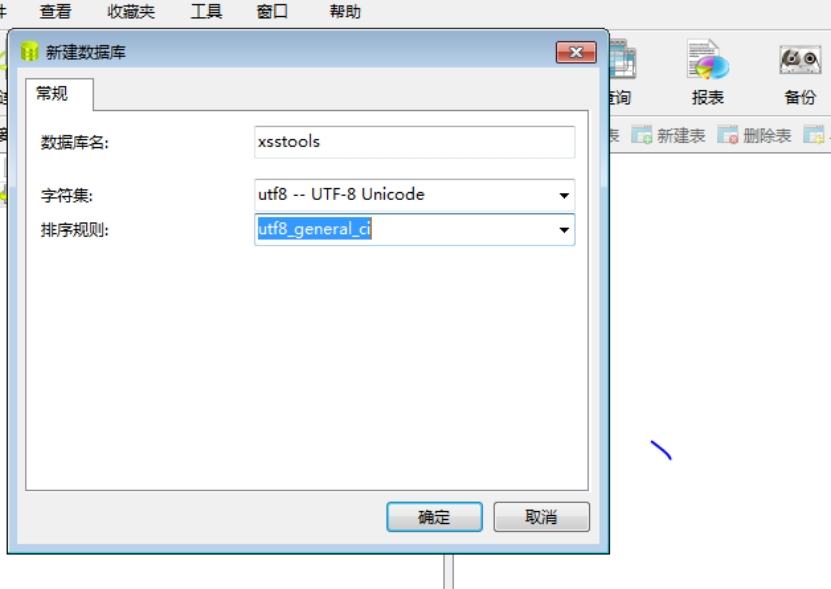 

修改config.php文件

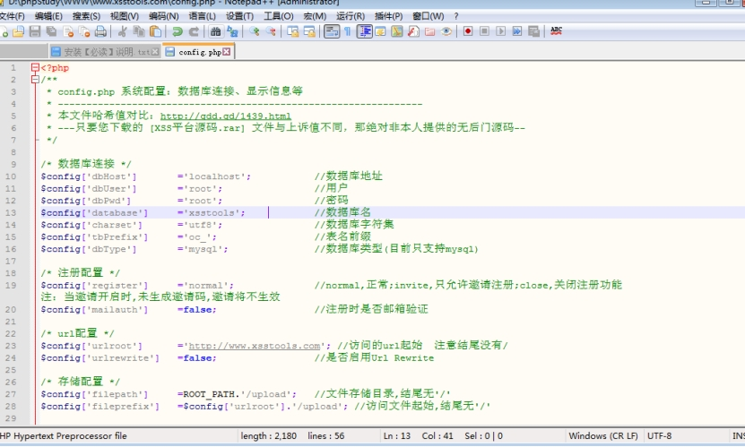 

修改authtest.php这个是用来做基础验证

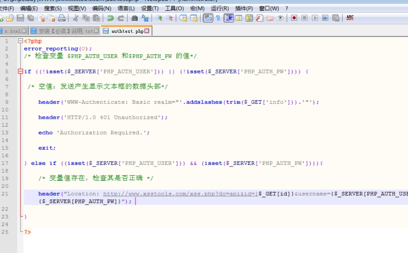 

修改数据库xss-MYSQL.sql文件 将数据库文件导入xsstools

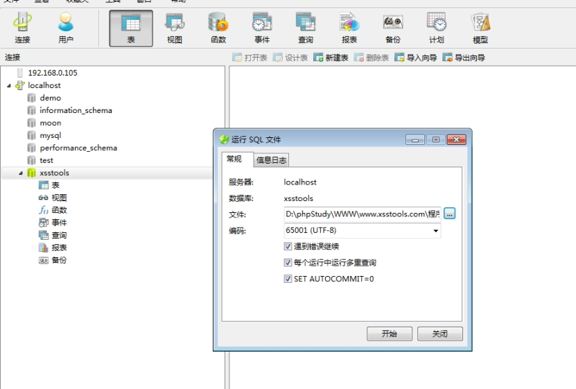 

 

开启apache的伪静态模块

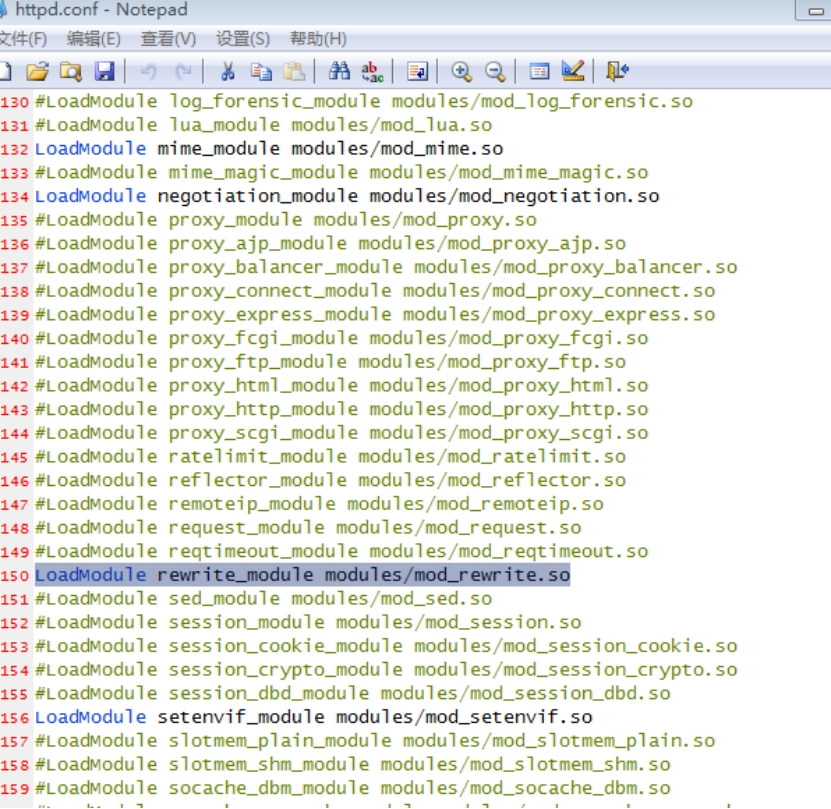 

访问首页

http://www.xsstools.com/xss.php?do=login

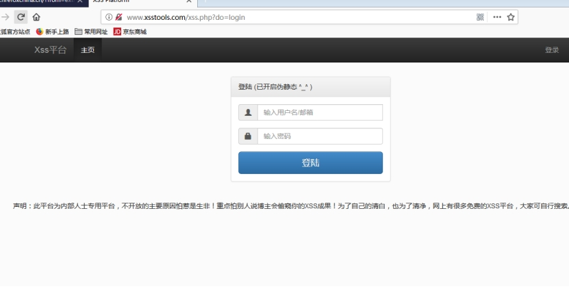 

登录admin 1234567

登录后台http://www.xsstools.com/admin/

注册用户xsstools

测试是否伪静态成功 

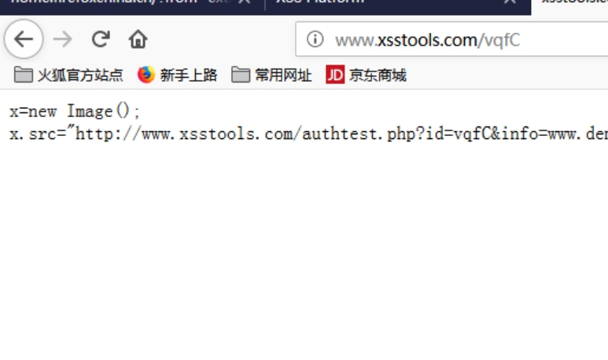 

基础认证钓鱼

 

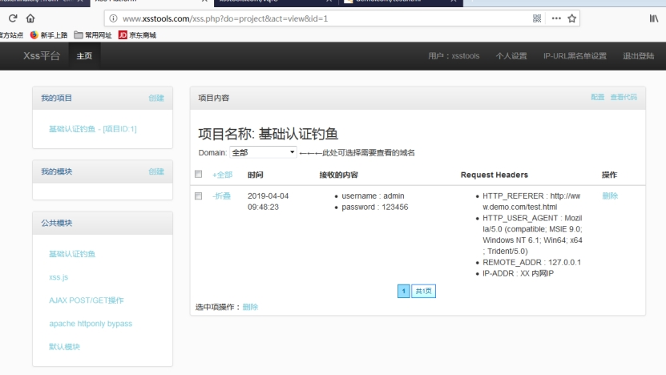 

 

默认模块 获取cookie

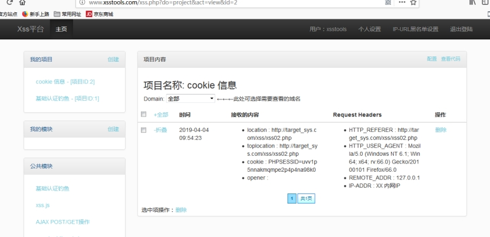 

安装其他模块 XSS-module(模块一) 修改域名之后 导入数据库

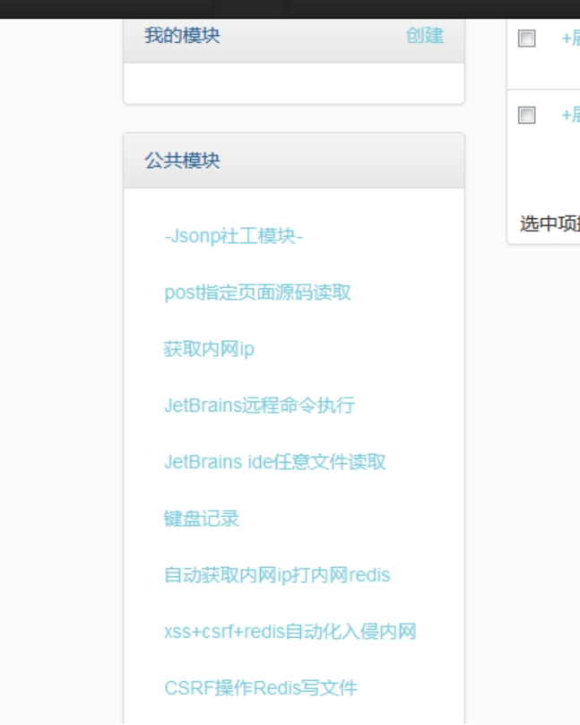 

 

修改XSS-module(模块二及附加文件)  修改好域名

导入模块二 

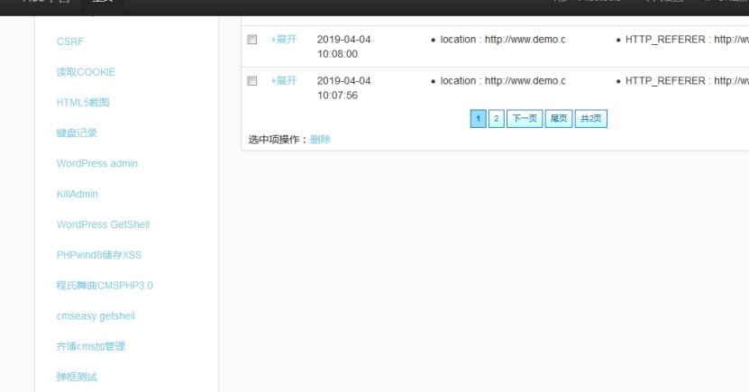 

 