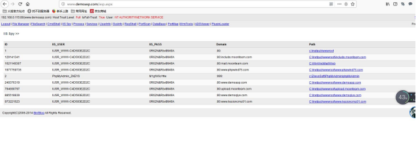

## 1、简介

aspx程序比asp的权限高，默认是可以执行cmd命令的。如果在asp不能执行命令的时候，如果服务器支持aspx 则上传aspx 程序到 网站上进行提权.

## **2、程序权限的对比**

在iis里面 权限依次的大小对比

aspx->php=>asp

aspx默认能执行终端命令

## **3、进行提权**

http://www.demoasp.com/asp.aspx 密码admin

 

权限更大的时候还可以看到iis所有网站的帐号和密码。

 

上传提权工具 iis6.0溢出工具

 

如果system32/cmd.exe 不能使用的情况，也可以cmd.exe 进行一些操作。