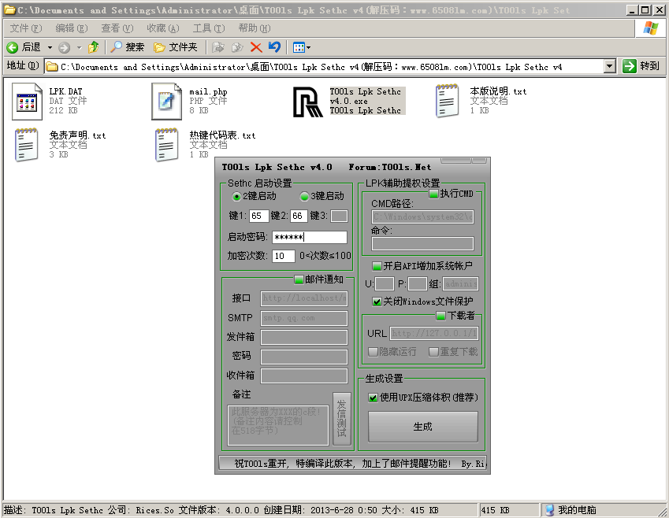
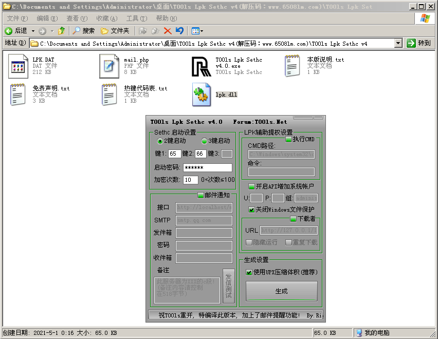
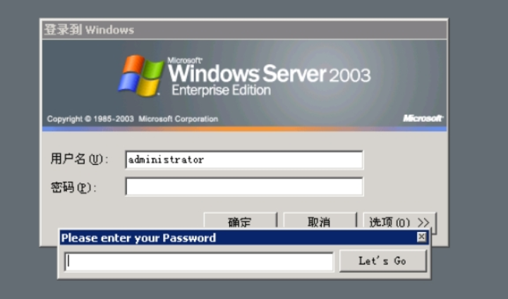
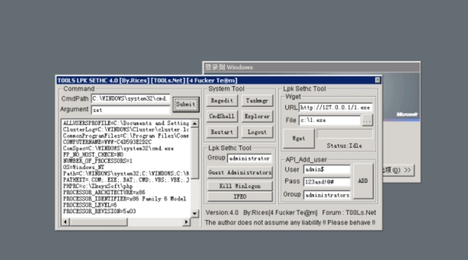

## 1、简介

lpk劫持  在window2003 或 windowxp中 如果同一个目录中 存在 exe和 lpk.dll 每当exe执行的时候就会被劫持。利用这个特性 可以把lpk提权的文件放到权限较高的程序 ，当exe运行时，lpk.dl就可以进行提权。

## 2、T00ls Lpk Sethc v4

这个工具是生成lpk dll文件的工具，利用这个工具就可以生成后门文件 劫持exe 替换 setch 实现提权 

## 3、过程

设置热键，分别设置65、66，后门的密码123456 

 生成lpk.dll

 

把这个lpk.dll  放到WebMail目录下 当用户重启机子的时候 因为WebMail 里面的会随之启动 这个就劫持了

远程链接 按shirt 五次弹出Sethc 窗口 同时按着ctrl a和b 就会弹出后门输入密码123456

劫持

 