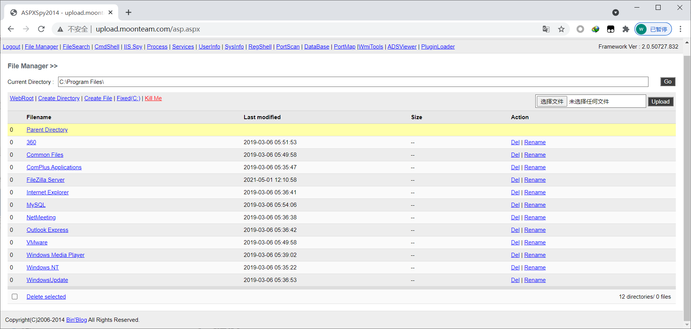
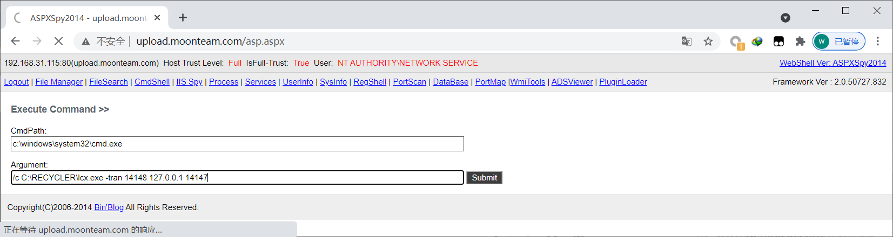
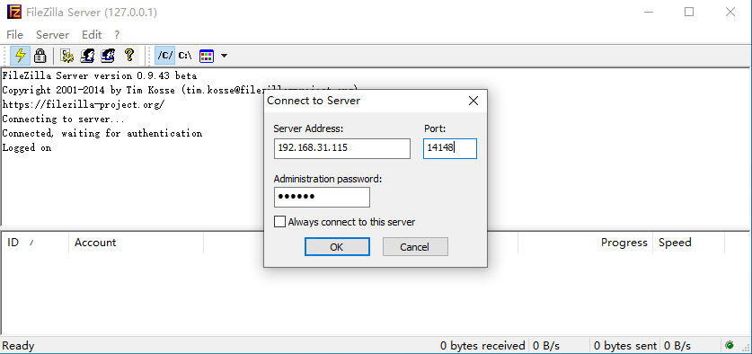
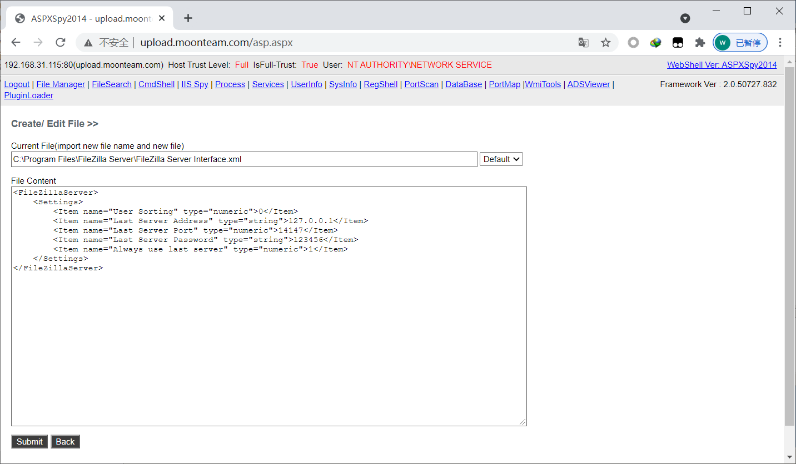
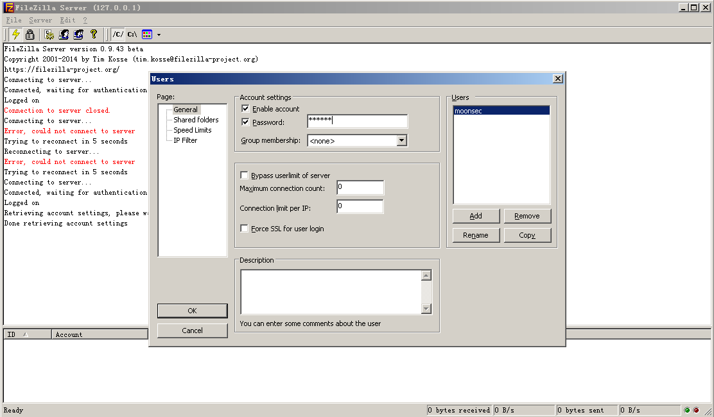
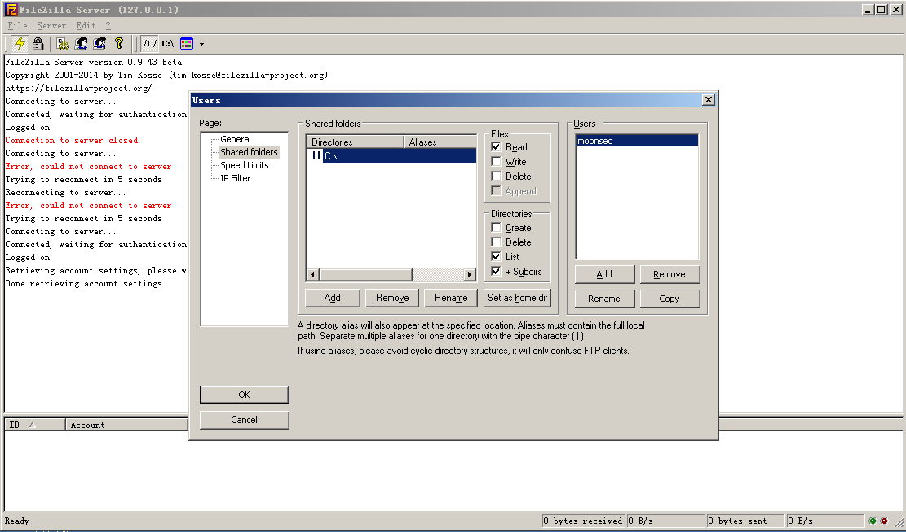
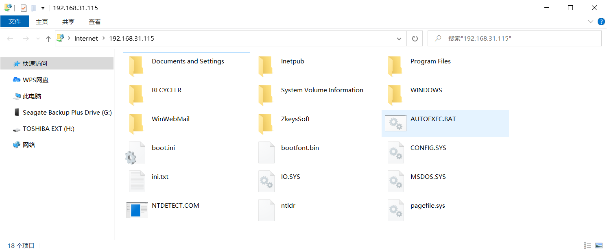
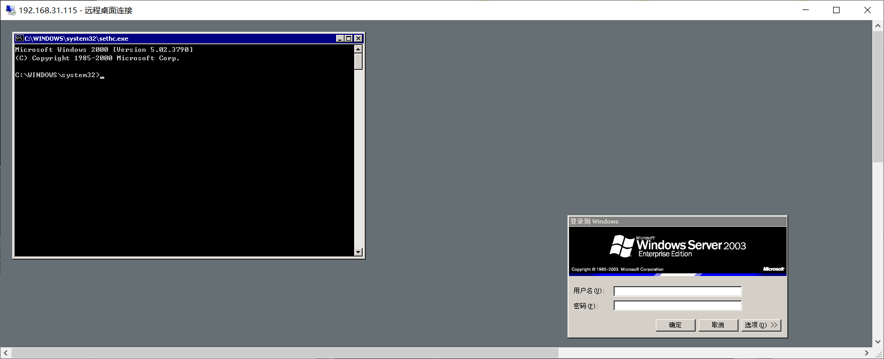

## 1、 简介

FileZilla 是一个ftp服务器， 假如配置不严的，读取xml密码 可以执行一些简答的命令

默认安装目录

C:\Program Files\FileZilla Server\

 

## 2、 提权

FileZilla Server Interface.xml  

```xml
FileZilla Server Interface.xml   
<FileZillaServer>
    <Settings>
        <Item name="Last Server Address" type="string">127.0.0.1</Item>
        <Item name="Last Server Port" type="numeric">14147</Item>
        <Item name="Last Server Password" type="string">123456</Item>
        <Item name="Always use last server" type="numeric">1</Item>
    </Settings>
</FileZillaServer>
```

本地ip 127.0.0.1 端口 14147 密码 123456

进行端口的转发

```
/c C:\RECYCLER\lcx.exe -tran 14148 127.0.0.1 14147
```

 

本地用同样版本的filezila server 是链接14148  端口



 ftp的用户密码在

 

 可以通过修改配置文件 或者修改这里的用户密码

 

因为在2003系统 这个ftp服务器是以系统权限启动的，那么可以修改默认的位置 比如修改c盘

 

 用账号 moonsec密码123456 登录ftp就会登录到c盘 

 

 那么可以用cmd改名替换C:\Windows\System32\sethc.exe 在连登录远程服务器的时候 在登录框 按五次shit键 就会弹出cms终端 那么就可以运行其他命令

 

 